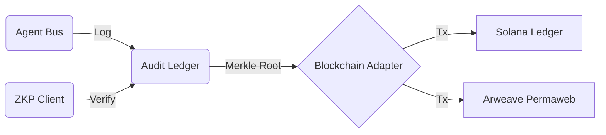

# Decentralized Audit & Blockchain Domain

The **Blockchain** domain provides immutable proof of all agent interactions and governance decisions. It ensures that the system's history is tamper-proof and externally verifiable.

## Overview

This domain handles the lifecycle of evidence:
1. **Hashing**: Individual messages are hashed to create deterministic fingerprints.
2. **Batching**: Hashes are gathered into Merkle Trees for efficient verification.
3. **Commitment**: Merkle roots are anchored to public or private blockchains.
4. **ZK-Proofs**: Zero-Knowledge Proofs are generated to prove compliance without leaking data.

## Module Breakdown

### 1. Audit Ledger (`services/audit_service/core/audit_ledger.py`)
The central orchestrator for pending audit logs.
- **Batches**: Groups `ValidationResult` objects into manageable chunks (default 100).
- **Integrity**: Manages a local `MerkleTree` instance to provide inclusion proofs.

### 2. Blockchain Adapters (`services/audit_service/blockchain/`)
Pluggable clients for different ledger technologies:
- **Solana**: High-throughput anchoring.
- **Arweave**: Permanent storage for full decision logs.
- **Ethereum L2**: General purpose secure state anchoring.

### 3. ZKP Engine (`services/audit_service/zkp/`)
Generates cryptographic proofs that an agent's inner state matched the constitutional requirements during a specific transaction.

## Integration Flow



## Immutable Evidence Structure

| Field | Type | Description |
|-------|------|-------------|
| `validation_result` | Object | The governance outcome (aligned/violated). |
| `hash` | String (SHA256) | Deterministic fingerprint of the result. |
| `merkle_proof` | List | Path to the batch root hash. |
| `batch_id` | String | Reference to the blockchain transaction. |

## Usage

```python
from services.audit_service.core.audit_ledger import AuditLedger
ledger = AuditLedger(batch_size=10)
entry_hash = ledger.add_validation_result(result)
```