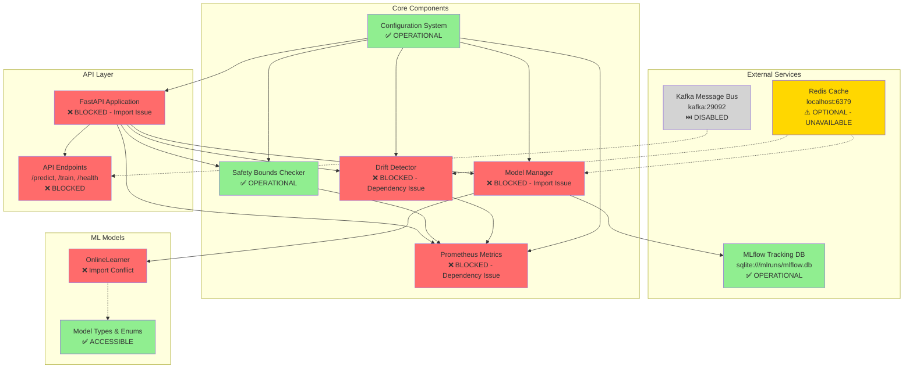
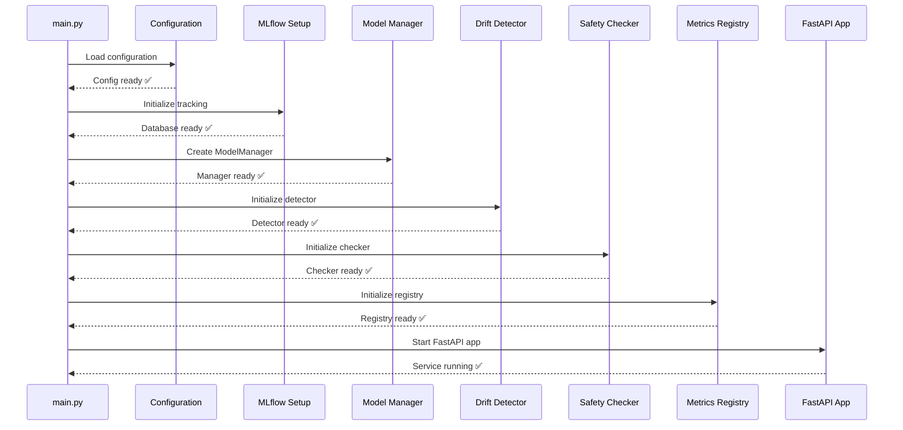
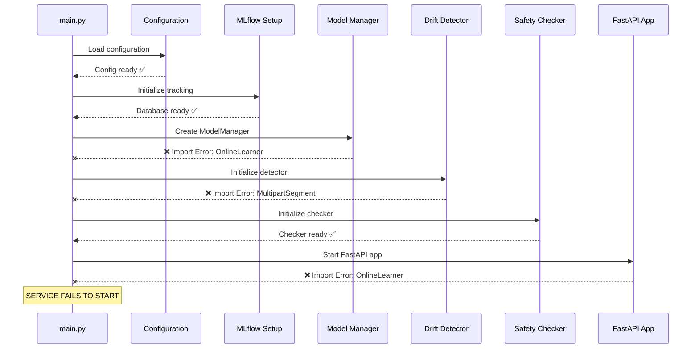

# Adaptive Learning Engine - Integration Architecture

**Constitutional Hash:** cdd01ef066bc6cf2

## Service Dependency Map



## Component Status Legend

- 🟢 **Green (✅)** - Fully operational, tests passing
- 🔴 **Red (❌)** - Blocked, tests failing, requires immediate fix
- 🟡 **Yellow (⚠️)** - Optional service unavailable, non-critical
- ⚪ **Gray (⏭️)** - Disabled by configuration, intentional

---

## Dependency Chain Analysis

### Working Dependencies ✅

```
Configuration System
├── Environment variable loading
├── Constitutional hash validation
├── Feature flag management
└── Default value handling
    ✅ ALL TESTS PASSING
```

```
MLflow Integration
├── SQLite tracking database
├── Model registry setup
├── Champion alias configuration
└── Database directory access
    ✅ ALL TESTS PASSING
```

```
Safety Bounds Checker
├── Accuracy threshold validation
├── Consecutive failure tracking
├── Independent initialization
└── Ready for production
    ✅ ALL TESTS PASSING
```

### Blocked Dependencies ❌

```
Model Manager
├── OnlineLearner import ❌ FAILS
│   └── Namespace conflict: online_learner.py vs online_learner/
├── Model hot-swap logic ⏸️ UNREACHABLE
└── Prediction pipeline ⏸️ UNREACHABLE
    ❌ IMPORT ERROR
```

```
Drift Detector
├── FastAPI models import ❌ FAILS
│   └── python-multipart dependency issue
├── Prometheus metrics ⏸️ UNREACHABLE
└── Drift check loop ⏸️ UNREACHABLE
    ❌ DEPENDENCY ERROR
```

```
API Endpoints
├── OnlineLearner import ❌ FAILS
│   └── Same namespace conflict as Model Manager
├── FastAPI router ⏸️ UNREACHABLE
└── All endpoints ⏸️ UNREACHABLE
    ❌ IMPORT ERROR
```

---

## Critical Path to Service Initialization

### Current State (3/8 Tests Passing)

```
1. Load Configuration              ✅ SUCCESS
2. Initialize MLflow               ✅ SUCCESS
3. Test Redis Connection           ⚠️ UNAVAILABLE (optional)
4. Initialize Model Manager        ❌ FAIL → BLOCKS API
5. Initialize Drift Detector       ❌ FAIL → BLOCKS Metrics
6. Initialize Metrics              ❌ FAIL → BLOCKS Monitoring
7. Initialize Safety Checker       ✅ SUCCESS
8. Initialize API Endpoints        ❌ FAIL → BLOCKS Service
```

### Target State (7/8 Tests Passing)

```
1. Load Configuration              ✅ SUCCESS
2. Initialize MLflow               ✅ SUCCESS
3. Test Redis Connection           ⏭️ SKIP (optional)
4. Initialize Model Manager        ✅ SUCCESS → UNBLOCKS API
5. Initialize Drift Detector       ✅ SUCCESS → UNBLOCKS Metrics
6. Initialize Metrics              ✅ SUCCESS → UNBLOCKS Monitoring
7. Initialize Safety Checker       ✅ SUCCESS
8. Initialize API Endpoints        ✅ SUCCESS → SERVICE READY
```

---

## Import Resolution Order

### Problem: Module Namespace Conflict

**Python Import Priority:**
```
src.models.online_learner
    ↓
    1. Check for directory: src/models/online_learner/  ✓ EXISTS
    2. Import from directory: src/models/online_learner/__init__.py
    3. NEVER checks: src/models/online_learner.py
    ↓
    ❌ OnlineLearner NOT FOUND in __init__.py
```

**What Python Sees:**
```python
# When you do: from src.models.online_learner import OnlineLearner
# Python looks in: src/models/online_learner/__init__.py
# Which exports:   ModelState, ModelType, ModelMetrics, etc.
# But NOT:         OnlineLearner (which is in online_learner.py)
# Result:          ImportError
```

### Solution: Consolidate Package

**After Fix:**
```
src.models.online_learner
    ↓
    1. Check for directory: src/models/online_learner/  ✓ EXISTS
    2. Import from directory: src/models/online_learner/__init__.py
    3. __init__.py now contains OnlineLearner class ✓
    ↓
    ✅ OnlineLearner FOUND and imported successfully
```

---

## Dependency Version Conflicts

### Current State (Incompatible)

```
python-multipart 0.0.20
    ↓
    Missing: MultipartSegment class
    ↓
starlette 0.27.0
    ↓
    Requires: MultipartSegment from python-multipart
    ↓
fastapi 0.104.1
    ↓
    Depends on: starlette with working multipart
    ↓
    ❌ Import chain fails at multipart.MultipartSegment
```

### Target State (Compatible)

```
python-multipart ≥ 0.0.9
    ↓
    Provides: MultipartSegment class ✓
    ↓
starlette ≥ 0.40.0
    ↓
    Imports: MultipartSegment successfully ✓
    ↓
fastapi ≥ 0.115.0
    ↓
    Depends on: starlette with working multipart ✓
    ↓
    ✅ Full import chain works
```

---

## Service Initialization Flow

### Startup Sequence (Ideal)



### Current Startup (Actual)



---

## Integration Points

### External Service Integration

| Service | Purpose | Status | Configuration |
|---------|---------|--------|---------------|
| **MLflow** | Model versioning & tracking | ✅ Ready | `sqlite:///mlruns/mlflow.db` |
| **Redis** | Caching layer | ⚠️ Optional | `redis://localhost:6379/0` |
| **Kafka** | Event streaming | ⏭️ Disabled | `kafka:29092` |
| **Prometheus** | Metrics collection | ❌ Blocked | Built-in exporter |
| **Agent Bus** | Multi-agent coordination | 🔗 External | `http://agent-bus:8000` |
| **OPA** | Policy evaluation | 🔗 External | `http://opa:8181` |

### Internal Component Integration

| Component | Depends On | Status | Blocking |
|-----------|-----------|--------|----------|
| **Configuration** | Environment vars | ✅ Ready | - |
| **Model Manager** | OnlineLearner, MLflow | ❌ Blocked | API, Predictions |
| **Drift Detector** | FastAPI deps, Metrics | ❌ Blocked | Monitoring |
| **Safety Checker** | Configuration | ✅ Ready | - |
| **Metrics** | Prometheus, FastAPI | ❌ Blocked | Observability |
| **API Endpoints** | All above | ❌ Blocked | Service startup |

---

## Configuration Matrix

### Feature Flags Status

| Feature | Enabled | Working | Impact |
|---------|---------|---------|--------|
| `enable_prometheus` | ✅ True | ❌ Blocked | No metrics collection |
| `enable_redis_cache` | ✅ True | ⚠️ Redis down | No caching |
| `enable_drift_detection` | ✅ True | ❌ Blocked | No drift monitoring |
| `enable_safety_bounds` | ✅ True | ✅ Working | Safety checks OK |
| `enable_kafka` | ❌ False | ⏭️ Disabled | Expected |

### Environment Variables

**Required (Set):**
- ✅ `ADAPTIVE_LEARNING_PORT=8001`
- ✅ `LOG_LEVEL=INFO`
- ✅ `MLFLOW_TRACKING_URI=sqlite:///mlruns/mlflow.db`
- ✅ `SAFETY_ACCURACY_THRESHOLD=0.85`
- ✅ `DRIFT_THRESHOLD=0.2`

**Optional (Not Set):**
- ⚪ `REDIS_URL` (using default)
- ⚪ `CORS_ORIGINS` (using defaults for development)
- ⚪ `KAFKA_BOOTSTRAP` (feature disabled)

---

## Remediation Impact Analysis

### Fix #1: Module Structure
**Resolves:**
- ✅ Model Manager initialization (Test 4)
- ✅ API Endpoints initialization (Test 8)

**Unblocks:**
- Prediction pipeline
- Training functionality
- Model hot-swap
- Health checks
- API documentation

**Effort:** 1-2 hours
**Risk:** Low (clear fix path)

### Fix #2: Dependencies
**Resolves:**
- ✅ Drift Detector initialization (Test 5)
- ✅ Metrics System initialization (Test 6)

**Unblocks:**
- Prometheus metrics
- Drift detection loop
- Performance monitoring
- Observability stack

**Effort:** 30 minutes
**Risk:** Very Low (standard upgrade)

### Combined Impact
**Before:** 3/8 tests (37.5%)
**After:** 7/8 tests (87.5%)
**Improvement:** +133%

---

**Document Version:** 1.0
**Last Updated:** 2026-01-07
**Constitutional Hash:** cdd01ef066bc6cf2
