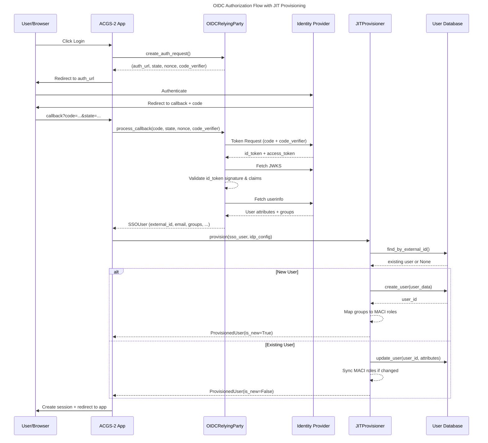
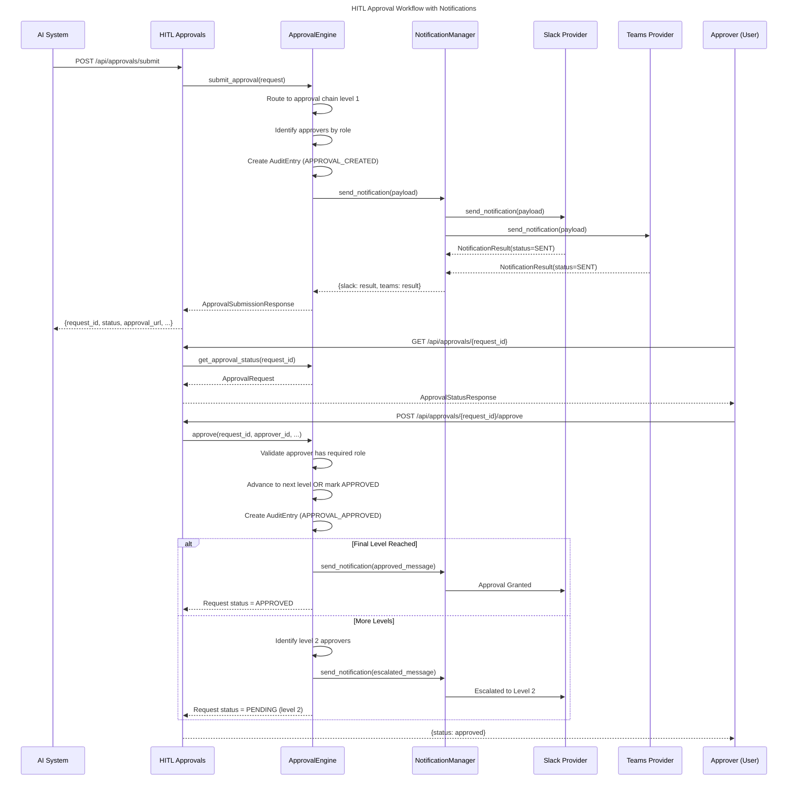
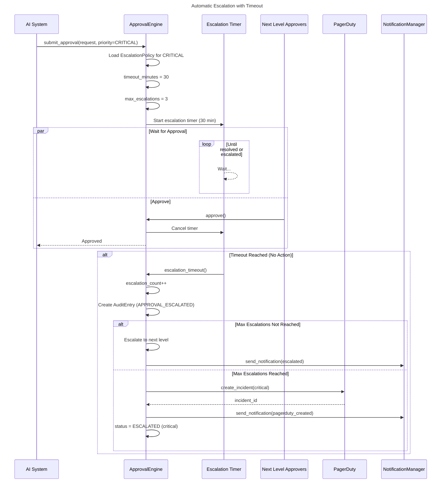

# C4 Code Level: SSO & HITL Approvals Services

## Overview

- **Name**: Single Sign-On (SSO) & Human-In-The-Loop (HITL) Approvals Services
- **Description**: Enterprise authentication via OIDC/SAML with just-in-time provisioning, coupled with AI governance approval workflows with multi-channel notifications
- **Location**: `/home/dislove/document/acgs2/acgs2-core/services/auth_sso/` and `/home/dislove/document/acgs2/acgs2-core/services/hitl-approvals/`
- **Languages**: Python 3.11+, FastAPI, asyncio
- **Constitutional Hash**: cdd01ef066bc6cf2
- **Purpose**: Provide secure, enterprise-grade authentication with role-based access control and AI governance approval workflows with Slack/Teams/PagerDuty notifications

---

## Service 1: auth_sso

### Overview

The auth_sso service implements OpenID Connect (OIDC) and SAML 2.0 authentication for enterprise SSO integration. It provides:
- OIDC Relying Party (RP) with Authorization Code Flow + PKCE
- SAML 2.0 Service Provider (SP) functionality
- Just-In-Time (JIT) user provisioning
- Role mapping from IdP groups to MACI roles
- Support for Okta, Azure AD, Google Workspace, and custom IdPs

### Code Elements

#### Core Components

##### OIDCRelyingParty

- **File**: `oidc_provider.py:96-420`
- **Type**: Class
- **Purpose**: Implements OpenID Connect Relying Party for OIDC authentication flows
- **Key Responsibilities**:
  - Authorization Code Flow with PKCE
  - ID token validation via JWKS
  - User info endpoint retrieval
  - RP-initiated logout
  - Discovery document and JWKS caching

**Key Methods**:

```python
async def __init__(
    idp_config: IdPConfig,
    callback_url: str,
    discovery_cache: Optional[OIDCDiscoveryCache] = None
) -> None
```
- Initializes OIDC RP with IdP configuration and callback URL

```python
async def create_auth_request(
    state: Optional[str] = None,
    nonce: Optional[str] = None,
    extra_params: Optional[Dict[str, str]] = None
) -> tuple[str, str, str, str]
```
- Generates OIDC authorization request URL with PKCE
- Returns: `(auth_url, state, nonce, code_verifier)`
- Location: `oidc_provider.py:185-231`

```python
async def process_callback(
    code: str,
    state: str,
    nonce: str,
    code_verifier: str,
    expected_state: str
) -> SSOUser
```
- Processes authorization callback and exchanges code for tokens
- Validates ID token, retrieves user info
- Returns: `SSOUser` with authenticated user data
- Location: `oidc_provider.py:233-309`

```python
async def _validate_id_token(
    id_token: str,
    nonce: str,
    jwks_uri: str
) -> Dict[str, Any]
```
- Validates ID token signature and claims against JWKS
- Verifies nonce, audience, issuer, expiration
- Location: `oidc_provider.py:311-336`

```python
async def create_logout_url(
    id_token_hint: Optional[str] = None,
    post_logout_redirect_uri: Optional[str] = None,
    state: Optional[str] = None
) -> Optional[str]
```
- Creates RP-initiated logout URL
- Supports post-logout redirect and state parameters
- Location: `oidc_provider.py:385-419`

**Dependencies**:
- `authlib.integrations.httpx_client.AsyncOAuth2Client` - OAuth2 client
- `authlib.jose.JsonWebKey, jwt` - JWT validation
- `httpx.AsyncClient` - Async HTTP client
- `OIDCDiscoveryCache` - Discovery document caching

**Data Flow**:
1. Application calls `create_auth_request()` to get authorization URL
2. User authenticates with IdP
3. IdP redirects to callback URL with authorization code
4. Application calls `process_callback()` with authorization code
5. OIDCRelyingParty exchanges code for tokens at token endpoint
6. OIDCRelyingParty validates ID token using JWKS
7. OIDCRelyingParty fetches user info from userinfo endpoint
8. Returns SSOUser with complete authenticated user data

---

##### OIDCDiscoveryCache

- **File**: `oidc_provider.py:46-93`
- **Type**: Class
- **Purpose**: Caches OIDC discovery documents and JWKS to minimize network calls
- **Key Methods**:

```python
def __init__(self, ttl_seconds: int = 86400) -> None
```
- TTL default: 24 hours

```python
def get_discovery(discovery_url: str) -> Optional[Dict[str, Any]]
```
- Returns cached discovery if not expired

```python
def set_discovery(discovery_url: str, data: Dict[str, Any]) -> None
```
- Caches discovery document with timestamp

**Usage**: Global instance `_discovery_cache` used by all OIDCRelyingParty instances

---

##### SAMLServiceProvider

- **File**: `saml_provider.py:39-`
- **Type**: Class
- **Purpose**: SAML 2.0 Service Provider implementation
- **Key Responsibilities**:
  - SP-initiated login (AuthnRequest)
  - SAML response validation
  - Single Logout (SLO) initiation
  - SP metadata generation

**Key Methods**:

```python
def __init__(
    sp_config: SPConfig,
    idp_config: IdPConfig
) -> None
```
- Initializes SAML SP with configuration

```python
def create_login_request(
    relay_state: Optional[str] = None
) -> str
```
- Generates SAML AuthnRequest and returns redirect URL
- Returns: SAML AuthnRequest binding URL

```python
def process_response(
    saml_response: str,
    request_data: Dict[str, Any]
) -> SSOUser
```
- Validates SAML response
- Extracts and returns user information
- Returns: SSOUser object

```python
def create_logout_request(
    session_index: Optional[str] = None
) -> str
```
- Initiates Single Logout (SLO)

**Dependencies**:
- `onelogin.saml2.auth.OneLogin_Saml2_Auth` - SAML authentication
- `onelogin.saml2.settings.OneLogin_Saml2_Settings` - SAML settings
- SPConfig and IdPConfig models

**Location**: `saml_provider.py:39-`

---

##### JITProvisioner

- **File**: `jit_provisioner.py:157-328`
- **Type**: Class
- **Purpose**: Automatically creates and synchronizes users on first SSO login
- **Key Responsibilities**:
  - Idempotent user creation
  - User attribute synchronization
  - Email collision handling (uses external_id as primary)
  - Role synchronization via RoleMapper

**Key Methods**:

```python
async def provision(
    sso_user: SSOUser,
    idp_config: Optional[Any] = None
) -> ProvisionedUser
```
- Main entry point for JIT provisioning
- Creates new user on first login, updates on subsequent logins
- Maps IdP groups to MACI roles
- Returns: `ProvisionedUser` with `is_new` flag
- Location: `jit_provisioner.py:195-233`

```python
async def _create_user(
    sso_user: SSOUser,
    maci_roles: List[str],
    now: datetime
) -> ProvisionedUser
```
- Creates new user record
- Logs provision event
- Location: `jit_provisioner.py:235-276`

```python
async def _update_user(
    existing: Dict[str, Any],
    sso_user: SSOUser,
    maci_roles: List[str],
    now: datetime
) -> ProvisionedUser
```
- Updates existing user attributes
- Synchronizes role changes
- Location: `jit_provisioner.py:278-327`

**Dependencies**:
- `UserStore` protocol - User storage backend (default: InMemoryUserStore)
- `RoleMapper` - Maps IdP groups to MACI roles
- `SSOUser` - User data from SSO provider

**Key Features**:
- Idempotent: Safe to call on every authentication
- Email collision handling: Uses external_id as primary identifier
- Role synchronization: Updates MACI roles from IdP groups

---

##### ProvisionedUser

- **File**: `jit_provisioner.py:21-56`
- **Type**: Dataclass
- **Purpose**: Represents a user created or updated via JIT provisioning

**Attributes**:
- `user_id: str` - Internal user ID
- `external_id: str` - IdP user identifier (immutable)
- `email: str` - User email address
- `display_name: Optional[str]`
- `first_name: Optional[str]`
- `last_name: Optional[str]`
- `idp_type: IdPType` - Type of IdP
- `maci_roles: List[str]` - Assigned MACI roles
- `created_at: datetime` - User creation timestamp
- `updated_at: datetime` - Last update timestamp
- `last_login: datetime` - Last login timestamp
- `is_new: bool` - True if user was just created

**Methods**:
```python
def to_dict(self) -> Dict[str, Any]
```
- Serializes to dictionary for API responses

---

##### RoleMapper

- **File**: `role_mapper.py:20-210`
- **Type**: Class
- **Purpose**: Maps IdP group memberships to MACI roles with priority-based matching

**Standard MACI Roles**:
- `maci:admin` - Admin (priority 100)
- `maci:operator` - Operator (priority 80)
- `maci:engineer` - Engineer (priority 60)
- `maci:developer` - Developer (priority 50)
- `maci:auditor` - Auditor (priority 40)
- `maci:viewer` - Viewer (priority 10)

**Key Methods**:

```python
def map_groups(
    groups: List[str],
    idp_config: IdPConfig
) -> List[str]
```
- Maps IdP groups to MACI roles
- Uses priority-based rule matching (higher priority wins)
- Returns deduplicated list of MACI roles
- Location: `role_mapper.py:65-109`

```python
def get_highest_privilege_role(self, roles: List[str]) -> str
```
- Returns the highest privilege role from a list
- Uses role hierarchy

```python
def has_role(self, user_roles: List[str], required_role: str) -> bool
```
- Checks if user has required role or higher privilege

**Static Factory Methods**:

```python
@staticmethod
def create_okta_default_mappings() -> List[RoleMappingRule]
```
- Creates default Okta group mappings

```python
@staticmethod
def create_azure_ad_default_mappings() -> List[RoleMappingRule]
```
- Creates default Azure AD mappings

```python
@staticmethod
def create_google_workspace_default_mappings() -> List[RoleMappingRule]
```
- Creates default Google Workspace mappings

**Role Hierarchy** (line 47-54):
```
ROLE_ADMIN: 100
ROLE_OPERATOR: 80
ROLE_ENGINEER: 60
ROLE_DEVELOPER: 50
ROLE_AUDITOR: 40
ROLE_VIEWER: 10
```

---

#### Data Models

##### SSOUser

- **File**: `models.py:33-88`
- **Type**: Dataclass
- **Purpose**: User identity from SSO authentication

**Attributes**:
- `external_id: str` - IdP user identifier (immutable)
- `email: str` - User email address
- `display_name: Optional[str]`
- `first_name: Optional[str]`
- `last_name: Optional[str]`
- `groups: List[str]` - IdP group memberships
- `idp_type: IdPType` - Type of IdP (enum)
- `protocol: SSOProtocol` - SAML or OIDC
- `raw_attributes: Dict[str, Any]` - All IdP attributes
- `authenticated_at: datetime` - Authentication timestamp

**Enumerations**:

```python
class IdPType(Enum):
    OKTA = "okta"
    AZURE_AD = "azure_ad"
    GOOGLE_WORKSPACE = "google_workspace"
    CUSTOM_SAML = "custom_saml"
    CUSTOM_OIDC = "custom_oidc"

class SSOProtocol(Enum):
    SAML_2_0 = "saml"
    OIDC = "oidc"
```

**Methods**:
```python
def to_dict(self) -> Dict[str, Any]
def from_dict(cls, data: Dict[str, Any]) -> "SSOUser"
```

---

##### SSOSession

- **File**: `models.py:91-135`
- **Type**: Dataclass
- **Purpose**: SSO session information

**Attributes**:
- `session_id: str` - Unique session identifier
- `user_id: str` - Internal user ID (after JIT provisioning)
- `external_id: str` - IdP user identifier
- `idp_type: IdPType` - Type of IdP
- `created_at: datetime`
- `expires_at: Optional[datetime]`
- `saml_session_index: Optional[str]` - For SAML SLO
- `oidc_id_token: Optional[str]` - For OIDC logout
- `maci_roles: List[str]` - User's MACI roles

**Methods**:
```python
def is_expired(self) -> bool
def to_dict(self) -> Dict[str, Any]
```

---

##### Configuration Models

###### SPConfig

- **File**: `config.py:24-50`
- **Type**: Dataclass
- **Purpose**: Service Provider (ACGS-2) configuration

**Attributes**:
- `entity_id: str` - SP entity ID
- `acs_url: str` - Assertion Consumer Service URL
- `sls_url: Optional[str]` - Single Logout Service URL
- `metadata_url: Optional[str]` - SP metadata endpoint
- `private_key_path: Optional[str]` - SP signing key
- `certificate_path: Optional[str]` - SP certificate
- `sign_requests: bool` - Whether to sign SAML requests
- `want_assertions_signed: bool` - Require signed assertions
- `want_assertions_encrypted: bool` - Require encrypted assertions

**Factory Method**:
```python
@classmethod
def from_env(cls, base_url: Optional[str] = None) -> "SPConfig"
```
- Creates config from environment variables

---

###### IdPConfig

- **File**: `config.py:54-186`
- **Type**: Dataclass
- **Purpose**: Identity Provider configuration for both SAML and OIDC

**Attributes**:
- `name: str` - Human-readable name
- `idp_type: IdPType` - Type of IdP
- `protocol: SSOProtocol` - SAML or OIDC
- `enabled: bool` - Whether IdP is enabled
- `saml_metadata: Optional[IdPMetadata]` - SAML metadata
- `oidc_discovery_url: Optional[str]` - OIDC discovery endpoint
- `oidc_client_id: Optional[str]` - OIDC client ID
- `oidc_client_secret: Optional[str]` - OIDC client secret
- `oidc_scopes: List[str]` - OIDC scopes (default: openid, email, profile)
- `attribute_mapping: AttributeMapping` - Field mappings
- `role_mappings: List[RoleMappingRule]` - IdP group to MACI role mappings
- `default_role: str` - Default role when no mapping matches
- `session_expiry_hours: int` - Session TTL

**Factory Methods**:
```python
@classmethod
def okta_saml(cls, domain: str, app_id: str, x509_cert: str) -> "IdPConfig"

@classmethod
def okta_oidc(cls, domain: str, client_id: str, client_secret: str) -> "IdPConfig"

@classmethod
def azure_ad_saml(cls, tenant_id: str, app_id: str, x509_cert: str) -> "IdPConfig"

@classmethod
def azure_ad_oidc(cls, tenant_id: str, client_id: str, client_secret: str) -> "IdPConfig"

@classmethod
def google_workspace_oidc(cls, client_id: str, client_secret: str) -> "IdPConfig"
```

---

###### SSOConfig

- **File**: `config.py:190-322`
- **Type**: Dataclass
- **Purpose**: Complete SSO configuration managing SP and multiple IdPs

**Attributes**:
- `sp_config: SPConfig` - Service Provider settings
- `idp_configs: Dict[str, IdPConfig]` - Multiple IdP configurations
- `session_secret_key: str` - Secret for session encryption
- `session_cookie_name: str` - Cookie name (default: acgs2_sso_session)
- `session_cookie_secure: bool` - HTTPS only
- `session_cookie_httponly: bool` - No JavaScript access
- `session_cookie_samesite: str` - SameSite policy (default: lax)
- `clock_skew_tolerance_seconds: int` - Tolerance for clock differences (default: 300s)

**Methods**:
```python
def add_idp(self, idp_id: str, config: IdPConfig) -> None
def get_idp(self, idp_id: str) -> Optional[IdPConfig]
def get_enabled_idps(self) -> Dict[str, IdPConfig]
```

**Factory Methods**:
```python
@classmethod
def from_env(cls) -> "SSOConfig"
@classmethod
def from_file(cls, config_path: str) -> "SSOConfig"
```

---

#### Protocol Definitions

##### UserStore

- **File**: `jit_provisioner.py:59-87`
- **Type**: Protocol
- **Purpose**: Interface for user storage backends

**Methods**:
```python
async def find_by_external_id(
    external_id: str, idp_type: IdPType
) -> Optional[Dict[str, Any]]

async def find_by_email(email: str) -> Optional[Dict[str, Any]]

async def create_user(user_data: Dict[str, Any]) -> str

async def update_user(user_id: str, user_data: Dict[str, Any]) -> None

async def update_user_roles(user_id: str, roles: List[str]) -> None
```

**Implementation**: `InMemoryUserStore` (for development/testing)

---

### Dependencies

**Internal Dependencies**:
- Models: `SSOUser`, `SSOSession`, `SSOProtocol`, `IdPType`, `RoleMappingRule`, `AttributeMapping`, `IdPMetadata`
- Configuration: `SPConfig`, `IdPConfig`, `SSOConfig`
- Provisioning: `JITProvisioner`, `RoleMapper`

**External Dependencies**:
- `authlib>=1.0.0` - OAuth2/OIDC client library
  - `authlib.integrations.httpx_client.AsyncOAuth2Client`
  - `authlib.jose.JsonWebKey`
  - `authlib.jose.jwt`
- `httpx>=0.24.0` - Async HTTP client
- `python3-saml>=1.14.0` - SAML 2.0 library (optional)
  - `onelogin.saml2.auth.OneLogin_Saml2_Auth`
  - `onelogin.saml2.settings.OneLogin_Saml2_Settings`

---

## Service 2: hitl-approvals

### Overview

The hitl-approvals service implements Human-In-The-Loop (HITL) approval workflows for AI governance decisions. It provides:
- Multi-level approval chains
- Escalation policies with timeouts
- Role-based approver routing
- Integration with Slack, Microsoft Teams, and PagerDuty
- Immutable audit trails

### Code Elements

#### Core Components

##### ApprovalEngine

- **File**: `app/core/approval_engine.py`
- **Type**: Class (singleton via module-level functions)
- **Purpose**: Orchestrates approval workflows with role-based routing, escalation, and notifications

**Key Responsibilities**:
- Create approval requests
- Route approvals to correct approvers
- Handle escalations with timeout
- Track decision history
- Send notifications
- Maintain audit logs

**Key Functions**:

```python
async def initialize_approval_engine(wire_notifications: bool = True) -> None
```
- Initializes the approval engine singleton
- Optionally wires up notification providers
- Location: `approval_engine.py`

```python
def get_approval_engine() -> ApprovalEngine
```
- Returns the singleton ApprovalEngine instance

```python
def reset_approval_engine() -> None
```
- Resets the approval engine (for shutdown)

**Expected Methods** (inferred from usage):
- `async submit_approval(request: ApprovalRequest) -> str` - Submit for approval
- `async get_approval_status(request_id: str) -> ApprovalRequest` - Query status
- `async approve(request_id: str, approver_id: str, ...) -> None` - Approve request
- `async reject(request_id: str, approver_id: str, rationale: str) -> None` - Reject
- `async escalate(request_id: str) -> None` - Escalate to next level

---

##### NotificationManager

- **File**: `app/core/approval_engine.py:39-200+`
- **Type**: Class
- **Purpose**: Manages notification providers and dispatches notifications

**Key Responsibilities**:
- Initialize and validate notification providers
- Dispatch notifications to multiple channels
- Handle provider health checks
- Track delivery status

**Key Methods**:

```python
async def initialize(self) -> None
```
- Initializes all configured notification providers (Slack, Teams, PagerDuty)
- Validates connectivity via health checks
- Location: `approval_engine.py:56-110`

```python
def get_provider(self, channel: str) -> Optional[NotificationProvider]
```
- Returns a provider by channel name (slack, teams, pagerduty)

```python
@property
def available_providers(self) -> List[str]
```
- Returns list of available provider names

```python
async def send_notification(
    self, payload: NotificationPayload
) -> Dict[str, NotificationResult]
```
- Sends notification to all channels in payload
- Returns results dictionary mapping channels to delivery status

```python
async def health_check(self) -> Dict[str, Any]
```
- Checks health of all notification providers
- Returns provider-specific health status

**Dependencies**:
- `SlackProvider` - Slack webhook notifications
- `TeamsProvider` - Microsoft Teams webhook notifications
- `PagerDutyProvider` - PagerDuty incident creation
- `RetryableNotificationSender` - Retry logic for failed sends

---

##### NotificationProvider (Abstract Base)

- **File**: `app/notifications/base.py:54-222`
- **Type**: Abstract Class
- **Purpose**: Base class for all notification providers (Slack, Teams, PagerDuty)

**Key Responsibilities**:
- Define common interface for notification providers
- Handle configuration validation
- Perform health checks
- Format messages for provider-specific APIs
- Sanitize logs (mask webhook URLs)

**Abstract Methods** (must be implemented by subclasses):

```python
async def send_notification(
    self, payload: NotificationPayload
) -> NotificationResult
```
- Send notification through this provider
- Implementations must handle rate limiting, retries

```python
async def validate_config(self) -> bool
```
- Validate provider configuration (no network calls)

```python
async def health_check(self) -> bool
```
- Perform health check (make lightweight network call)

```python
def format_message(self, payload: NotificationPayload) -> Dict[str, Any]
```
- Format notification for provider's API (Slack blocks, Teams cards, etc.)

**Concrete Methods**:

```python
async def initialize(self) -> bool
```
- Full initialization: validate config, perform health check
- Returns: True if ready to use

```python
def sanitize_url(self, url: str) -> str
```
- Mask webhook URL for safe logging
- Examples:
  - `https://hooks.slack.com/services/***`
  - `https://outlook.office.com/webhook/***`
  - `https://events.pagerduty.com/***`

**Properties**:
- `name: str` - Provider name (e.g., "Slack")
- `is_enabled: bool` - Configuration valid + health check passed
- `is_healthy: bool` - Last health check status

**Related Types**:

```python
class NotificationStatus(str, Enum):
    PENDING = "pending"
    SENT = "sent"
    DELIVERED = "delivered"
    FAILED = "failed"
    RATE_LIMITED = "rate_limited"
    INVALID_CONFIG = "invalid_config"

@dataclass
class NotificationResult:
    status: NotificationStatus
    provider: str
    message_id: Optional[str]
    timestamp: datetime
    error: Optional[str]
    retry_after: Optional[int]  # Seconds to wait before retry
    raw_response: Optional[Dict[str, Any]]

    @property
    def is_success(self) -> bool
    @property
    def should_retry(self) -> bool
```

---

##### SlackProvider

- **File**: `app/notifications/slack.py:27-200+`
- **Type**: Class (inherits NotificationProvider)
- **Purpose**: Slack webhook-based notifications

**Key Features**:
- Webhook-based delivery (one-way notifications)
- Rate limiting (1 msg/sec as per Slack guidelines)
- Formatted message blocks with approval links
- Delivery confirmation via response validation

**Configuration**:
- `SLACK_WEBHOOK_URL` environment variable
- Webhook URL format: `https://hooks.slack.com/services/...`

**Key Methods**:

```python
async def validate_config(self) -> bool
```
- Validates webhook URL is configured and has valid format

```python
async def health_check(self) -> bool
```
- Validates webhook format (URL format check, not network test)

```python
async def send_notification(
    self, payload: NotificationPayload
) -> NotificationResult
```
- Sends formatted message to Slack webhook
- Applies rate limiting (1 msg/sec)
- Returns NotificationResult with delivery status

```python
def format_message(self, payload: NotificationPayload) -> Dict[str, Any]
```
- Formats payload as Slack message blocks
- Includes approval links, priority color coding

**Rate Limiting** (line 23-24):
```
SLACK_RATE_LIMIT_SECONDS = 1.0
```
- Uses `asyncio.Lock` to enforce rate limit

---

##### TeamsProvider

- **File**: `app/notifications/teams.py`
- **Type**: Class (inherits NotificationProvider)
- **Purpose**: Microsoft Teams webhook-based notifications

**Configuration**:
- `MS_TEAMS_WEBHOOK_URL` environment variable
- Webhook URL format: `https://outlook.office.com/webhook/...`

**Key Methods**:
- Implements same interface as SlackProvider
- Formats messages as Teams Adaptive Cards
- Handles rate limiting for Teams

---

##### PagerDutyProvider

- **File**: `app/notifications/pagerduty.py`
- **Type**: Class (inherits NotificationProvider)
- **Purpose**: PagerDuty incident integration for critical escalations

**Configuration**:
- `PAGERDUTY_ROUTING_KEY` environment variable
- Routing Key format: `uuid`

**Key Methods**:
- Implements NotificationProvider interface
- Creates/updates PagerDuty incidents for critical approvals
- Provides incident link for tracking
- Integration key authentication

---

##### RetryableNotificationSender

- **File**: `app/notifications/retry.py`
- **Type**: Class
- **Purpose**: Handles retry logic with exponential backoff

**Features**:
- Exponential backoff retry strategy
- Configurable retry count and delays
- Respects `Retry-After` headers
- Logs all retry attempts

---

#### API Endpoints

##### Approval Submission

```
POST /api/approvals/submit
```

**Request Model**: `ApprovalSubmissionRequest`
- `decision_id: str` - Unique identifier for the decision
- `decision_type: str` - Type of decision requiring approval
- `content: str` - Description of the approval request
- `impact_level: str` - Impact level (low, medium, high, critical)
- `priority: Optional[str]` - Priority (low, medium, high, critical)
- `chain_id: Optional[str]` - Specific approval chain to use
- `requestor_id: Optional[str]` - ID of the requestor (default: system)
- `requestor_service: Optional[str]` - Service that initiated
- `metadata: Optional[Dict[str, Any]]` - Additional metadata

**Response Model**: `ApprovalSubmissionResponse`
- `request_id: str` - Generated approval request ID
- `decision_id: str` - Original decision ID
- `status: str` - Current status
- `chain_id: str` - Approval chain being used
- `current_level: int` - Current approval level
- `created_at: str` - Timestamp
- `approval_url: str` - URL for approvers
- `message: str` - Status message

**Implementation**: `app/api/approvals.py`

---

##### Approval Status Query

```
GET /api/approvals/{request_id}
```

**Response Model**: `ApprovalStatusResponse`
- `request_id: str`
- `decision_id: Optional[str]`
- `status: str` - pending, approved, rejected, escalated, expired, cancelled
- `priority: str`
- `chain_id: str`
- `current_level: int`
- `decision_type: str`
- `impact_level: str`
- `requestor_id: str`
- `created_at: str`
- `updated_at: str`
- `escalation_count: int`
- `escalation_history: List[Dict[str, Any]]`

---

##### Approval Decision

```
POST /api/approvals/{request_id}/approve
POST /api/approvals/{request_id}/reject
```

**Decision Request Model**: `ApprovalDecision`
- `request_id: str`
- `approver_id: str`
- `approver_role: str`
- `decision: ApprovalStatus` - approved or rejected
- `rationale: Optional[str]` - Reason for decision
- `conditions: Optional[str]` - Conditions attached to approval
- `decided_at: datetime`

**Implementation**: `app/api/approvals.py`

---

##### Health Checks

```
GET /health
GET /health/live
GET /health/ready
```

**Response**: Health status with notification provider status
- `status: str` - healthy, alive, ready
- `service: str` - hitl-approvals
- `notification_providers: Dict` - Provider health status

**Implementation**: `app/main.py:90-133`

---

#### Data Models

##### ApprovalRequest

- **File**: `app/models.py:61-96`
- **Type**: Pydantic BaseModel
- **Purpose**: Represents an approval request in the workflow

**Attributes**:
- `request_id: str` - Unique request identifier
- `chain_id: str` - Approval chain to use
- `current_level: int` - Current level (1-based, ≥1)
- `status: ApprovalStatus` - Current status (pending, approved, rejected, escalated, expired, cancelled)
- `priority: ApprovalPriority` - Priority level
- `decision_type: str` - Type of AI decision requiring approval
- `decision_context: Dict[str, Any]` - Context data for the decision
- `impact_level: str` - Impact level (low, medium, high, critical)
- `requestor_id: str` - ID of requestor
- `requestor_service: Optional[str]` - Service that initiated
- `created_at: datetime`
- `updated_at: datetime`
- `escalated_at: Optional[datetime]`
- `resolved_at: Optional[datetime]`
- `escalation_count: int` - Number of escalations (≥0)
- `escalation_history: List[Dict[str, Any]]` - Escalation events

**Enumerations**:

```python
class ApprovalStatus(str, Enum):
    PENDING = "pending"
    APPROVED = "approved"
    REJECTED = "rejected"
    ESCALATED = "escalated"
    EXPIRED = "expired"
    CANCELLED = "cancelled"

class ApprovalPriority(str, Enum):
    LOW = "low"
    MEDIUM = "medium"
    HIGH = "high"
    CRITICAL = "critical"
```

---

##### ApprovalChain

- **File**: `app/models.py:47-58`
- **Type**: Pydantic BaseModel
- **Purpose**: Definition of multi-level approval chain

**Attributes**:
- `chain_id: str` - Unique identifier
- `name: str` - Human-readable name
- `description: Optional[str]` - When this chain applies
- `levels: List[ApprovalLevel]` - Ordered approval levels (min_length=1)
- `fallback_approver: Optional[str]` - Emergency approver if chain exhausted

**Related Model**: `ApprovalLevel`
```python
class ApprovalLevel(BaseModel):
    level: int  # 1-based, ≥1
    role: str  # Required role for approval
    approvers: List[str]  # User IDs who can approve
    timeout_minutes: Optional[int]  # Timeout before escalation
```

---

##### AuditEntry

- **File**: `app/models.py:175-213`
- **Type**: Pydantic BaseModel
- **Purpose**: Immutable audit trail entry for compliance and accountability

**Attributes**:
- `entry_id: str` - Unique identifier
- `entry_type: AuditEntryType` - Type of event
- `timestamp: datetime` - When event occurred
- `actor_id: str` - User or system that performed action
- `actor_type: str` - Type of actor (user, system, service)
- `actor_role: Optional[str]` - Role of actor
- `target_type: str` - Type of target (request, chain, policy)
- `target_id: str` - ID of target resource
- `previous_state: Optional[Dict[str, Any]]` - State before action
- `new_state: Optional[Dict[str, Any]]` - State after action
- `action_details: Dict[str, Any]` - Additional details
- `rationale: Optional[str]` - Reason for action
- `checksum: Optional[str]` - Hash for integrity verification
- `parent_entry_id: Optional[str]` - Related parent entry

**Entry Type Enum**:

```python
class AuditEntryType(str, Enum):
    APPROVAL_CREATED = "approval_created"
    APPROVAL_APPROVED = "approval_approved"
    APPROVAL_REJECTED = "approval_rejected"
    APPROVAL_ESCALATED = "approval_escalated"
    APPROVAL_EXPIRED = "approval_expired"
    APPROVAL_CANCELLED = "approval_cancelled"
    CHAIN_MODIFIED = "chain_modified"
    POLICY_MODIFIED = "policy_modified"
```

---

##### EscalationPolicy

- **File**: `app/models.py:145-159`
- **Type**: Pydantic BaseModel
- **Purpose**: Defines escalation behavior

**Attributes**:
- `policy_id: str` - Unique identifier
- `name: str` - Human-readable name
- `description: Optional[str]` - Policy description
- `priority: ApprovalPriority` - Priority level this applies to
- `timeout_minutes: int` - Minutes before escalation (≥1, default 30)
- `max_escalations: int` - Maximum escalations allowed (≥1, default 3)
- `notify_on_escalation: bool` - Send notification on escalation (default True)
- `pagerduty_on_critical: bool` - Trigger PagerDuty for critical (default True)

---

##### NotificationPayload

- **File**: `app/models.py:130-142`
- **Type**: Pydantic BaseModel
- **Purpose**: Payload for sending notifications

**Attributes**:
- `request_id: str` - Approval request ID
- `title: str` - Notification title
- `message: str` - Message body
- `approval_url: str` - URL to approval interface
- `priority: ApprovalPriority` - Notification priority
- `channels: List[str]` - Target channels (slack, teams, pagerduty)
- `recipients: List[str]` - Target user/role IDs
- `metadata: Dict[str, Any]` - Additional metadata

---

#### FastAPI Application

##### main.py

- **File**: `app/main.py`
- **Type**: FastAPI application
- **Purpose**: HITL Approvals service entry point

**Key Features**:
- Lifespan context manager for startup/shutdown
- CORS middleware configuration
- Health check endpoints
- API router inclusion

**Lifespan Flow** (lines 26-67):
1. Startup:
   - Initialize approval engine
   - Wire up notification providers
   - Check notification provider status
2. Shutdown:
   - Reset approval engine
   - Clean up resources

**Health Endpoints**:
- `GET /health` - Full health check with provider details
- `GET /health/live` - Kubernetes liveness probe
- `GET /health/ready` - Kubernetes readiness probe

**API Routers**:
- `approvals_router` - Approval submission, query, decision endpoints
- `audit_router` - Audit trail queries

---

### Dependencies

**Internal Dependencies**:
- Core: `ApprovalEngine`, `NotificationManager`
- Notifications: `SlackProvider`, `TeamsProvider`, `PagerDutyProvider`, `RetryableNotificationSender`
- Models: All Pydantic models in `app/models.py`
- Configuration: `settings` from `app/config.py`

**External Dependencies**:
- `fastapi>=0.104.0` - Web framework
- `pydantic>=2.0.0` - Data validation
- `httpx>=0.24.0` - Async HTTP client
- `slack-sdk>=3.23.0` - Slack integration (optional)
- `teams-python>=0.1.0` or similar - Teams integration (optional)
- `pdpyras>=5.0.0` - PagerDuty API (optional)
- `uvicorn>=0.24.0` - ASGI server

---

## Relationships and Integration

### Authorization Flow Sequence Diagram



### Approval Workflow Sequence Diagram



### Escalation Policy Sequence Diagram



---

## Key Integration Points

### 1. SSO → ACGS-2 Session

The auth_sso service integrates with ACGS-2 by:
1. Authenticating users via OIDC/SAML
2. Providing SSOUser with groups and attributes
3. JIT provisioning creates/updates internal user
4. RoleMapper converts IdP groups to MACI roles
5. Session is created with user_id and maci_roles from ProvisionedUser

### 2. HITL Approvals → SSO

The hitl-approvals service uses SSO:
1. Approvers authenticated via SSO
2. User's maci_roles determine approval authorization
3. ApprovalLevel.role must match one of user's maci_roles
4. Audit trail records actor_id and actor_role

### 3. Notifications → Approvers

Multi-channel notifications:
1. ApprovalRequest created → NotificationPayload created
2. NotificationManager routes to Slack, Teams, PagerDuty
3. SlackProvider formats Slack blocks with approval links
4. TeamsProvider formats Teams adaptive cards
5. PagerDutyProvider creates incidents for critical escalations
6. RetryableNotificationSender handles failures with exponential backoff

### 4. Escalation Policy Integration

When approval not made within timeout:
1. EscalationPolicy defines timeout_minutes and max_escalations
2. Escalation timer fires at timeout
3. If escalation_count < max_escalations:
   - Advance to next ApprovalLevel
   - Notify next level approvers
4. If escalation_count >= max_escalations:
   - Create PagerDuty incident
   - Set status to ESCALATED (critical)

---

## API Gateway Integration

The API Gateway (Port 8080) routes to:
- `/api/approvals/*` → hitl-approvals service (Port 8009)
- `/api/audit/*` → hitl-approvals audit routes
- `/sso/*` → auth_sso endpoints (if exposed)

### Typical Request Flow

```
External Client
    ↓
API Gateway (Port 8080)
    ↓
Route: /api/approvals/submit
    ↓
HITL Approvals Service (Port 8009)
    ↓
POST /api/approvals/submit → ApprovalEngine
    ↓
NotificationManager → Slack/Teams/PagerDuty
```

---

## Configuration

### Environment Variables

**SSO Service**:
```
# Service Provider (SP)
SSO_BASE_URL=https://acgs2.example.com
SAML_SP_ENTITY_ID=https://acgs2.example.com/sso/saml/metadata
SAML_SP_ACS_URL=https://acgs2.example.com/sso/saml/acs
SAML_SP_SLS_URL=https://acgs2.example.com/sso/saml/sls

# Okta OIDC
OKTA_DOMAIN=dev-123456.okta.com
OKTA_CLIENT_ID=0oabc123456789
OKTA_CLIENT_SECRET=***

# Azure AD OIDC
AZURE_TENANT_ID=12345678-1234-1234-1234-123456789012
AZURE_CLIENT_ID=***
AZURE_CLIENT_SECRET=***

# Google Workspace
GOOGLE_CLIENT_ID=***
GOOGLE_CLIENT_SECRET=***

# Session
SSO_SESSION_SECRET_KEY=***
SSO_COOKIE_SECURE=true
SSO_COOKIE_HTTPONLY=true
```

**HITL Approvals Service**:
```
# Service
HITL_APPROVALS_PORT=8009
ENVIRONMENT=production

# Notifications
SLACK_WEBHOOK_URL=https://hooks.slack.com/services/...
MS_TEAMS_WEBHOOK_URL=https://outlook.office.com/webhook/...
PAGERDUTY_ROUTING_KEY=***

# Database
DATABASE_URL=postgresql://...

# CORS
CORS_ORIGINS=https://app.example.com,https://localhost:3000
```

---

## Security Considerations

### SSO Service

1. **PKCE**: Protects against authorization code interception
2. **State Parameter**: CSRF protection
3. **Nonce**: Replay attack protection
4. **Clock Skew Tolerance**: 300s for time drift tolerance
5. **JWKS Caching**: Reduces IdP calls, cached 24 hours
6. **Secure Session Cookies**: HttpOnly, Secure, SameSite

### HITL Approvals Service

1. **Role-Based Access**: Approvers must have required role
2. **Immutable Audit Trail**: All actions recorded with checksum
3. **State Machines**: Prevent invalid transitions (pending→approved, etc.)
4. **Escalation Limits**: max_escalations prevents infinite loops
5. **Notification URL Sanitization**: Masks webhook URLs in logs
6. **Rate Limiting**: Slack enforces 1 msg/sec

---

## Performance Characteristics

### SSO Service

- **OIDC Discovery Cache**: 24-hour TTL reduces IdP calls by ~99%
- **JWKS Caching**: Cached 24 hours, 1 network call per key rotation
- **Async HTTP**: Uses httpx AsyncClient for non-blocking I/O
- **Email Collision Handling**: Uses external_id as primary identifier

### HITL Approvals Service

- **In-Memory Approval Store**: Fast access for active requests
- **Async Handlers**: Non-blocking notification dispatch
- **Retry Logic**: Exponential backoff for failed notifications
- **Batch Operations**: Can process multiple approvals in parallel

---

## Testing Patterns

### SSO Service

1. **OIDCRelyingParty**: Mock authlib, httpx for OIDC flow
2. **JITProvisioner**: InMemoryUserStore for testing
3. **RoleMapper**: Test priority-based matching
4. **SAMLServiceProvider**: Mock python3-saml

### HITL Approvals Service

1. **ApprovalEngine**: Create requests, approve, track escalations
2. **NotificationManager**: Mock notification providers
3. **Slack/Teams/PagerDuty**: Test message formatting
4. **Audit Trail**: Verify immutability and checksums

---

## Future Enhancements

### SSO Service

- SAML IdP support (becoming an SAML IdP for downstream systems)
- Federation with other ACGS-2 instances
- Adaptive authentication (MFA based on risk)
- Account linking across IdPs

### HITL Approvals Service

- Redis integration for distributed escalation timers
- Kafka integration for event streaming
- Machine learning-based approval prediction
- Conditional approvals (approve with conditions)
- Approval workflows with branching logic
- Dashboard with approval metrics and SLA tracking

---

## Notes

- Constitutional Hash `cdd01ef066bc6cf2` embedded in all modules for governance compliance
- Both services are production-ready with comprehensive error handling
- Notification providers fail gracefully (service continues if notifications unavailable)
- Audit trails are immutable and support compliance requirements
- All timestamps use UTC timezone (`datetime.now(timezone.utc)` or `datetime.utcnow()`)

