# C4 Component Level: External Integrations Component

<!-- Constitutional Hash: cdd01ef066bc6cf2 -->

## Overview

- **Name**: External Integrations Component
- **Description**: Integration layer connecting ACGS-2 constitutional governance with external systems including NVIDIA NeMo-Agent-Toolkit, policy engines (OPA), formal verification solvers (Z3), blockchain platforms, and search infrastructure
- **Type**: Integration Component
- **Technology**: Python 3.11+ with async HTTP clients, blockchain SDKs, and SMT solvers
- **Constitutional Hash**: `cdd01ef066bc6cf2`

## Purpose

The External Integrations Component provides seamless connectivity between ACGS-2's constitutional AI governance framework and third-party platforms while maintaining constitutional hash validation across all external communication boundaries. This component serves as the anti-corruption layer (ACL) that protects the constitutional integrity of the governance system when interfacing with external services.

**Key Responsibilities**:
- **NeMo Integration**: Wrap AI agents from LangChain, LlamaIndex, CrewAI, and NeMo with constitutional guardrails
- **Policy Enforcement**: Integrate with OPA (Open Policy Agent) for real-time policy evaluation
- **Formal Verification**: Connect to Z3 SMT solver for constraint validation and proof generation
- **Blockchain Anchoring**: Store immutable audit trails on Arweave, Ethereum L2, and Hyperledger Fabric
- **Search Platform**: High-performance search across code, audit trails, and constitutional policies
- **Anti-Corruption Layer**: Prevent constitutional compromise through standardized adapters with circuit breakers

## Software Features

### Constitutional Guardrails for AI Agents
- **Input/Output Validation**: Real-time content validation against constitutional principles (privacy, safety, ethics, compliance)
- **PII Detection**: 15+ pattern recognition (SSN, credit card, email, phone, custom patterns)
- **Safety Checking**: Harmful content detection with configurable safety patterns
- **NIM Integration**: Optional NVIDIA NIM guardrail microservice for enhanced content safety
- **Reasoning Validation**: Monitor LLM reasoning traces to detect guardrail bypass attempts
- **Audit Logging**: Comprehensive audit trail of all guardrail checks with trace IDs
- **Multi-Framework Support**: Wrap agents from LangChain, LlamaIndex, CrewAI, and custom implementations
- **Performance**: <100ms check latency with constitutional validation at every boundary

### Model Context Protocol (MCP) Bridge
- **MCP Server**: Expose ACGS-2 governance tools to NeMo agents via MCP protocol
- **Constitutional Validation Tool**: Validate agent actions against constitutional principles
- **Compliance Checking Tool**: Real-time policy compliance verification
- **Audit Action Tool**: Record governance decisions in immutable audit trail
- **Policy Retrieval Tool**: Query active policies with filtering
- **Approval Request Tool**: Submit high-risk decisions for governance review
- **Remote Client**: Connect to ACGS-2 services from distributed NeMo deployments

### Anti-Corruption Layer (ACL) Adapters
- **Base ACL Pattern**: Abstract adapter with retry logic, circuit breakers, caching, and timeout handling
- **Z3 Adapter**: Formal verification through SMT-LIB2 constraint solving (30-35s timeout, proof/model generation)
- **OPA Adapter**: Policy enforcement with fail-closed security (<1s evaluation, Rego language)
- **Circuit Breaker Integration**: 3-state circuit breaker (CLOSED/OPEN/HALF_OPEN) with exponential backoff
- **Response Caching**: TTL-based caching (Z3: 1 hour, OPA: 1 minute) for deterministic results
- **Rate Limiting**: Configurable rate limits (default: 100 RPS) per adapter
- **Performance Metrics**: Success rate, latency percentiles (P50/P95/P99), circuit breaker state tracking

### Blockchain Integration
- **Arweave Client**: Permanent decentralized storage with one-time payment model (mainnet at arweave.net)
- **Ethereum L2 Client**: Cost-efficient audit hash anchoring on Arbitrum/Optimism/Base
- **Hyperledger Fabric Client**: Enterprise permissioned blockchain with channel-based architecture
- **Transaction Management**: Async transaction submission with status tracking
- **Verification**: Query and verify blockchain-anchored audit records
- **Immutability**: Cryptographic proof of governance decisions and audit trails

### Search Platform Integration
- **High-Performance Search**: Code search, audit trail search, compliance reporting
- **Constitutional Code Search**: Search for potential constitutional violations in code
- **Principle-Based Search**: Find code by constitutional principle (privacy, fairness, transparency)
- **Audit Trail Search**: Query audit logs with filters (date, actor, action, outcome)
- **Governance Impact Analysis**: Analyze impact of code changes on governance
- **Compliance Reporting**: Generate compliance reports for date ranges
- **Multi-Domain Support**: CODE, AUDIT, POLICIES, GOVERNANCE search domains

### Governance Profiler
- **Compliance Metrics**: Total requests, compliant/blocked/modified counts, compliance rate
- **Violation Tracking**: Privacy, safety, ethics, compliance violation counts by type
- **Guardrail Metrics**: Input/output checks, blocks, PII redactions
- **Performance Analytics**: Average check latency, P50/P95/P99 latencies
- **Constitutional Monitoring**: Track constitutional hash validation across all operations

## Code Elements

This component contains the following code-level elements:

- [c4-code-integrations.md](./c4-code-integrations.md) - External integrations layer including NeMo, ACL adapters, blockchain clients, and search platform

### Key Classes and Modules

**NeMo Integration** (`integrations/nemo_agent_toolkit/`):
- `ConstitutionalGuardrails` - Input/output validation with PII detection and safety checking
- `ConstitutionalAgentWrapper` - Generic wrapper supporting LangChain, LlamaIndex, CrewAI agents
- `ACGS2MCPServer` - Model Context Protocol server exposing 6 governance tools
- `ACGS2MCPClient` - Remote client for distributed ACGS-2 access
- `ConstitutionalProfiler` - Governance metrics collection and analysis
- `NeMoAgentIntegration` - Direct hooks into NeMo optimization pipeline

**ACL Adapters** (`enhanced_agent_bus/acl_adapters/`):
- `ACLAdapter` - Abstract base with retry, circuit breaker, caching, timeout patterns
- `Z3Adapter` - SMT-LIB2 constraint solving with proof/model generation
- `OPAAdapter` - Rego policy evaluation with fail-closed security
- `AdapterConfig` - Configuration with constitutional hash validation
- `AdapterResult` - Response wrapper with success/error, latency, cache status

**Blockchain Clients** (`services/audit_service/blockchain/`):
- `ArweaveClient` - Permanent storage with transaction posting and querying
- `EthereumL2Client` - L2 smart contract interaction for audit hashing
- `HyperledgerFabricClient` - Enterprise chaincode interaction for audit records

**Search Platform** (`services/integration/search_platform/`):
- `SearchPlatformClient` - Search client with circuit breaker and connection pooling
- `ConstitutionalCodeSearchService` - Constitutional violation detection in code
- `AuditTrailSearchService` - Audit log search and compliance reporting

## Interfaces

### ConstitutionalGuardrails API

**Protocol**: Python Async API
**Description**: Validate content against constitutional principles with PII detection and safety checking

**Operations**:
- `async check_input(content: str, context: dict | None) -> GuardrailResult` - Validate input content
- `async check_output(content: str, context: dict | None, reasoning: str | None) -> GuardrailResult` - Validate output with optional reasoning trace
- `add_input_validator(validator: Callable) -> None` - Register custom input validator
- `add_output_validator(validator: Callable) -> None` - Register custom output validator
- `on_violation(violation_type: ViolationType, handler: Callable) -> None` - Register violation handler
- `get_audit_log() -> list[dict]` - Retrieve audit trail
- `async get_metrics() -> dict` - Get guardrail metrics

### ACGS2MCPServer API (Model Context Protocol)

**Protocol**: MCP (Model Context Protocol)
**Description**: Expose ACGS-2 governance tools to NeMo agents

**Operations**:
- `register_tool(tool: ConstitutionalMCPTool) -> None` - Register MCP tool
- `get_tool_definitions() -> list[dict]` - Get all tool definitions
- `async call_tool(name: str, arguments: dict) -> MCPToolResult` - Execute tool

**Registered Tools**:
- `acgs2_validate_constitutional` - Constitutional action validation
- `acgs2_check_compliance` - Policy compliance checking
- `acgs2_audit_action` - Audit trail recording
- `acgs2_get_policies` - Policy retrieval
- `acgs2_submit_approval` - Approval request submission
- `acgs2_check_governance` - Governance status checking

### ACL Adapter API

**Protocol**: Python Async API (Generic `ACLAdapter[T, R]`)
**Description**: Base interface for external system adapters with fault tolerance

**Operations**:
- `async call(request: T) -> AdapterResult[R]` - Execute with retry logic
- `async execute(request: T) -> AdapterResult[R]` - Abstract execution method (implemented by subclasses)
- `get_metrics() -> dict` - Get adapter performance metrics
- `reset() -> None` - Reset adapter state

### Z3Adapter API

**Protocol**: SMT-LIB2
**Description**: Formal verification through Z3 SMT solver

**Operations**:
- `async execute(request: Z3Request) -> AdapterResult[Z3Response]` - Solve SMT-LIB2 formula

**Request Fields**:
- `formula: str` - SMT-LIB2 formula
- `assertions: list[str]` - Specific assertions
- `get_model: bool` - Request model if satisfiable
- `get_proof: bool` - Request proof if unsatisfiable

**Response Fields**:
- `result: str` - sat/unsat/unknown
- `model: dict | None` - Variable assignments if sat
- `proof: str | None` - Proof if unsat
- `execution_time_ms: float` - Solver duration

### OPAAdapter API

**Protocol**: HTTP/REST to OPA server
**Description**: Policy evaluation through Open Policy Agent

**Operations**:
- `async execute(request: OPARequest) -> AdapterResult[OPAResponse]` - Evaluate Rego policy

**Request Fields**:
- `input: dict` - Input data for policy
- `policy_path: str | None` - Override default policy path
- `explain: bool` - Request explanation
- `metrics: bool` - Include OPA metrics

**Response Fields**:
- `decision: bool` - Allow/deny decision
- `reason: str | None` - Decision reasoning
- `metrics: dict | None` - OPA evaluation metrics
- `evaluation_time_ms: float` - Evaluation duration

### Blockchain Clients API

**Protocol**: Blockchain-specific (Arweave HTTP, Ethereum RPC, Fabric gRPC)
**Description**: Immutable audit trail anchoring on blockchain

**ArweaveClient Operations**:
- `connect() -> bool` - Connect to Arweave network
- `async post_transaction(data: dict, tags: list | None) -> dict` - Post audit data
- `async query_transaction(tx_id: str) -> dict | None` - Query transaction
- `get_balance() -> float` - Get wallet balance (AR tokens)

**EthereumL2Client Operations**:
- `connect() -> bool` - Connect to L2 network
- `async submit_audit_hash(audit_hash: str, metadata: dict) -> dict` - Submit hash to contract
- `async verify_audit_hash(audit_hash: str) -> bool` - Verify hash existence
- `get_transaction_status(tx_hash: str) -> str` - Get confirmation status

**HyperledgerFabricClient Operations**:
- `connect() -> bool` - Connect to Fabric network
- `async submit_audit_record(record: dict, chaincode_function: str) -> dict` - Submit to chaincode
- `async query_audit_record(audit_id: str) -> dict | None` - Query from ledger

### SearchPlatformClient API

**Protocol**: HTTP/REST with circuit breaker
**Description**: High-performance search across code, audit trails, and policies

**Operations**:
- `async search(request: SearchRequest) -> SearchResponse` - Execute search
- `async bulk_search(requests: list[SearchRequest]) -> list[SearchResponse]` - Parallel searches

**Request Fields**:
- `query: str` - Search pattern
- `domain: SearchDomain` - CODE, AUDIT, POLICIES, ALL
- `scope: SearchScope` - FILES, FUNCTIONS, CLASSES, MODULES
- `options: SearchOptions` - Filters, limits, sorting

**Response Fields**:
- `matches: list[SearchMatch]` - Search results
- `total_count: int` - Total matches
- `execution_time_ms: float` - Search duration
- `stats: SearchStats` - Search statistics

## Dependencies

### Components Used

**Enhanced Agent Bus Component**:
- Uses `EnhancedAgentBus` for message routing and constitutional validation
- Uses `MessageType`, `Priority`, `AgentMessage` for message structure
- Uses `validate_constitutional_hash` for hash validation at integration boundaries
- Uses exception hierarchy (`ConstitutionalError`, `PolicyEvaluationError`, etc.)

**Constitutional AI Component**:
- Uses constitutional validation services for guardrail integration
- Uses policy registry for OPA policy retrieval
- Uses audit service for blockchain anchoring

**Shared Services Component**:
- Uses `CONSTITUTIONAL_HASH` constant for governance marker
- Uses `CircuitBreaker` for fault tolerance patterns
- Uses Prometheus metrics integration for performance monitoring

### External Systems

**NVIDIA NeMo-Agent-Toolkit**:
- Optional integration for enterprise AI agent framework
- NIM guardrail microservice endpoint (default: http://localhost:8000/v1)
- Colang 2.x flow definitions for guardrail behaviors
- Connection: Async HTTP with JSON payloads

**Open Policy Agent (OPA)**:
- Policy evaluation engine for constitutional compliance
- Default endpoint: http://localhost:8181
- Policy path: /v1/data/acgs2/constitutional
- Language: Rego policy language
- Fail mode: Fail-closed (deny on connection failure)

**Z3 SMT Solver**:
- Formal verification for constraint solving
- Connection: Local process or remote service
- Timeout: 30-35 seconds (configurable)
- Memory limit: 1024 MB (configurable)

**Blockchain Networks**:
- **Arweave**: Permanent storage at arweave.net (HTTPS)
- **Ethereum L2**: Arbitrum/Optimism/Base via RPC endpoints
- **Hyperledger Fabric**: Enterprise blockchain via gRPC peer nodes

**Search Platform**:
- High-performance search backend
- Connection: HTTP/HTTPS with circuit breaker
- Supported backends: Elasticsearch or custom

**AI Agent Frameworks** (Optional):
- LangChain (chains, agent executors)
- LlamaIndex (query engines, ReActAgent)
- CrewAI (crew orchestration)

### Libraries

**Python Standard Library**:
- `asyncio` - Async/await runtime
- `logging` - Structured logging
- `dataclasses` - Type hints and data structures
- `datetime` - Timezone-aware datetime handling
- `enum` - Enumeration types
- `json` - JSON serialization
- `hashlib` - Cryptographic hashing
- `re` - Regular expression patterns
- `typing` - Type hints and generics

**External Python Libraries**:
- `httpx` - Async HTTP client (NIM, OPA, search)
- `aiohttp` - Alternative async HTTP (search platform)
- `z3-solver` - Z3 SMT solver Python bindings
- `arweave-python-client` - Arweave blockchain client (optional)
- `web3.py` - Ethereum Web3 client (optional)
- `fabric-sdk-py` - Hyperledger Fabric SDK (optional)
- `nemo-agent-toolkit` - NVIDIA NeMo integration (optional)
- `langchain`, `llama-index`, `crewai` - AI agent frameworks (optional)

## Component Diagram

```mermaid
C4Component
    title Component Diagram for External Integrations Component

    Container_Boundary(integrations_container, "External Integrations Component") {
        Component(nemo_guardrails, "NeMo Guardrails", "Python", "Constitutional guardrails for AI agents with PII detection")
        Component(agent_wrapper, "Agent Wrapper", "Python", "Generic wrapper for LangChain/LlamaIndex/CrewAI agents")
        Component(mcp_bridge, "MCP Bridge", "Python", "Model Context Protocol server/client for NeMo")
        Component(profiler, "Governance Profiler", "Python", "Metrics collection and compliance reporting")

        Component(acl_base, "ACL Base Adapter", "Python", "Abstract adapter with retry, circuit breaker, caching")
        Component(z3_adapter, "Z3 Adapter", "Python", "Formal verification through SMT solving")
        Component(opa_adapter, "OPA Adapter", "Python", "Policy evaluation with fail-closed security")

        Component(arweave, "Arweave Client", "Python", "Permanent decentralized storage")
        Component(ethereum, "Ethereum L2 Client", "Python", "Cost-efficient audit hash anchoring")
        Component(fabric, "Fabric Client", "Python", "Enterprise permissioned blockchain")

        Component(search_client, "Search Platform Client", "Python", "Code and audit trail search")
        Component(const_search, "Constitutional Search", "Python", "Violation detection in code")
        Component(audit_search, "Audit Search", "Python", "Audit trail search and reporting")
    }

    Container(agent_bus, "Enhanced Agent Bus", "Python", "Core message bus with constitutional validation")
    Container(const_ai, "Constitutional AI Services", "Python", "Core constitutional validation")
    Container(audit_service, "Audit Service", "Python", "Audit logging and compliance")

    System_Ext(nemo_toolkit, "NVIDIA NeMo", "AI agent framework with NIM guardrails")
    System_Ext(opa_server, "OPA Server", "Policy evaluation engine (Rego)")
    System_Ext(z3_solver, "Z3 Solver", "SMT solver for formal verification")
    System_Ext(blockchain_net, "Blockchain Networks", "Arweave/Ethereum L2/Fabric")
    System_Ext(search_engine, "Search Platform", "Elasticsearch or custom backend")
    System_Ext(ai_frameworks, "AI Frameworks", "LangChain/LlamaIndex/CrewAI")

    Rel(agent_wrapper, nemo_guardrails, "Uses", "Constitutional validation")
    Rel(mcp_bridge, nemo_guardrails, "Uses", "Guardrail checks")
    Rel(profiler, nemo_guardrails, "Collects from", "Governance metrics")

    Rel(z3_adapter, acl_base, "Extends", "Inherits fault tolerance")
    Rel(opa_adapter, acl_base, "Extends", "Inherits retry/circuit breaker")

    Rel(const_search, search_client, "Uses", "Search API")
    Rel(audit_search, search_client, "Uses", "Search API")

    Rel(nemo_guardrails, agent_bus, "Sends to", "AgentMessage with hash")
    Rel(mcp_bridge, agent_bus, "Sends to", "MCP tool results")
    Rel(nemo_guardrails, const_ai, "Validates with", "Constitutional principles")

    Rel(opa_adapter, opa_server, "Evaluates via", "HTTP/REST")
    Rel(z3_adapter, z3_solver, "Solves with", "SMT-LIB2")
    Rel(arweave, blockchain_net, "Posts to", "HTTPS")
    Rel(ethereum, blockchain_net, "Submits to", "RPC")
    Rel(fabric, blockchain_net, "Records to", "gRPC")
    Rel(search_client, search_engine, "Queries", "HTTP/REST")

    Rel(agent_wrapper, ai_frameworks, "Wraps", "Agent instances")
    Rel(mcp_bridge, nemo_toolkit, "Exposes to", "MCP tools")
    Rel(nemo_guardrails, nemo_toolkit, "Validates for", "NIM guardrails")

    Rel(arweave, audit_service, "Anchors from", "Audit records")
    Rel(ethereum, audit_service, "Anchors from", "Audit hashes")
    Rel(fabric, audit_service, "Anchors from", "Audit records")

    UpdateLayoutConfig($c4ShapeInRow="4", $c4BoundaryInRow="1")
```



**Key Principles Applied**:

1. **Component Grouping**: Organized into logical sub-components:
   - NeMo integration (guardrails, wrapper, MCP, profiler)
   - ACL adapters (base, Z3, OPA)
   - Blockchain clients (Arweave, Ethereum L2, Fabric)
   - Search platform (client, constitutional search, audit search)

2. **Component Interfaces**: Shows clear interfaces between sub-components:
   - Agent wrapper uses guardrails for validation
   - MCP bridge uses guardrails for tool execution
   - Z3 and OPA adapters extend ACL base adapter
   - Constitutional and audit search use search platform client

3. **External Dependencies**: Shows external systems:
   - NVIDIA NeMo-Agent-Toolkit for AI agent integration
   - OPA server for policy evaluation
   - Z3 solver for formal verification
   - Blockchain networks for immutable storage
   - Search platform for code/audit search
   - AI frameworks (LangChain, LlamaIndex, CrewAI)

4. **Integration with ACGS-2 Core**: Shows dependencies on:
   - Enhanced Agent Bus for message routing
   - Constitutional AI Services for validation
   - Audit Service for blockchain anchoring

5. **Constitutional Validation**: All components send messages with constitutional hash to agent bus

## Performance Characteristics

### Latency Targets

| Integration | P99 Latency | Notes |
|------------|-------------|-------|
| NeMo Guardrails | <100ms | PII detection, pattern matching, safety checks |
| OPA Policy Evaluation | <1s | Typically 100-500ms, configurable timeout |
| Z3 Solver | <35s | For complex constraint problems, configurable |
| Search Queries | <30s | Depends on query complexity and result set |
| Blockchain Transactions | Variable | Arweave: minutes, L2: seconds, Fabric: seconds |

### Throughput

- **ACL Adapters**: 100 RPS default (configurable per adapter)
- **Circuit Breaker**: Threshold of 5 failures before opening
- **Connection Pooling**: 10 connections per search client
- **Retry Attempts**: 3 maximum retries for transient failures

### Caching Strategy

- **Z3 Adapter**: 1 hour TTL (deterministic proofs)
- **OPA Adapter**: 1 minute TTL (policies may change)
- **Search Platform**: Client-side caching with circuit breaker
- **Cache Invalidation**: TTL-based expiration, manual reset available

### Error Handling

- **Fail-Closed Security**: OPA denies by default on connection failure
- **Graceful Degradation**: Non-critical integrations fall back to local validation
- **Circuit Breaker**: Automatic recovery from transient failures
- **Audit Logging**: All integration failures logged for compliance

## Security Considerations

### Constitutional Hash Enforcement

All integration points embed constitutional hash (`cdd01ef066bc6cf2`):
- **Guardrails**: Every check result includes constitutional hash
- **ACL Adapters**: All requests/responses validated against hash
- **Blockchain**: Audit records anchored with constitutional commitment
- **Search**: Constitutional searches filter by governance status

### Privacy Protection

- **PII Detection**: 15+ pattern recognition (SSN, credit card, email, phone, custom)
- **Redaction**: Configurable hashing vs masking strategies
- **Reasoning Validation**: Detects LLM attempts to bypass guardrails
- **Audit Trail**: Complete logging of all PII detections

### Access Control

- **OPA Policies**: Role-based access control enforcement
- **Constitutional Validation**: Every external call validated
- **Blockchain Immutability**: Prevents audit trail tampering
- **Fail-Closed Mode**: Security-first deny on failure

### Threat Mitigation

| Threat | Mitigation | Implementation |
|--------|-----------|----------------|
| Spoofing | Constitutional hash validation | `validators.py` in all adapters |
| Tampering | Blockchain anchoring | Arweave/Ethereum L2/Fabric clients |
| Repudiation | Immutable audit trails | Blockchain + trace IDs |
| Info Disclosure | PII detection + redaction | `ConstitutionalGuardrails` |
| DoS | Rate limiting + circuit breakers | ACL adapter base patterns |
| Elevation | OPA policy enforcement | `OPAAdapter` with fail-closed |

## Extensibility

### Adding New ACL Adapters

Subclass `ACLAdapter[T, R]` to integrate new external systems:

```python
from enhanced_agent_bus.acl_adapters.base import ACLAdapter, AdapterResult

class CustomAdapter(ACLAdapter[CustomRequest, CustomResponse]):
    async def execute(self, request: CustomRequest) -> AdapterResult[CustomResponse]:
        # Implement custom integration logic
        # Retry, circuit breaker, caching handled by base class
        pass
```

### Custom Guardrail Validators

Register custom validation functions:

```python
from integrations.nemo_agent_toolkit import ConstitutionalGuardrails

guardrails = ConstitutionalGuardrails()

# Add custom input validator
guardrails.add_input_validator(my_custom_validator)

# Add custom violation handler
guardrails.on_violation(ViolationType.PRIVACY, my_privacy_handler)
```

### New Blockchain Networks

Extend base blockchain client pattern:

```python
class CustomBlockchainClient:
    def __init__(self, config: dict):
        self.config = config

    def connect(self) -> bool:
        # Connect to blockchain network
        pass

    async def submit_audit_record(self, record: dict) -> dict:
        # Submit with constitutional hash
        pass
```

### Search Domain Expansion

Subclass search services:

```python
class CustomSearchService:
    def __init__(self, client: SearchPlatformClient):
        self.client = client

    async def custom_search(self, params: dict) -> list:
        # Implement custom search logic
        pass
```

## Deployment Considerations

### Service Dependencies

**Required Services**:
- ACGS-2 Core (Enhanced Agent Bus, Constitutional AI, Audit Service)
- Redis (for circuit breaker state and caching)

**Optional Services**:
- OPA server (for policy evaluation, can run locally)
- Z3 solver (can run in-process or remote)
- NIM guardrail microservice (optional NVIDIA service)
- Blockchain nodes (optional for audit anchoring)
- Search platform (optional for code/audit search)

### Configuration

**Environment Variables**:
```bash
# OPA Integration
OPA_URL=http://localhost:8181
OPA_POLICY_PATH=/v1/data/acgs2/constitutional
OPA_FAIL_CLOSED=true

# Blockchain Integration (optional)
ARWEAVE_WALLET_FILE=/path/to/wallet.json
ETHEREUM_L2_PROVIDER=https://arb1.arbitrum.io/rpc
FABRIC_CHANNEL=governance-channel

# Search Platform (optional)
SEARCH_PLATFORM_URL=http://localhost:9200
SEARCH_PLATFORM_API_KEY=<api_key>

# NIM Guardrails (optional)
NIM_ENDPOINT=http://localhost:8000/v1
NIM_MODEL=nvidia/nemotron-3-8b-steerlm
```

### Docker Deployment

All integration components run within the main ACGS-2 container, with optional external service connections:

```yaml
services:
  acgs2-core:
    image: acgs2/core:latest
    environment:
      - OPA_URL=http://opa:8181
      - CONSTITUTIONAL_HASH=cdd01ef066bc6cf2
    depends_on:
      - opa
      - redis

  opa:
    image: openpolicyagent/opa:latest
    ports:
      - "8181:8181"
    command: run --server --bundle /policies
    volumes:
      - ./policies:/policies
```

### Kubernetes Deployment

Deploy as part of ACGS-2 core deployment with optional sidecars:

```yaml
apiVersion: apps/v1
kind: Deployment
metadata:
  name: acgs2-integrations
spec:
  template:
    spec:
      containers:
      - name: acgs2-core
        image: acgs2/core:latest
        env:
        - name: OPA_URL
          value: "http://localhost:8181"
      - name: opa-sidecar
        image: openpolicyagent/opa:latest
        args: ["run", "--server", "--bundle", "/policies"]
```

## Notes

### Anti-Corruption Layer Pattern

All integrations follow the ACL pattern to prevent constitutional compromise:
- **Standardized Interface**: `ACLAdapter[T, R]` base class for all external systems
- **Circuit Breaker**: Automatic fault isolation and recovery
- **Retry Logic**: Configurable retry with exponential backoff
- **Timeout Handling**: Prevent indefinite blocking on external failures
- **Response Caching**: Reduce external system load and improve latency
- **Constitutional Validation**: Hash validation at every boundary

### Performance vs Security Trade-offs

- **Guardrail Latency**: <100ms adds negligible overhead to agent execution
- **OPA Evaluation**: <1s may impact real-time decision paths, consider caching
- **Z3 Solver**: 30-35s timeout suitable for offline verification, not real-time
- **Blockchain Anchoring**: Async/background submission to avoid blocking
- **Fail-Closed Mode**: Prioritizes security over availability (configurable)

### Integration Testing

Test integrations against mock services in CI/CD:
```bash
# With mock OPA server
pytest tests/test_opa_adapter.py -v

# With mock blockchain
pytest tests/test_blockchain_integration.py -v

# With real services (integration tests)
pytest -m integration tests/ -v
```

### Monitoring and Observability

All integrations emit Prometheus metrics:
- `acgs2_integration_calls_total{adapter="opa", status="success"}`
- `acgs2_integration_latency_seconds{adapter="z3", quantile="0.99"}`
- `acgs2_circuit_breaker_state{adapter="search", state="closed"}`
- `acgs2_guardrail_violations_total{type="privacy", action="block"}`

---

**Constitutional Compliance**: All integrations maintain 100% constitutional hash validation across external system boundaries, ensuring governance integrity throughout the enterprise AI platform.
