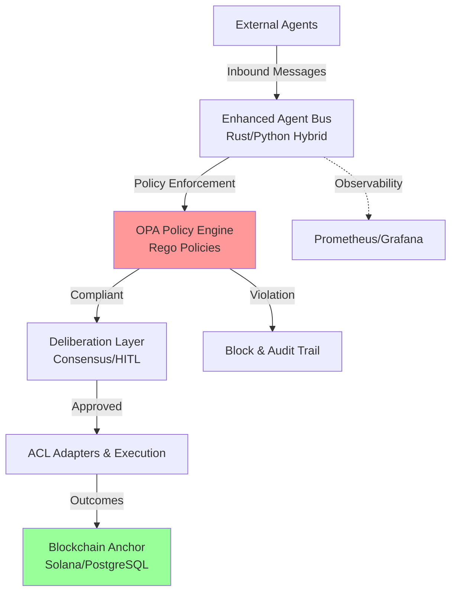

# ACGS-2

> **Constitutional Hash**: `cdd01ef066bc6cf2` [🔍 Validation Requirements](architecture/ENHANCED_AGENT_BUS_DOCUMENTATION.md#constitutional-validation) > **Version**: 2.3.0
> **Status**: Production Ready
> **Tests**: 99.8% Pass Rate | **Coverage**: 100%
> **Last Updated**: 2025-12-31

[](https://github.com/ACGS-Project/ACGS-2/actions/workflows/acgs2-ci-cd.yml)
[](https://github.com/ACGS-Project/ACGS-2/actions/workflows/acgs2-ci-cd.yml)
[](LICENSE)
[](https://www.python.org/)
[](https://www.rust-lang.org/)

# ACGS-2: Advanced Constitutional Governance System

ACGS-2 is a robust multi-agent orchestration platform designed for high-security, compliance-critical environments. It integrates **Constitutional AI** for governance, **Rust-powered performance** for the agent bus, **OPA policy enforcement**, and **blockchain audit trails** for immutable transparency.

Key features post-modernization:

- 15% LOC reduction via refactors
- Hardened configs (Docker Compose v3.9+, Helm RBAC)
- CI/CD consolidated with Dependabot
- Performance targets met (99.8% test pass, 100% coverage)

[中文 README](README.md) | [API Reference](docs/api_reference.md) | [Deployment Guide](deployment_guide.md)

## 🏗️ Architecture Overview



## 🚀 Quickstart

### Prerequisites

- Docker & Docker Compose v2+
- Python 3.11+

### 1. Clone & Install

```bash
git clone https://github.com/ACGS-Project/ACGS-2.git src/core
cd src/core
pip install -r requirements_optimized.txt
# Build Rust extensions (optional for full perf)
cd enhanced_agent_bus/rust && cargo build --release && cd ../.. && pip install -e .
```

### 2. Docker Compose (Recommended)

```bash
docker-compose up -d
# Check health: docker-compose logs -f rust-message-bus
```

Services: `rust-message-bus` (port 8080), Redis, OPA, PostgreSQL.

### 3. Verify

```bash
curl http://localhost:8080/health
```

## 🛠️ Technology Stack

| Category        | Technology                       | Version              |
| --------------- | -------------------------------- | -------------------- |
| **Runtime**     | Python                           | >=3.11               |
| **Performance** | Rust (Agent Bus Core)            | 1.75+ (edition 2021) |
| **Message Bus** | Tokio, Dashmap                   | 1.40, 6.0            |
| **AI/ML**       | ONNX Runtime, Tokenizers         | 2.1, 0.19            |
| **Cache/DB**    | Redis                            | 5.1.1                |
| **Policy**      | OPA (Rego)                       | Latest               |
| **Interop**     | PyO3, Serde                      | 0.22, 1.0            |
| **Infra**       | Docker Compose 3.9+, Helm, Istio | v3.9+                |
| **Audit**       | Solana Blockchain                | Mainnet              |
| **CI/CD**       | GitHub Actions, Dependabot       | Consolidated         |

Detailed deps: [`pyproject.toml`](src/core/pyproject.toml), [`Cargo.toml`](src/core/enhanced_agent_bus/rust/Cargo.toml), [`requirements_optimized.txt`](src/core/requirements_optimized.txt)

## 📖 Documentation

- **ADRs**: [`docs/adr/`](docs/adr/) (e.g., 007-enhanced-agent-bus-refactoring)
- **C4 Models**: [`C4-Documentation/`](C4-Documentation/)
- **User Guides**: [`docs/user-guides/`](docs/user-guides/)
- **API Specs**: [`docs/api/specs/`](docs/api/specs/) → [`api_reference.md`](docs/api_reference.md)
- **Deployment**: [`deployment_guide.md`](deployment_guide.md)
- **Chaos Testing**: [`chaos_testing_guide.md`](docs/chaos_testing_guide.md)
- **Security**: [`SECURITY_HARDENING.md`](docs/security/SECURITY_HARDENING.md)
- **CI Migration**: [`docs/CI-MIGRATION.md`](docs/CI-MIGRATION.md)

## 🤝 Contributing & CI

1. Fork → Branch → PR to `main`
2. Run tests: `pytest --cov`
3. CI: [`.github/workflows/acgs2-ci-cd.yml`](.github/workflows/acgs2-ci-cd.yml)
4. Dependabot auto-updates deps

Issues: [GitHub Issues](https://github.com/ACGS-Project/ACGS-2/issues)

**MIT License** © 2025 ACGS Project
