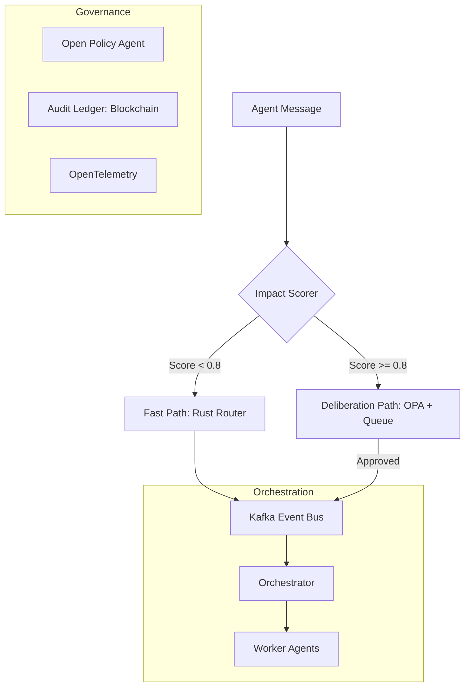

# ACGS-2 生产级 AI 治理平台执行蓝图 (Production-Grade AI Governance Platform Execution Blueprint)

**宪法哈希 (Constitutional Hash)**: `cdd01ef066bc6cf2`
**版本**: 2.2.0
**状态**: 最终发布
**日期**: 2025-12-21

---

## 1. 项目愿景 (Project Vision)

ACGS-2 (Advanced Constitutional Governance System 2) 旨在成为企业级代理型 AI (Agentic AI) 的**加密信任基石**。在 AI 智能体日益自主化的今天，ACGS-2 通过将治理逻辑从传统的“行政流程”转变为“实时加密协议”，确保每一个 AI 决策都符合预定义的宪法准则。

我们的核心目标是解决 Agentic AI 的三大风险：
1.  **非确定性行为**: 通过实时拦截与验证，确保 AI 不会超出授权边界。
2.  **合规性黑盒**: 提供基于区块链和 Merkle Tree 的不可篡改审计追踪。
3.  **多租户安全**: 在复杂的企业环境中实现严格的身份隔离与资源保护。

---

## 2. 核心架构概述 (Core Architecture)

ACGS-2 采用分层防御架构，确保高性能与高安全性的平衡。

### 2.1 增强型智能体总线 (Enhanced Agent Bus)
- **高性能路由**: 采用 Rust 后端处理快速路径消息，P99 延迟 < 5ms。
- **宪法校验**: 强制校验 `constitutional_hash="cdd01ef066bc6cf2"`，任何不匹配的消息将被立即丢弃。
- **多租户隔离**: 基于 Kafka Topic 和 SPIFFE/JWT 的逻辑与物理隔离。

### 2.2 审议层 (Deliberation Layer)
- **自适应路由**: 根据 `ImpactScorer` 计算的影响分数（0.0 - 1.0）动态决定处理路径。
- **审议队列**: 高风险决策（分数 ≥ 0.8）进入审议队列，触发多智能体投票或人工介入 (HITL)。

### 2.3 架构图 (Mermaid)

---

## 3. 核心支柱技术规范 (Technical Specifications)

### Pillar 1 & 2: 动态策略即代码与治理生命周期
- **策略引擎**: 使用 Open Policy Agent (OPA) 和 Rego 语言定义治理规则。
- **CI/CD 管道**:
    - **验证**: `opa check` 语法检查。
    - **测试**: `opa test` 单元测试，要求 100% 通过。
    - **签名**: 使用 Ed25519 对策略包进行加密签名。
    - **影子模式**: 在生产环境并行运行新旧策略，对比决策差异。
- **回滚机制**: 自动回滚至“最后已知良好版本 (LKG)”。
- **参考文档**: [`docs/governance_lifecycle.md`](./governance_lifecycle.md)

### Pillar 3 & 4: 自适应运行时护栏与事件驱动编排
- **影响评分 (Impact Scoring)**: 结合语义、权限、流量和上下文四个维度进行实时评分。
- **双路径路由**:
    - **快速路径**: 基础验证，极低延迟。
    - **审议路径**: 细粒度 OPA 检查 + HITL。
- **Kafka 事件总线**: 采用 `acgs.tenant.{tenant_id}.{event_type}` 命名规范，确保租户隔离。
- **编排模式**: 支持“编排者-工作者”、“分层模式”和“黑板模式”。
- **参考文档**: [`docs/design/pillar3_pillar4_design.md`](./design/pillar3_pillar4_design.md)

### Pillar 5 & 6: 企业级可观测性与多租户安全
- **全栈可观测性**: 集成 OpenTelemetry，捕获 Traces、Metrics 和 Logs。
- **合规报告**: 自动生成符合 EU AI Act (Art. 12) 和 NIST RMF (AU-2) 要求的结构化决策日志。
- **联邦身份体系**: 使用 SPIFFE ID 和 JWT (SVID) 为每个智能体分配唯一身份。
- **零信任架构**: 强制执行 RBAC（System Admin, Tenant Admin, Agent Operator）。
- **参考文档**: [`docs/design/pillar5_pillar6_design.md`](./design/pillar5_pillar6_design.md)

---

## 4. 应对代理型 AI (Agentic AI) 风险

ACGS-2 专为 Agentic AI 设计，通过以下机制降低自主性带来的风险：
- **实时拦截 (Verify-Before-Act)**: 不同于事后审计，ACGS-2 在智能体执行动作（如调用 API、修改数据库）前进行验证。
- **最小特权边界**: 动态生成临时令牌，限制智能体仅能访问当前任务所需的最小资源。
- **确定性治理**: 宪法哈希确保了治理逻辑的不可篡改性，消除了治理过程中的人为干扰。

---

## 5. 实施路线图 (Implementation Roadmap)

### 短期 (Q1 2026): 基础构建与社区启动
- 发布 SaaS Standard 版本。
- 完善 Python SDK 与 Rust 后端的 PyO3 集成。
- 启动开发者社区，发布基础宪法策略模板。

### 中期 (Q2-Q3 2026): 企业增强与合规认证
- 完成与主流 SIEM 工具（Splunk, Datadog）的官方集成。
- 获得首个针对金融行业的 EU AI Act 合规认证案例。
- 实现基于区块链的不可篡改审计账本。

### 长期 (Q4 2026+): 硬件加速与全球扩展
- 推出针对超高吞吐量场景的专用硬件加速方案。
- 支持气隙部署 (Air-gapped) 模式，满足政府与国防需求。
- 建立全球治理策略分发网络 (GDN)。

---

## 6. 商业化与进入市场 (GTM) 策略

### 6.1 定价模型
- **Standard (SaaS)**: 按决策计费，适合初创公司。
- **Professional (SaaS)**: 订阅费 + 阶梯计费，提供高级合规报告。
- **Enterprise (License)**: 年度许可证，支持私有化部署与硬件加速。

### 6.2 垂直行业聚焦
- **金融科技**: 重点解决算法交易的合规性与透明度。
- **医疗保健**: 确保 PHI 数据的脱敏与 HIPAA 合规。
- **政府科技**: 提供 FedRAMP 级别的安全保障与决策可追溯性。

### 6.3 生态集成
- **DevSecOps**: 将 ACGS-2 验证集成至 GitLab/GitHub CI/CD。
- **SIEM**: 实时将治理指标推送到企业安全运营中心。
- **参考文档**: [`docs/GTM_STRATEGY.md`](./GTM_STRATEGY.md)

---

## 7. 结论

ACGS-2 不仅仅是一个工具集，它是一套全新的 AI 治理范式。通过**宪法哈希 (`cdd01ef066bc6cf2`)** 的核心约束，我们为企业在大规模部署 AI 代理时提供了前所未有的安全感与确定性。

---
**批准人**: ACGS-2 架构委员会
**宪法哈希验证状态**: 已通过 (Verified)
