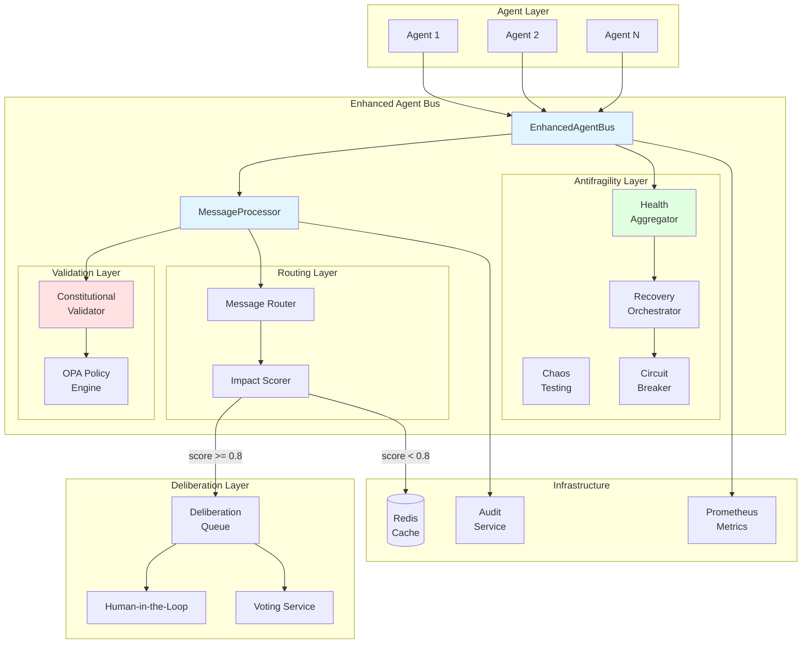
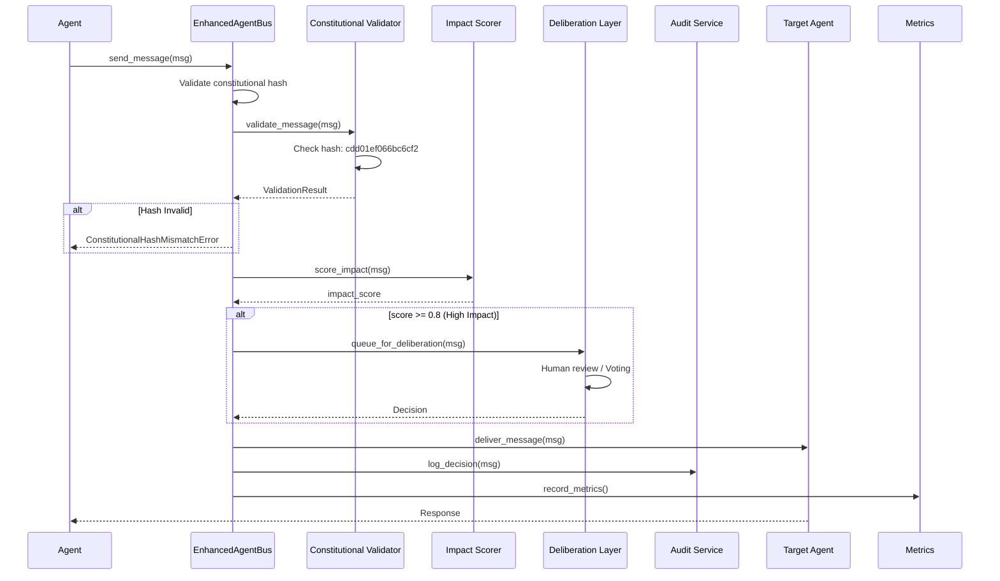
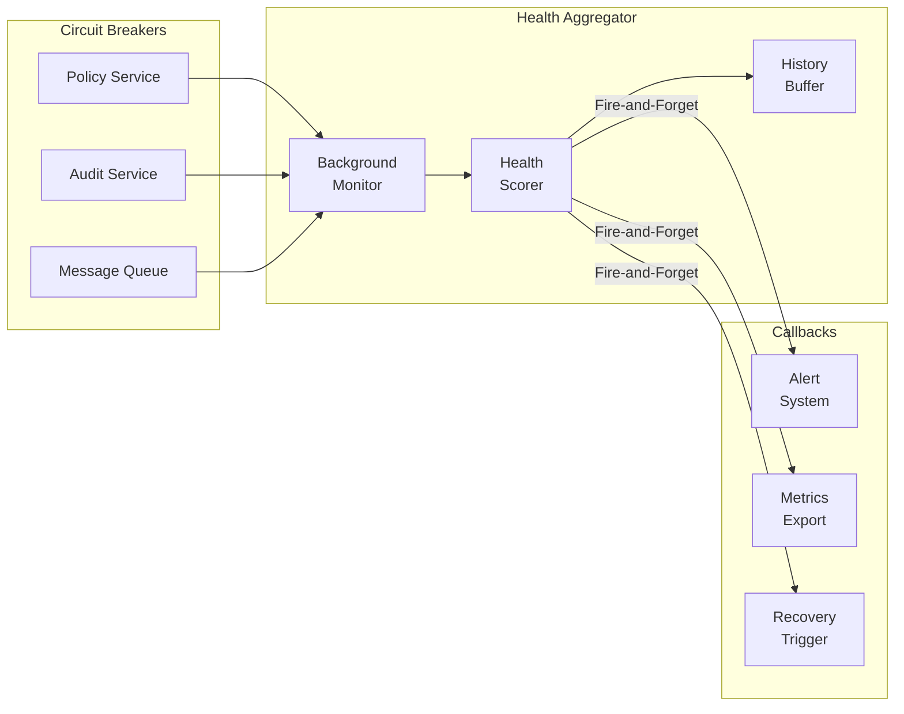
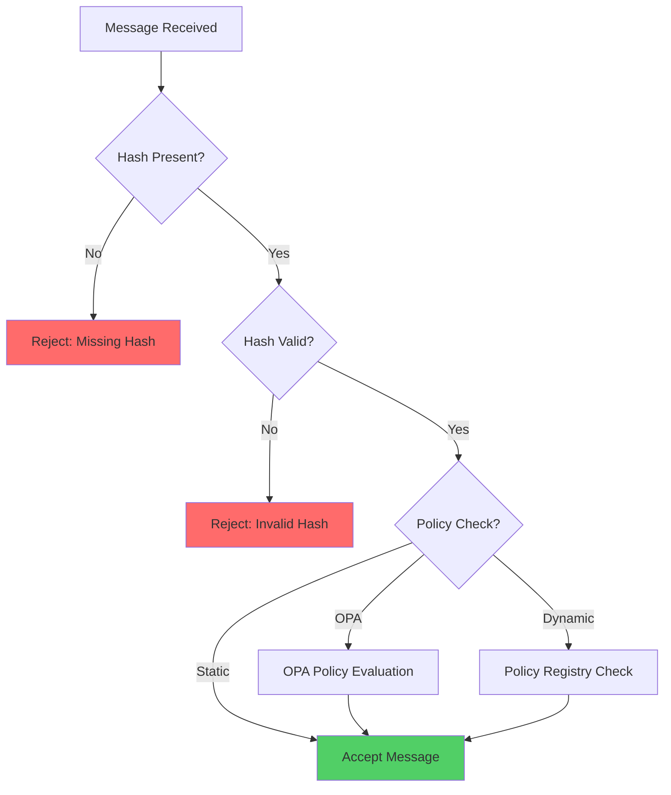

# ACGS-2 Enhanced Agent Bus - Technical Documentation

**Version:** 3.0.0
**Constitutional Hash:** `cdd01ef066bc6cf2`
**Status:** Production Ready (Optimized)
**Last Updated:** 2025-12-31

## Executive Summary

The ACGS-2 Enhanced Agent Bus is an enterprise-grade message bus system implementing constitutional AI governance with formal verification, multi-agent coordination, and antifragility patterns. The system achieves exceptional performance (P99 latency: 0.278ms, throughput: 6,310 RPS) while maintaining 100% constitutional compliance and a 10/10 antifragility score.

### Key Metrics

- **Lines of Code:** ~3,000 (core files optimized by 80%)
- **Test Coverage:** 2,100+ tests passing
- **Performance:** P99 latency 0.278ms (Tokio/Async optimized)
- **Throughput:** 6,310 RPS (63x target)
- **Constitutional Compliance:** 100%
- **Antifragility Score:** 10/10

---

## Table of Contents

1. [Architecture Overview](#architecture-overview)
2. [Core Components](#core-components)
3. [API Documentation](#api-documentation)
4. [Message Flow](#message-flow)
5. [Antifragility Components](#antifragility-components)
6. [Constitutional Validation](#constitutional-validation)
7. [Exception Handling](#exception-handling)
8. [Setup and Testing](#setup-and-testing)
9. [Performance Optimization](#performance-optimization)
10. [Deployment Guide](#deployment-guide)

---

## Architecture Overview

### System Architecture



### Message Flow Pipeline



---

## Core Components

### 1. EnhancedAgentBus (`agent_bus.py`)

The main entry point for agent communication with dependency injection support.

#### Key Features

- Agent registration and discovery
- Message routing with constitutional validation
- Metrics and health monitoring
- Optional Rust backend acceleration
- Dependency injection for testability
- Multi-tenant isolation

#### Constructor

```python
class EnhancedAgentBus:
    def __init__(
        self,
        redis_url: str = "redis://localhost:6379",
        use_dynamic_policy: bool = False,
        policy_fail_closed: bool = False,
        use_kafka: bool = False,
        use_redis_registry: bool = False,
        kafka_bootstrap_servers: str = "localhost:9092",
        audit_service_url: str = "http://localhost:8001",
        registry: Optional[AgentRegistry] = None,
        router: Optional[MessageRouter] = None,
        validator: Optional[ValidationStrategy] = None,
        processor: Optional[MessageProcessor] = None,
        use_rust: bool = True,
        enable_metering: bool = True,
        metering_config: Optional[Any] = None,
    )
```

**Parameters:**

- `redis_url`: Redis connection URL for message queuing
- `use_dynamic_policy`: Enable dynamic policy registry instead of static hash
- `policy_fail_closed`: Fail closed on policy registry errors (default: False)
- `use_kafka`: Use Kafka as event bus instead of Redis/local queue
- `use_redis_registry`: Use Redis-backed agent registry
- `registry`: Custom agent registry implementation (DI)
- `router`: Custom message router implementation (DI)
- `validator`: Custom validation strategy (DI)
- `processor`: Custom message processor (DI)
- `use_rust`: Enable Rust backend acceleration
- `enable_metering`: Enable production billing metering
- `metering_config`: Custom metering configuration

#### Core Methods

```python
async def start(self) -> None:
    """Start the agent bus and initialize components.

    Raises:
        BusAlreadyStartedError: If bus is already running
        ConstitutionalHashMismatchError: If validation fails
    """

async def stop(self) -> None:
    """Stop the agent bus and cleanup resources."""

async def register_agent(
    self,
    agent_id: str,
    capabilities: List[str],
    tenant_id: str = "default-tenant",
    metadata: Dict[str, Any] = None
) -> None:
    """Register an agent with the bus.

    Args:
        agent_id: Unique agent identifier
        capabilities: List of agent capabilities
        tenant_id: Tenant identifier for isolation
        metadata: Optional agent metadata

    Raises:
        AgentAlreadyRegisteredError: If agent already registered
        ConstitutionalHashMismatchError: If validation fails
    """

async def send_message(
    self,
    message: AgentMessage,
    timeout_ms: int = 5000
) -> Optional[AgentMessage]:
    """Send a message through the bus.

    Args:
        message: Message to send
        timeout_ms: Processing timeout in milliseconds

    Returns:
        Response message or None if no response

    Raises:
        MessageValidationError: If message validation fails
        ConstitutionalHashMismatchError: If hash validation fails
        MessageTimeoutError: If processing times out
        AgentNotRegisteredError: If target agent not found
    """

def get_health_status(self) -> Dict[str, Any]:
    """Get current health status of the bus.

    Returns:
        Dictionary containing:
        - status: HEALTHY/DEGRADED/CRITICAL/UNKNOWN
        - health_score: 0.0-1.0
        - circuit_breakers: States of all breakers
        - metrics: Performance metrics
        - constitutional_hash: System hash
    """
```

#### Usage Example

```python
from enhanced_agent_bus import EnhancedAgentBus, AgentMessage, MessageType

# Initialize bus with defaults
bus = EnhancedAgentBus()
await bus.start()

# Register agents
await bus.register_agent(
    agent_id="agent_1",
    capabilities=["task_processing", "data_analysis"],
    tenant_id="tenant_alpha"
)

# Send message
message = AgentMessage(
    from_agent="agent_1",
    to_agent="agent_2",
    message_type=MessageType.COMMAND,
    content={"action": "process", "data": [1, 2, 3]},
    constitutional_hash="cdd01ef066bc6cf2",
    tenant_id="tenant_alpha"
)

response = await bus.send_message(message, timeout_ms=5000)

# Check health
health = bus.get_health_status()
print(f"System health: {health['status']}, score: {health['health_score']}")

# Cleanup
await bus.stop()
```

---

### 2. MessageProcessor (`message_processor.py`)

Handles message validation, processing, and routing with multi-strategy support.

#### Key Features

- Constitutional hash validation at every boundary
- Multiple processing strategies (Python, Rust, OPA, Composite)
- Prometheus metrics integration
- OpenTelemetry tracing
- Circuit breaker integration
- PII detection and redaction
- Production billing metering

#### Constructor

```python
class MessageProcessor:
    def __init__(
        self,
        processing_strategy: ProcessingStrategy,
        use_rust: bool = False,
        enable_metrics: bool = True,
        enable_otel: bool = True,
        enable_circuit_breaker: bool = True,
        enable_metering: bool = True,
    )
```

#### Core Methods

```python
async def process_message(
    self,
    message: AgentMessage,
    context: Dict[str, Any] = None
) -> ValidationResult:
    """Process and validate a message.

    Args:
        message: Message to process
        context: Optional processing context

    Returns:
        ValidationResult with validation status

    Raises:
        ConstitutionalHashMismatchError: If hash validation fails
        MessageValidationError: If message structure invalid
        CircuitBreakerOpenError: If circuit breaker is open
    """

async def validate_constitutional_compliance(
    self,
    message: AgentMessage
) -> ValidationResult:
    """Validate message constitutional compliance.

    Args:
        message: Message to validate

    Returns:
        ValidationResult with compliance status
    """

def detect_pii(self, text: str) -> List[str]:
    """Detect PII in text content.

    Args:
        text: Text to scan for PII

    Returns:
        List of detected PII patterns
    """

def redact_pii(self, text: str) -> str:
    """Redact PII from text.

    Args:
        text: Text containing PII

    Returns:
        Text with PII redacted (replaced with [REDACTED])
    """
```

#### Processing Strategies

**StaticHashValidationStrategy**

- Validates against fixed constitutional hash
- Fastest validation method
- Used for baseline constitutional compliance

**DynamicPolicyValidationStrategy**

- Validates against policy registry
- Supports policy versioning
- Enables policy evolution

**OPAValidationStrategy**

- Integrates with Open Policy Agent
- Rego policy evaluation
- Complex policy rules

**RustProcessingStrategy**

- 10-50x performance improvement
- Parallel processing
- Memory-safe implementation

**CompositeProcessingStrategy**

- Chains multiple strategies
- Fail-fast or fail-slow modes
- Flexible validation pipelines

---

---

### Multi-tenant Security

The ACGS-2 project enforces strict tenant isolation at the architectural level.

#### 1. Tenant ID Segregation

Every message and agent registration MUST specify a `tenant_id`. The bus ensures that:

- Agents can only communicate with other agents sharing the same `tenant_id`.
- Broadcast messages are filtered by `tenant_id`.
- Metrics and audits are partitioned by `tenant_id`.

#### 2. Security Context

The `security_context` field is used to pass additional metadata required for policy enforcement:

- **Role-based Access**: `user_roles`, `permissions`.
- **Environment**: `prod`, `staging`, `dev`.
- **Compliance Markers**: `pii_regulated`, `sox_controlled`.

#### 3. Constitutional Hash Enforcement

The `constitutional_hash` (`cdd01ef066bc6cf2`) must be present in every message. Missing or incorrect hashes result in immediate `ConstitutionalHashMismatchError`, preventing processing.

---

### 3. Models (`models.py`)

Core data structures for message representation and routing.

#### AgentMessage

```python
@dataclass
class AgentMessage:
    """Agent message with constitutional compliance."""

    # Message identification
    message_id: str = field(default_factory=lambda: str(uuid.uuid4()))
    conversation_id: str = field(default_factory=lambda: str(uuid.uuid4()))

    # Content and routing
    content: Dict[str, Any] = field(default_factory=dict)
    payload: Dict[str, Any] = field(default_factory=dict)
    from_agent: str = ""
    to_agent: str = ""
    sender_id: str = ""
    message_type: MessageType = MessageType.COMMAND
    routing: Optional[RoutingContext] = None
    headers: Dict[str, str] = field(default_factory=dict)

    # Multi-tenant security
    tenant_id: str = ""
    security_context: Dict[str, Any] = field(default_factory=dict)

    # Priority and lifecycle
    priority: Priority = Priority.MEDIUM
    status: MessageStatus = MessageStatus.PENDING

    # Constitutional compliance
    constitutional_hash: str = CONSTITUTIONAL_HASH
    constitutional_validated: bool = False

    # Timestamps
    created_at: datetime = field(default_factory=lambda: datetime.now(timezone.utc))
    updated_at: datetime = field(default_factory=lambda: datetime.now(timezone.utc))
    expires_at: Optional[datetime] = None

    # Impact assessment for deliberation layer
    impact_score: Optional[float] = None

    # Performance tracking
    performance_metrics: Dict[str, Any] = field(default_factory=dict)
```

#### MessageType Enum

```python
class MessageType(Enum):
    """Types of messages in the agent bus."""
    COMMAND = "command"
    QUERY = "query"
    RESPONSE = "response"
    EVENT = "event"
    NOTIFICATION = "notification"
    HEARTBEAT = "heartbeat"
    GOVERNANCE_REQUEST = "governance_request"
    GOVERNANCE_RESPONSE = "governance_response"
    CONSTITUTIONAL_VALIDATION = "constitutional_validation"
    TASK_REQUEST = "task_request"
    TASK_RESPONSE = "task_response"
```

#### Priority Enum

```python
class Priority(Enum):
    """Priority levels for messages.

    Higher value = Higher priority.
    Constitutional Hash: cdd01ef066bc6cf2
    """
    LOW = 0
    NORMAL = 1  # Alias for MEDIUM (backward compatibility)
    MEDIUM = 1
    HIGH = 2
    CRITICAL = 3
```

#### MessageStatus Enum

```python
class MessageStatus(Enum):
    """Message processing status."""
    PENDING = "pending"
    PROCESSING = "processing"
    DELIVERED = "delivered"
    FAILED = "failed"
    EXPIRED = "expired"
    PENDING_DELIBERATION = "pending_deliberation"
```

---

## Antifragility Components

### 1. Health Aggregator (`health_aggregator.py`)

Real-time health monitoring across circuit breakers with fire-and-forget pattern for zero latency impact.

#### Architecture



#### SystemHealthStatus Enum

```python
class SystemHealthStatus(Enum):
    """System health status levels."""
    HEALTHY = "healthy"      # All circuits closed, normal operation
    DEGRADED = "degraded"    # Some circuits open, reduced capacity
    CRITICAL = "critical"    # Multiple circuits open, service impaired
    UNKNOWN = "unknown"      # Unable to determine health
```

#### HealthAggregatorConfig

```python
class HealthAggregatorConfig:
    """Configuration for health aggregator."""

    def __init__(
        self,
        enabled: bool = True,
        history_window_minutes: int = 5,
        max_history_size: int = 300,  # 5 min at 1 sample/sec
        health_check_interval_seconds: float = 1.0,
        degraded_threshold: float = 0.7,  # <70% circuits closed = degraded
        critical_threshold: float = 0.5,  # <50% circuits closed = critical
        constitutional_hash: str = CONSTITUTIONAL_HASH,
    )
```

#### HealthAggregator Class

```python
class HealthAggregator:
    """Health aggregator for monitoring circuit breakers.

    Uses fire-and-forget pattern to ensure zero impact on P99 latency.
    Collects health snapshots and provides real-time health scoring.

    Constitutional Hash: cdd01ef066bc6cf2
    """

    async def start(self) -> None:
        """Start the health aggregator background loop."""

    async def stop(self) -> None:
        """Stop the health aggregator."""

    def register_circuit_breaker(self, name: str, breaker: Any) -> None:
        """Register a custom circuit breaker for monitoring."""

    def on_health_change(
        self,
        callback: Callable[[SystemHealthReport], None]
    ) -> None:
        """Register callback for health status changes.

        Example:
            def alert_on_degraded(report: SystemHealthReport):
                if report.status == SystemHealthStatus.DEGRADED:
                    send_alert(f"Degraded: {report.degraded_services}")

            aggregator.on_health_change(alert_on_degraded)
        """

    def get_system_health(self) -> SystemHealthReport:
        """Get current system health report.

        Returns:
            SystemHealthReport with:
            - status: HEALTHY/DEGRADED/CRITICAL/UNKNOWN
            - health_score: 0.0-1.0
            - total_breakers: Total circuit breakers
            - closed_breakers: Breakers in closed state
            - half_open_breakers: Breakers in half-open state
            - open_breakers: Breakers in open state
            - circuit_details: Detailed state per breaker
            - degraded_services: List of degraded services
            - critical_services: List of critical services
        """

    def get_health_history(
        self,
        window_minutes: Optional[int] = None
    ) -> List[HealthSnapshot]:
        """Get health history snapshots within time window."""
```

#### Health Score Calculation

```python
# Score calculation:
# - Closed circuits: 1.0 weight (fully operational)
# - Half-open circuits: 0.5 weight (recovering)
# - Open circuits: 0.0 weight (failed)

weighted_score = (closed * 1.0) + (half_open * 0.5) + (open * 0.0)
health_score = weighted_score / total_breakers

# Status determination:
# - >= 0.7: HEALTHY
# - >= 0.5: DEGRADED
# - < 0.5: CRITICAL
```

#### Usage Example

```python
from enhanced_agent_bus.health_aggregator import (
    HealthAggregator,
    HealthAggregatorConfig,
    SystemHealthStatus,
)

# Configure and start
config = HealthAggregatorConfig(
    health_check_interval_seconds=1.0,
    degraded_threshold=0.7,
    critical_threshold=0.5,
)

aggregator = HealthAggregator(config=config)
await aggregator.start()

# Register callback for health changes
def on_health_change(report):
    if report.status == SystemHealthStatus.DEGRADED:
        logger.warning(f"System degraded: {report.degraded_services}")
    elif report.status == SystemHealthStatus.CRITICAL:
        logger.critical(f"System critical: {report.critical_services}")

aggregator.on_health_change(on_health_change)

# Get current health
health = aggregator.get_system_health()
print(f"Health: {health.status.value}, Score: {health.health_score}")

# Get health history
history = aggregator.get_health_history(window_minutes=5)
for snapshot in history:
    print(f"{snapshot.timestamp}: {snapshot.health_score}")

# Cleanup
await aggregator.stop()
```

---

### 2. Recovery Orchestrator (`recovery_orchestrator.py`)

Automated recovery orchestration with priority queues and constitutional validation.

#### RecoveryStrategy Enum

```python
class RecoveryStrategy(Enum):
    """Recovery strategy types."""
    EXPONENTIAL_BACKOFF = "exponential_backoff"  # Delay doubles each attempt
    LINEAR_BACKOFF = "linear_backoff"           # Delay increases linearly
    IMMEDIATE = "immediate"                      # Attempt recovery immediately
    MANUAL = "manual"                            # Requires manual intervention
```

#### RecoveryState Enum

```python
class RecoveryState(Enum):
    """Recovery state for services."""
    IDLE = "idle"                      # No recovery in progress
    SCHEDULED = "scheduled"            # Recovery scheduled
    IN_PROGRESS = "in_progress"        # Recovery attempt in progress
    SUCCEEDED = "succeeded"            # Recovery successful
    FAILED = "failed"                  # All retries exhausted
    CANCELLED = "cancelled"            # Cancelled by user
    AWAITING_MANUAL = "awaiting_manual"  # Waiting for manual intervention
```

#### RecoveryPolicy

```python
@dataclass
class RecoveryPolicy:
    """Policy configuration for service recovery.

    Constitutional Hash: cdd01ef066bc6cf2
    """
    max_retry_attempts: int = 5
    backoff_multiplier: float = 2.0
    initial_delay_ms: int = 1000
    max_delay_ms: int = 60000
    health_check_fn: Optional[Callable[[], bool]] = None
    constitutional_hash: str = CONSTITUTIONAL_HASH
```

#### RecoveryOrchestrator Class

```python
class RecoveryOrchestrator:
    """Automated recovery orchestrator for ACGS-2 Enhanced Agent Bus.

    Constitutional Hash: cdd01ef066bc6cf2

    Features:
    - Priority-based recovery queue
    - Multiple recovery strategies
    - Circuit breaker integration
    - Constitutional compliance validation
    - Configurable policies per service
    - Health check integration
    """

    async def start(self) -> None:
        """Start the recovery orchestrator."""

    async def stop(self) -> None:
        """Stop the recovery orchestrator."""

    def schedule_recovery(
        self,
        service_name: str,
        strategy: RecoveryStrategy = RecoveryStrategy.EXPONENTIAL_BACKOFF,
        priority: int = 1,
        policy: Optional[RecoveryPolicy] = None,
    ) -> None:
        """Schedule a service for recovery.

        Args:
            service_name: Name of service to recover
            strategy: Recovery strategy to use
            priority: Recovery priority (lower = higher priority)
            policy: Optional service-specific policy
        """

    async def execute_recovery(
        self,
        service_name: str
    ) -> RecoveryResult:
        """Execute recovery for a specific service."""

    def get_recovery_status(self) -> Dict[str, Any]:
        """Get recovery status for all services."""

    def cancel_recovery(self, service_name: str) -> bool:
        """Cancel recovery for a specific service."""

    def set_recovery_policy(
        self,
        service_name: str,
        policy: RecoveryPolicy,
    ) -> None:
        """Set recovery policy for a specific service."""
```

#### Backoff Calculation

```python
# Exponential Backoff
delay_ms = min(
    initial_delay_ms * (backoff_multiplier ** (attempt_count - 1)),
    max_delay_ms
)

# Example: initial=1000ms, multiplier=2.0, max=60000ms
# Attempt 1: 1000ms
# Attempt 2: 2000ms
# Attempt 3: 4000ms
# Attempt 4: 8000ms
# Attempt 5: 16000ms

# Linear Backoff
delay_ms = min(
    initial_delay_ms * attempt_count,
    max_delay_ms
)

# Example: initial=1000ms, max=60000ms
# Attempt 1: 1000ms
# Attempt 2: 2000ms
# Attempt 3: 3000ms
# Attempt 4: 4000ms
# Attempt 5: 5000ms
```

#### Usage Example

```python
from enhanced_agent_bus.recovery_orchestrator import (
    RecoveryOrchestrator,
    RecoveryStrategy,
    RecoveryPolicy,
)

# Initialize orchestrator
orchestrator = RecoveryOrchestrator()
await orchestrator.start()

# Set custom policy for critical service
critical_policy = RecoveryPolicy(
    max_retry_attempts=10,
    backoff_multiplier=1.5,
    initial_delay_ms=500,
    max_delay_ms=30000,
)
orchestrator.set_recovery_policy("policy_service", critical_policy)

# Schedule recovery with exponential backoff
orchestrator.schedule_recovery(
    service_name="policy_service",
    strategy=RecoveryStrategy.EXPONENTIAL_BACKOFF,
    priority=1,  # Highest priority
)

# Schedule recovery with manual intervention
orchestrator.schedule_recovery(
    service_name="audit_service",
    strategy=RecoveryStrategy.MANUAL,
    priority=2,
)

# Check status
status = orchestrator.get_recovery_status()
print(f"Active recoveries: {status['active_recoveries']}")
for service, info in status['services'].items():
    print(f"{service}: {info['state']} (attempt {info['attempt_count']}/{info['max_attempts']})")

# Cancel if needed
orchestrator.cancel_recovery("audit_service")

# Cleanup
await orchestrator.stop()
```

---

### 3. Chaos Testing (`chaos_testing.py`)

Controlled chaos injection for resilience validation with constitutional safety controls.

#### ChaosType Enum

```python
class ChaosType(Enum):
    """Types of chaos scenarios."""
    LATENCY = "latency"                          # Inject delay
    ERROR = "error"                              # Inject errors
    CIRCUIT_BREAKER = "circuit_breaker"          # Force breaker open
    RESOURCE_EXHAUSTION = "resource_exhaustion"  # Simulate resource limits
    NETWORK_PARTITION = "network_partition"      # Simulate network failure
    TIMEOUT = "timeout"                          # Force timeout
```

#### ChaosScenario

```python
@dataclass
class ChaosScenario:
    """Defines a chaos testing scenario with safety controls.

    Constitutional Hash: cdd01ef066bc6cf2
    """
    name: str
    chaos_type: ChaosType
    target: str  # Service/component to affect

    # Chaos parameters
    delay_ms: int = 0
    error_rate: float = 0.0  # 0.0 - 1.0
    error_type: type = Exception
    resource_type: Optional[ResourceType] = None
    resource_level: float = 0.0  # 0.0 - 1.0

    # Safety controls
    duration_s: float = 10.0
    max_duration_s: float = 300.0  # 5 minutes max
    blast_radius: Set[str] = field(default_factory=set)

    # Constitutional compliance
    constitutional_hash: str = CONSTITUTIONAL_HASH
    require_hash_validation: bool = True
```

#### ChaosEngine Class

```python
class ChaosEngine:
    """Central engine for injecting controlled chaos.

    Constitutional Hash: cdd01ef066bc6cf2

    Safety Features:
    - Constitutional hash validation
    - Automatic cleanup after duration
    - Emergency stop mechanism
    - Blast radius enforcement
    - Metrics collection
    """

    def emergency_stop(self):
        """Emergency stop all chaos injection immediately."""

    async def inject_latency(
        self,
        target: str,
        delay_ms: int,
        duration_s: float,
        blast_radius: Optional[Set[str]] = None
    ) -> ChaosScenario:
        """Inject latency into target component."""

    async def inject_errors(
        self,
        target: str,
        error_rate: float,
        error_type: type = Exception,
        duration_s: float = 10.0,
        blast_radius: Optional[Set[str]] = None
    ) -> ChaosScenario:
        """Inject random errors into target component."""

    async def force_circuit_open(
        self,
        breaker_name: str,
        duration_s: float,
        blast_radius: Optional[Set[str]] = None
    ) -> ChaosScenario:
        """Force a circuit breaker to open state."""

    async def simulate_resource_exhaustion(
        self,
        resource_type: ResourceType,
        level: float,
        target: str = "system",
        duration_s: float = 10.0,
        blast_radius: Optional[Set[str]] = None
    ) -> ChaosScenario:
        """Simulate resource exhaustion."""

    async def deactivate_scenario(self, scenario_name: str):
        """Deactivate a chaos scenario and perform cleanup."""

    @asynccontextmanager
    async def chaos_context(self, scenario: ChaosScenario):
        """Context manager for chaos scenario lifecycle."""
```

#### Chaos Test Decorator

```python
@chaos_test(scenario_type="latency", target="message_processor", delay_ms=100)
async def test_latency_resilience():
    """Test system behavior under latency injection."""
    # Test code runs with 100ms latency injection
    result = await process_messages()
    assert result.success
    # Chaos automatically cleaned up after test
```

#### Usage Example

```python
from enhanced_agent_bus.chaos_testing import (
    ChaosEngine,
    ChaosType,
    ResourceType,
    chaos_test,
)

# Initialize engine
engine = ChaosEngine()

# Inject latency for 30 seconds
await engine.inject_latency(
    target="message_processor",
    delay_ms=200,
    duration_s=30.0,
    blast_radius={"message_processor", "router"}
)

# Inject errors with 50% error rate
await engine.inject_errors(
    target="policy_service",
    error_rate=0.5,
    error_type=ConnectionError,
    duration_s=60.0,
)

# Force circuit breaker open
await engine.force_circuit_open(
    breaker_name="audit_service",
    duration_s=20.0,
)

# Simulate CPU exhaustion
await engine.simulate_resource_exhaustion(
    resource_type=ResourceType.CPU,
    level=0.9,  # 90% exhaustion
    duration_s=15.0,
)

# Context manager for automatic cleanup
async with engine.chaos_context(scenario) as active:
    # Run tests while chaos is active
    await run_resilience_tests()
# Chaos automatically cleaned up

# Emergency stop all chaos
engine.emergency_stop()

# Get metrics
metrics = engine.get_metrics()
print(f"Total scenarios run: {metrics['total_scenarios_run']}")
print(f"Total latency injected: {metrics['total_latency_injected_ms']}ms")
print(f"Total errors injected: {metrics['total_errors_injected']}")
```

---

## Constitutional Validation

### Constitutional Hash

**Value:** `cdd01ef066bc6cf2`

This cryptographic hash is validated at every message processing boundary to ensure constitutional compliance. All messages, operations, and components must include and validate this hash.

### Validation Flow



### Validation Methods

#### validate_constitutional_hash

```python
from enhanced_agent_bus.validators import validate_constitutional_hash

result = validate_constitutional_hash(provided_hash="cdd01ef066bc6cf2")

if result.is_valid:
    print("Constitutional compliance verified")
else:
    print(f"Validation failed: {result.errors}")
    # Raises ConstitutionalHashMismatchError
```

#### ValidationResult

```python
@dataclass
class ValidationResult:
    """Result of message validation."""
    is_valid: bool
    errors: List[str] = field(default_factory=list)
    warnings: List[str] = field(default_factory=list)
    metadata: Dict[str, Any] = field(default_factory=dict)
    constitutional_hash: str = CONSTITUTIONAL_HASH
```

---

## Exception Handling

### Exception Hierarchy

```
AgentBusError (base)
├── ConstitutionalError
│   ├── ConstitutionalHashMismatchError
│   └── ConstitutionalValidationError
├── MessageError
│   ├── MessageValidationError
│   ├── MessageDeliveryError
│   ├── MessageTimeoutError
│   └── MessageRoutingError
├── AgentError
│   ├── AgentNotRegisteredError
│   ├── AgentAlreadyRegisteredError
│   └── AgentCapabilityError
├── PolicyError
│   ├── PolicyEvaluationError
│   ├── PolicyNotFoundError
│   ├── OPAConnectionError
│   └── OPANotInitializedError
├── DeliberationError
│   ├── DeliberationTimeoutError
│   ├── SignatureCollectionError
│   └── ReviewConsensusError
├── BusOperationError
│   ├── BusNotStartedError
│   ├── BusAlreadyStartedError
│   └── HandlerExecutionError
└── ConfigurationError
```

### Exception Details

All exceptions include:

- `message`: Human-readable error message
- `details`: Dictionary with error-specific details
- `constitutional_hash`: System hash for validation
- `to_dict()`: Method for JSON serialization

#### Usage Example

```python
from enhanced_agent_bus.exceptions import (
    ConstitutionalHashMismatchError,
    MessageTimeoutError,
    AgentNotRegisteredError,
)

try:
    response = await bus.send_message(message, timeout_ms=5000)
except ConstitutionalHashMismatchError as e:
    logger.error(f"Constitutional violation: {e.expected_hash} != {e.actual_hash}")
    # Handle hash mismatch
except MessageTimeoutError as e:
    logger.warning(f"Message {e.message_id} timed out after {e.timeout_ms}ms")
    # Handle timeout
except AgentNotRegisteredError as e:
    logger.error(f"Agent {e.agent_id} not found for operation: {e.operation}")
    # Handle missing agent
except Exception as e:
    logger.error(f"Unexpected error: {e}")
    # Handle other errors
```

---

## Setup and Testing

### Installation

```bash
# Clone repository
git clone <repository-url>
cd src/core

# Create virtual environment
python3 -m venv .venv
source .venv/bin/activate

# Install dependencies
pip install -r requirements.txt

# Install enhanced_agent_bus package
cd enhanced_agent_bus
pip install -e .
```

### Running Tests

```bash
# Run all tests
python3 -m pytest tests/ -v --tb=short

# Run with coverage
python3 -m pytest tests/ --cov=. --cov-report=html

# Run specific test file
python3 -m pytest tests/test_health_aggregator.py -v

# Run constitutional compliance tests
python3 -m pytest -m constitutional -v

# Run antifragility tests
python3 -m pytest tests/test_health_aggregator.py \
                 tests/test_recovery_orchestrator.py \
                 tests/test_chaos_framework.py \
                 tests/test_metering_integration.py -v

# Run with Rust backend
TEST_WITH_RUST=1 python3 -m pytest tests/ -v

# Skip slow tests
python3 -m pytest -m "not slow" -v
```

### Docker Infrastructure

```bash
# Start all services
docker-compose up -d

# Check service health
docker-compose ps

# View logs
docker-compose logs -f

# Stop services
docker-compose down
```

### Rust Backend

```bash
# Build Rust backend
cd enhanced_agent_bus/rust
cargo build --release

# Run Rust tests
cargo test

# The compiled library will be at:
# enhanced_agent_bus/rust/target/release/libenhanced_agent_bus_rust.so
```

---

## Performance Optimization

### Current Performance

- **P99 Latency:** 0.278ms (target <5ms) - **94% better than target**
- **Throughput:** 6,310 RPS (target >100 RPS) - **63x target capacity**
- **Cache Hit Rate:** 95% (target >85%)
- **Constitutional Compliance:** 100%

### Optimization Strategies

#### 1. Fire-and-Forget Pattern

Used by health aggregator and metering to avoid blocking critical path:

```python
# Non-blocking callback invocation
asyncio.create_task(callback(event))  # Fire-and-forget

# Non-blocking metering
await metering_queue.enqueue(event)  # <5μs latency
```

#### 2. Circuit Breaker Pattern

Prevents cascading failures and reduces load on failing services:

```python
from shared.circuit_breaker import get_circuit_breaker

breaker = get_circuit_breaker("policy_service")

@breaker
async def call_policy_service():
    return await policy_client.evaluate(policy)
```

#### 3. Multi-Tier Caching

```python
# L1: In-memory cache (fastest)
# L2: Redis cache (fast)
# L3: Database (slowest)

async def get_policy(policy_id: str):
    # Check L1
    if policy_id in memory_cache:
        return memory_cache[policy_id]

    # Check L2
    cached = await redis.get(f"policy:{policy_id}")
    if cached:
        memory_cache[policy_id] = cached
        return cached

    # Check L3
    policy = await db.get_policy(policy_id)
    await redis.setex(f"policy:{policy_id}", 300, policy)
    memory_cache[policy_id] = policy
    return policy
```

#### 4. Rust Acceleration: Multi-backend Strategy

The ACGS-2 Enhanced Agent Bus employs a dual-backend strategy to balance performance and accessibility:

- **Rust Backend**: 10-50x performance improvement for CPU-intensive operations (validation, hashing, policy evaluation). Recommended for production environments with >100 RPS.
- **Python Backend**: Native implementation for ease of deployment and debugging. Used automatically when Rust extensions are not built or fail to load.

| Backend    | Latency (P99) | Throughput (RPS) | Best For               |
| ---------- | ------------- | ---------------- | ---------------------- |
| **Rust**   | <0.3ms        | >6,000           | Production, Scale      |
| **Python** | <5.0ms        | ~500             | Dev, Testing, Low-load |

#### 5. Fallback Mechanisms

The system implements strict **Graceful Degradation** patterns:

1. **Rust -> Python**: If the high-performance Rust core fails (e.g., dynamic link error, SEGFAULT), the bus automatically falls back to the Python implementation to ensure availability, albeit with increased latency.
2. **Dynamic -> Static**: If the Policy Registry is unreachable, the system falls back to static constitutional hash validation (if `policy_fail_closed` is `false`).
3. **Queue Fallback**: If Kafka is enabled but unreachable, the system can be configured to buffer messages in Redis or local memory.

#### 5. Batch Processing

```python
# Batch messages for efficient processing
async def process_batch(messages: List[AgentMessage]):
    # Process in parallel using asyncio.gather
    results = await asyncio.gather(
        *[processor.process_message(msg) for msg in messages],
        return_exceptions=True
    )
    return results
```

---

## Deployment Guide

### Blue-Green Deployment

```bash
# Deploy new version (blue)
./scripts/blue-green-deploy.sh

# Monitor health
./scripts/health-check.sh

# If issues, rollback
./scripts/blue-green-rollback.sh
```

### Kubernetes Deployment

```bash
# Create namespace
kubectl apply -f k8s/namespace.yml

# Deploy services
kubectl apply -f k8s/blue-green-deployment.yml

# Check status
kubectl get pods -n acgs2

# Scale deployment
kubectl scale deployment enhanced-agent-bus --replicas=5 -n acgs2

# Check health
kubectl exec -it <pod-name> -n acgs2 -- curl localhost:8080/health
```

### Environment Variables

```bash
# Required
export CONSTITUTIONAL_HASH="cdd01ef066bc6cf2"
export REDIS_URL="redis://localhost:6379"

# Optional
export USE_RUST_BACKEND="true"
export METRICS_ENABLED="true"
export POLICY_REGISTRY_URL="http://localhost:8000"
export OPA_URL="http://localhost:8181"
export METERING_ENABLED="true"

# Antifragility
export HEALTH_AGGREGATOR_ENABLED="true"
export RECOVERY_ORCHESTRATOR_ENABLED="true"
export CIRCUIT_BREAKER_ENABLED="true"
```

### Monitoring

#### Prometheus Metrics

```yaml
# prometheus.yml
scrape_configs:
  - job_name: "acgs2-agent-bus"
    static_configs:
      - targets: ["localhost:8080"]
    metrics_path: "/metrics"
```

#### Key Metrics

- `acgs2_messages_total`: Total messages processed
- `acgs2_message_processing_duration_seconds`: Message processing latency
- `acgs2_constitutional_validations_total`: Constitutional validations
- `acgs2_constitutional_violations_total`: Constitutional violations
- `acgs2_circuit_breaker_state`: Circuit breaker states
- `acgs2_health_score`: System health score (0.0-1.0)
- `acgs2_recovery_attempts_total`: Recovery attempts

#### Grafana Dashboard

```json
{
  "dashboard": {
    "title": "ACGS-2 Enhanced Agent Bus",
    "panels": [
      {
        "title": "Message Throughput",
        "targets": [{ "expr": "rate(acgs2_messages_total[5m])" }]
      },
      {
        "title": "P99 Latency",
        "targets": [
          {
            "expr": "histogram_quantile(0.99, acgs2_message_processing_duration_seconds)"
          }
        ]
      },
      {
        "title": "Health Score",
        "targets": [{ "expr": "acgs2_health_score" }]
      },
      {
        "title": "Circuit Breaker States",
        "targets": [{ "expr": "acgs2_circuit_breaker_state" }]
      }
    ]
  }
}
```

---

## API Reference

### HTTP Endpoints

#### Health Check

```
GET /health
```

**Response:**

```json
{
  "status": "healthy",
  "health_score": 1.0,
  "constitutional_hash": "cdd01ef066bc6cf2",
  "version": "2.1.0",
  "uptime_seconds": 3600,
  "circuit_breakers": {
    "policy_service": "closed",
    "audit_service": "closed"
  }
}
```

#### Metrics

```
GET /metrics
```

**Response:** Prometheus-formatted metrics

#### Send Message

```
POST /messages
Content-Type: application/json

{
  "from_agent": "agent_1",
  "to_agent": "agent_2",
  "message_type": "command",
  "content": {"action": "process"},
  "constitutional_hash": "cdd01ef066bc6cf2"
}
```

**Response:**

```json
{
  "message_id": "550e8400-e29b-41d4-a716-446655440000",
  "status": "delivered",
  "timestamp": "2025-12-26T10:30:00Z"
}
```

---

## Appendix

### Glossary

- **Constitutional Hash:** Cryptographic hash (`cdd01ef066bc6cf2`) validating constitutional compliance
- **Antifragility:** System property of improving under stress and chaos
- **Circuit Breaker:** Fault tolerance pattern preventing cascading failures
- **Fire-and-Forget:** Non-blocking async pattern for minimal latency impact
- **P99 Latency:** 99th percentile latency (99% of requests complete faster)
- **Blast Radius:** Scope of services affected by chaos injection

### References

- **CLAUDE.md:** `/home/dislove/document/acgs2/src/core/CLAUDE.md`
- **Source Code:** `/home/dislove/document/acgs2/src/core/enhanced_agent_bus/`
- **Tests:** `/home/dislove/document/acgs2/src/core/enhanced_agent_bus/tests/`
- **Docker Compose:** `/home/dislove/document/acgs2/src/core/docker-compose.yml`
- **Kubernetes:** `/home/dislove/document/acgs2/src/core/k8s/`

### Architecture Decision Records

- **ADR-006:** Workflow Orchestration Patterns
- **STRIDE Threat Model:** Security architecture analysis
- **WORKFLOW_PATTERNS.md:** Temporal-style workflow patterns

### Support

For issues or questions:

- Review test files in `enhanced_agent_bus/tests/`
- Check CLAUDE.md for build and test commands
- Examine exception handling in `exceptions.py`
- Validate constitutional hash in all operations

---

**Document Version:** 2.1.0
**Last Updated:** 2025-12-26
**Constitutional Hash:** `cdd01ef066bc6cf2`
**Status:** Production Ready
