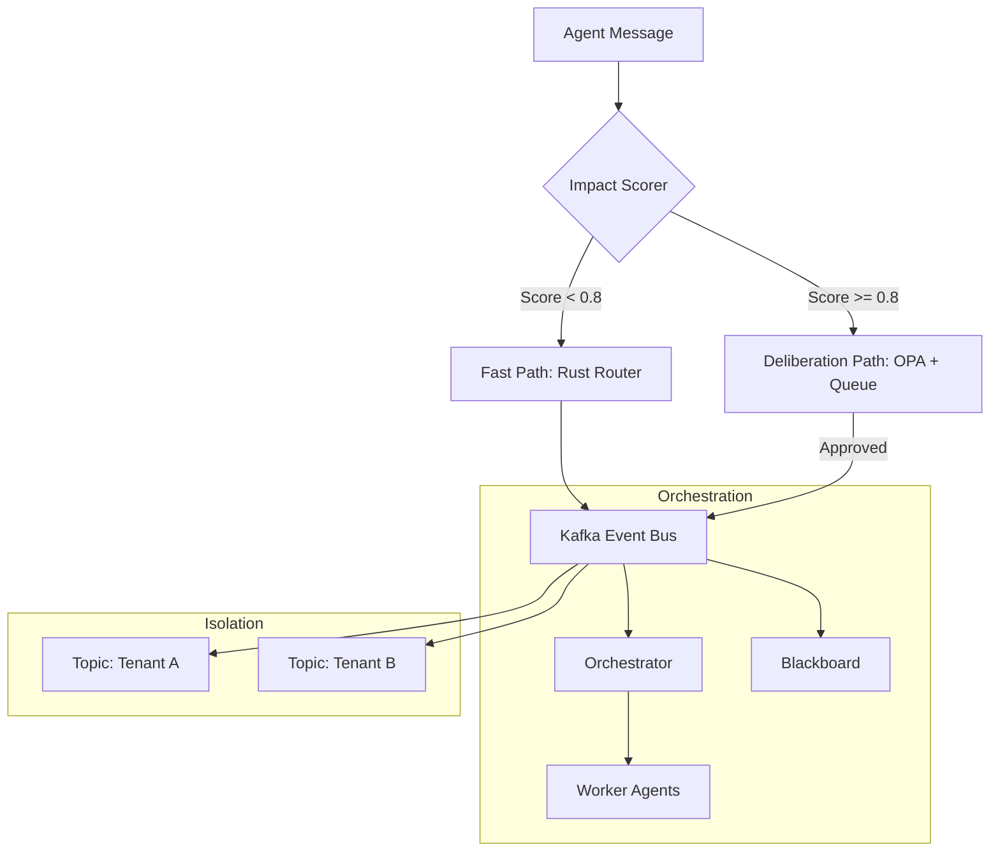

# ACGS-2 技术设计方案：自适应运行时护栏与事件驱动编排

**版本**: 2.0
**状态**: 草案
**宪法哈希**: `cdd01ef066bc6cf2`

## 1. 背景与目标

ACGS-2 旨在构建一个高性能、可扩展且符合宪法治理要求的智能体总线。本方案详细说明了 Pillar 3（自适应运行时护栏）和 Pillar 4（事件驱动的多智能体编排）的设计与实现。

## 2. Pillar 3: 自适应运行时护栏 (Adaptive Runtime Guardrails)

### 2.1 实时影响评分 (Impact Scoring)

我们将现有的 `ImpactScorer` 升级为多维度评分引擎，以实现更精准的风险评估。

#### 评分维度
1.  **语义维度 (Semantic)**: 使用 BERT 嵌入计算消息内容与高风险关键词的余弦相似度。
2.  **权限维度 (Permission)**: 检查消息请求的工具权限。
    - `LOW`: 只读操作，基础查询。
    - `MEDIUM`: 数据修改，非关键配置变更。
    - `HIGH`: 资金转移，系统级配置，敏感数据访问。
3.  **流量维度 (Volume)**: 监控智能体或租户的请求频率。
    - 触发公式: $S_v = \min(1.0, \frac{\text{current\_rate}}{\text{threshold}})$。
4.  **上下文维度 (Context)**: 结合历史行为序列，识别异常模式（如深夜突然发起的大额转账）。

### 2.2 双路径路由 (Dual-path Router)

路由决策基于影响分数 $S$：

-   **快速路径 (Fast Path)** ($S < 0.8$):
    -   由 Rust 后端直接处理。
    -   仅进行基础的宪法哈希验证。
    -   极低延迟（目标 < 1ms）。
-   **审议路径 (Deliberation Path)** ($S \ge 0.8$):
    -   **OPA 强制执行**: 调用 Open Policy Agent 进行细粒度策略检查。
    -   **最小特权边界**: 动态生成临时令牌，限制智能体仅能访问该任务所需的最小资源。
    -   **审议队列**: 进入 `DeliberationQueue`，触发多智能体投票或人工介入 (HITL)。

## 3. Pillar 4: 事件驱动的多智能体编排 (Event-Driven Orchestration)

### 3.1 Kafka 事件总线架构

我们将点对点消息替换为基于 Kafka 的事件总线，以支持高吞吐量和持久化。

#### Topic 设计与隔离
-   **命名规范**: `acgs.tenant.{tenant_id}.{event_type}`
-   **多租户隔离**: 在 Kafka 级别通过 Topic 权限控制 (ACLs) 确保租户间数据完全隔离。
-   **分区策略**: 以 `conversation_id` 作为 Partition Key，保证同一会话内的消息顺序性。

### 3.2 编排模式实现

1.  **编排者-工作者 (Orchestrator-Worker)**:
    -   编排者负责任务拆解和状态跟踪。
    -   工作者通过订阅任务 Topic 异步执行。
2.  **分层模式 (Hierarchical)**:
    -   顶级编排者管理多个领域编排者（如金融编排者、安全编排者）。
    -   适用于复杂的大规模系统。
3.  **黑板模式 (Blackboard)**:
    -   使用 Kafka Compacted Topic 维护全局状态。
    -   智能体观察状态变化并自主发布更新。

## 4. Rust 后端与 Python SDK 集成

-   **Rust 后端**: 负责 Kafka 客户端集成、高性能路由逻辑和基础验证。
-   **Python SDK**: 提供装饰器和异步 API，方便开发者快速构建智能体。
-   **通信**: 通过 PyO3 实现零拷贝数据交换。

## 5. 宪法合规性

所有操作必须携带 `constitutional_hash="cdd01ef066bc6cf2"`。Rust 后端在消息进入总线前会强制校验此哈希，任何不匹配的消息将被立即丢弃并触发安全告警。

---

## 架构图 (Mermaid)

