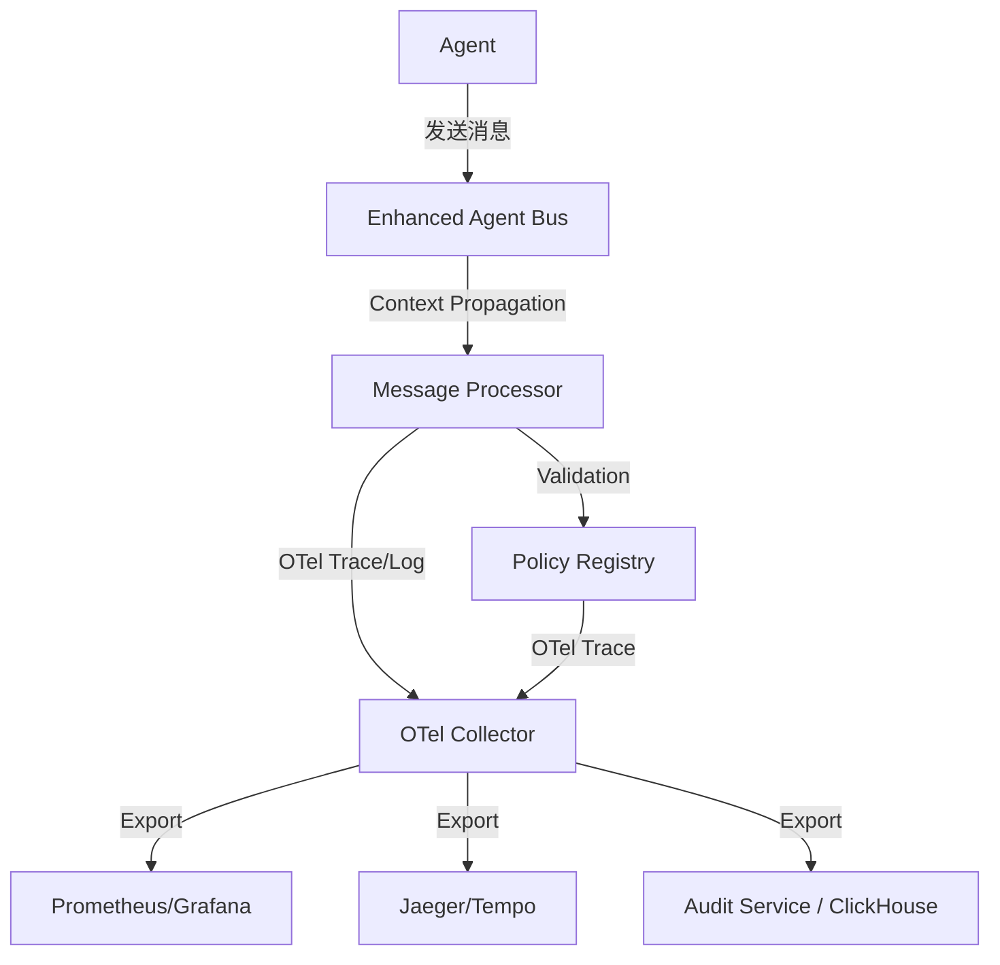
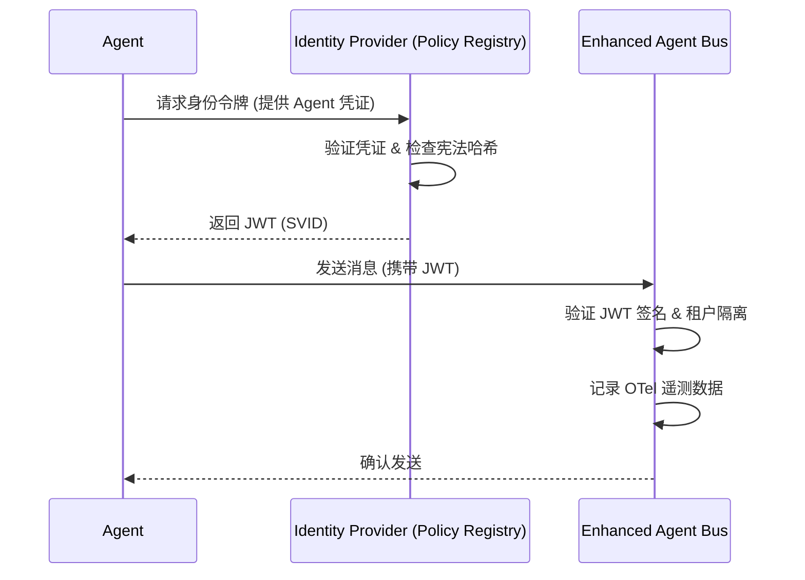

# ACGS-2 Pillar 5 & 6 技术设计方案

## 1. 背景与目标
本方案旨在完善 ACGS-2 的企业级特性，通过引入 OpenTelemetry 实现全栈可观测性，并构建基于 SPIFFE/JWT 的联邦身份体系，确保多租户环境下的安全隔离与合规审计。

**宪法哈希验证**: `cdd01ef066bc6cf2`

---

## 2. Pillar 5: 企业级可观测性与合规报告

### 2.1 OpenTelemetry 遥测架构
我们将集成 OpenTelemetry (OTel) 以捕获三类遥测数据：

- **Traces (追踪)**: 跟踪消息在总线中的流转，包括 `send -> validate -> deliberate -> deliver` 全过程。
- **Metrics (指标)**: 实时监控验证成功率、风险分数分布、租户流量等。
- **Logs (日志)**: 捕获结构化的决策日志，作为合规审计的基础。

#### 遥测数据流图


### 2.2 结构化决策日志模型
每条决策日志必须包含以下核心字段：

| 字段名 | 类型 | 说明 |
| :--- | :--- | :--- |
| `trace_id` | string | 关联追踪 ID |
| `agent_id` | string | 执行决策的 Agent 标识 |
| `tenant_id` | string | 所属租户标识 |
| `policy_version` | string | 决策时使用的策略版本 |
| `risk_score` | float | 影响评估分数 (0.0 - 1.0) |
| `decision` | string | 决策结果 (ALLOW/DENY/DELIBERATE) |
| `constitutional_hash` | string | 必须为 `cdd01ef066bc6cf2` |
| `compliance_tags` | list | 合规标签 (如 `eu-ai-act-art-12`, `nist-rmf-au-2`) |

### 2.3 合规映射表 (Compliance Mapping)

| 监管要求 | ACGS-2 遥测映射 | 自动化报告内容 |
| :--- | :--- | :--- |
| **EU AI Act (Art. 12)** | 结构化决策日志 + 审计追踪 | 自动记录高风险 AI 系统的所有决策及其依据。 |
| **NIST RMF (AU-2)** | 不可变审计账本 (AuditLedger) | 提供基于 Merkle Tree 的事件完整性证明。 |
| **NIST RMF (AC-3)** | RBAC 审计日志 | 记录所有管理 API 的访问和策略变更。 |

---

## 3. Pillar 6: 多租户安全与身份体系

### 3.1 联邦身份系统 (SPIFFE/JWT)
为每个 Agent 分配唯一的身份标识，并使用加密令牌进行保护。

- **SPIFFE ID 格式**: `spiffe://acgs2.io/tenant/{tenant_id}/agent/{agent_id}`
- **SVID (JWT) 载荷**:
  ```json
  {
    "sub": "spiffe://acgs2.io/tenant/alpha/agent/worker-1",
    "iss": "acgs2-identity-provider",
    "tenant_id": "alpha",
    "capabilities": ["messaging", "deliberation"],
    "constitutional_hash": "cdd01ef066bc6cf2",
    "exp": 1734567890
  }
  ```

### 3.2 租户隔离机制

#### 3.2.1 逻辑隔离增强
- **策略注册表隔离**: 在 `Policy Registry` 中，所有策略对象均绑定 `tenant_id`。API 请求必须携带有效的租户 Token，仅能操作所属租户的策略。
- **消息总线隔离**: `EnhancedAgentBus` 在处理消息时，校验 `message.tenant_id` 与发送方 Agent 的 Token 声明是否一致。

#### 3.2.2 RBAC 控制
管理 API 引入三级角色：
1. **System Admin**: 全局管理，可跨租户审计。
2. **Tenant Admin**: 管理本租户内的策略、Agent 注册和审计报告。
3. **Agent Operator**: 仅限操作特定 Agent 的生命周期。

### 3.3 身份验证流程


---

## 4. 实施计划 (Todo List)
1. [ ] **遥测集成**: 在 `enhanced_agent_bus/core.py` 中引入 `opentelemetry-sdk`。
2. [ ] **日志模型**: 在 `enhanced_agent_bus/models.py` 中定义 `DecisionLog` 类。
3. [ ] **身份系统**: 在 `services/policy_registry` 中实现 JWT 签发逻辑。
4. [ ] **隔离增强**: 修改 `EnhancedAgentBus.register_agent` 以强制校验租户身份。
5. [ ] **合规导出**: 在 `services/audit_service` 中增加合规报告生成器。

---
**方案确认**: 请确认上述设计是否满足您的需求。
