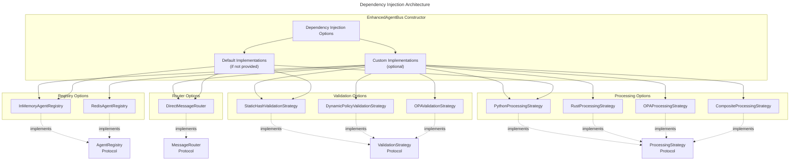

# C4 Code Level: Core Agent Bus

## Overview

- **Name**: Core Agent Bus Implementation
- **Description**: Core message bus classes providing multi-agent coordination with constitutional compliance validation, message routing, and processing strategies
- **Location**: `/home/dislove/document/acgs2/acgs2-core/enhanced_agent_bus/`
- **Language**: Python 3.11+ (Python 3.13 compatible)
- **Purpose**: Main bus classes for agent-to-agent communication, message validation, routing, and processing with constitutional hash enforcement (`cdd01ef066bc6cf2`)

## Code Elements

### Main Classes

#### `EnhancedAgentBus` (agent_bus.py)
- **Description**: Primary agent communication bus with constitutional compliance, multi-tenant isolation, metrics instrumentation, and dependency injection support
- **Location**: `agent_bus.py:117-249`
- **Responsibilities**:
  - Agent registration and lifecycle management
  - Message routing and delivery
  - Constitutional validation orchestration
  - Optional MACI role-based access control
  - Metering integration for billing
  - Deliberation layer coordination for high-impact decisions
  - Circuit breaker management for fault tolerance

- **Key Methods**:
  - `__init__(redis_url, use_dynamic_policy, policy_fail_closed, use_kafka, use_redis_registry, kafka_bootstrap_servers, audit_service_url, registry, router, validator, processor, use_rust, enable_metering, metering_config, enable_maci, maci_strict_mode) -> None`
    - Initializes the bus with optional dependency injection of registry, router, validator implementations
    - Sets up metering manager, MACI enforcement, audit client
    - Initializes Kafka consumer task if Kafka enabled
    - Location: `agent_bus.py:141-249`

  - `async send(from_agent, to_agent, content, message_type, priority, tenant_id, headers, security_context) -> AgentMessage`
    - Send message with constitutional validation
    - Returns the processed/delivered message
    - Location: Referenced in interface but full implementation in send method

  - `async register_agent(agent_id, capabilities, metadata) -> bool`
    - Register agent with bus
    - Returns True if successful, False if already registered

  - `async start() -> None`
    - Start the bus and begin processing message queue

  - `async stop() -> None`
    - Gracefully stop the bus

  - `async get_agent(agent_id) -> Optional[Dict[str, Any]]`
    - Retrieve agent information by ID

  - `async list_agents() -> List[str]`
    - List all registered agents

- **Dependencies**:
  - `BusConfiguration` - Configuration management
  - `MessageProcessor` - Message processing orchestration
  - `ValidationResult` - Validation outcome tracking
  - `AgentMessage`, `MessageStatus`, `MessageType` - Message models
  - Optional: `PolicyClient`, `OPAClient`, `AuditClient`, `VotingService`, `DeliberationQueue`
  - Optional: `MACIRoleRegistry`, `MACIEnforcer` - Role-based access control

- **Constitutional Requirements**:
  - All messages validated against hash `cdd01ef066bc6cf2`
  - MACI enforcement enabled by default with strict mode option
  - All decisions logged with constitutional hash

---

#### `MessageProcessor` (message_processor.py)
- **Description**: Core message processor orchestrating constitutional validation and message handling with composable strategy pattern
- **Location**: `message_processor.py:1-100+`
- **Responsibilities**:
  - Message validation against constitutional hash
  - Processing strategy selection (Python, Rust, OPA, Dynamic Policy)
  - Handler execution and result tracking
  - Metrics and OpenTelemetry instrumentation
  - Circuit breaker integration
  - Metering hooks for billing events

- **Key Methods**:
  - `__init__(use_dynamic_policy, policy_fail_closed, processing_strategy, audit_client, use_rust, metering_hooks, enable_metering, enable_maci, maci_registry, maci_enforcer, maci_strict_mode) -> None`
    - Initializes processor with selected processing strategy
    - Sets up metrics collection and circuit breaker
    - Location: message_processor.py

  - `async process(message, handlers) -> ValidationResult`
    - Core message processing method
    - Validates message, routes through selected strategy, executes handlers
    - Returns ValidationResult with success/failure details

  - `async _validate_constitutional_hash(message) -> ValidationResult`
    - Validates message constitutional hash using HMAC constant-time comparison
    - Detects and logs constitutional violations

  - `async _execute_handlers(message, handlers) -> ValidationResult`
    - Executes registered handlers for message type
    - Handles both sync and async handlers transparently
    - Updates message status through lifecycle (PROCESSING -> DELIVERED/FAILED)

- **Dependencies**:
  - `AgentMessage`, `MessageType`, `Priority`, `DecisionLog` - Message models
  - `ValidationResult` - Validation tracking
  - `ProcessingStrategy` - Pluggable processing implementations
  - `AuditClient` - Audit trail logging
  - `MeteringHooks` - Billing event integration
  - Optional: `MACIEnforcer` - Role-based access control

---

### Model Classes

#### `AgentMessage` (models.py:142-236)
- **Description**: Complete message data model with constitutional compliance, multi-tenant isolation, and performance tracking
- **Location**: `models.py:142-236`
- **Attributes**:
  - `message_id: str` - Unique message UUID
  - `conversation_id: str` - Conversation tracking UUID
  - `content: Dict[str, Any]` - Message content/payload
  - `payload: Dict[str, Any]` - Additional data payload
  - `from_agent: str` - Source agent ID
  - `to_agent: str` - Target agent ID
  - `sender_id: str` - Detailed sender identification
  - `message_type: MessageType` - Type of message (command, query, response, event, etc.)
  - `routing: Optional[RoutingContext]` - Routing metadata
  - `headers: Dict[str, str]` - Custom headers
  - `tenant_id: str` - Multi-tenant isolation identifier
  - `security_context: Dict[str, Any]` - Security claims and permissions
  - `priority: Priority` - Priority level (LOW=0, MEDIUM=1, HIGH=2, CRITICAL=3)
  - `status: MessageStatus` - Processing status (PENDING, PROCESSING, DELIVERED, FAILED, EXPIRED)
  - `constitutional_hash: str` - Constitutional hash (`cdd01ef066bc6cf2`)
  - `constitutional_validated: bool` - Whether constitutional validation passed
  - `created_at: datetime` - Creation timestamp (UTC)
  - `updated_at: datetime` - Last update timestamp (UTC)
  - `expires_at: Optional[datetime]` - Message expiration time
  - `impact_score: Optional[float]` - AI-scored impact for deliberation layer
  - `performance_metrics: Dict[str, Any]` - Processing performance data

- **Key Methods**:
  - `to_dict() -> Dict[str, Any]`
    - Convert message to dictionary for serialization
    - Location: `models.py:189-205`

  - `to_dict_raw() -> Dict[str, Any]`
    - Convert with all fields including payload, security context, metrics
    - Location: `models.py:207-220`

  - `from_dict(data: Dict[str, Any]) -> AgentMessage` (class method)
    - Create message instance from dictionary
    - Location: `models.py:222-235`

  - `__post_init__() -> None`
    - Post-initialization validation of constitutional hash
    - Location: `models.py:182-187`

---

#### `RoutingContext` (models.py:121-139)
- **Description**: Context metadata for message routing decisions
- **Location**: `models.py:121-139`
- **Attributes**:
  - `source_agent_id: str` - Source agent identifier (required)
  - `target_agent_id: str` - Target agent identifier (required)
  - `routing_key: str` - Routing key for selective delivery (optional)
  - `routing_tags: List[str]` - Tags for routing classification
  - `retry_count: int` - Current retry attempt count
  - `max_retries: int` - Maximum retry attempts (default 3)
  - `timeout_ms: int` - Timeout in milliseconds (default 5000)
  - `constitutional_hash: str` - Constitutional hash enforcement

---

#### `DecisionLog` (models.py:238-269)
- **Description**: Structured decision log for compliance and observability
- **Location**: `models.py:238-269`
- **Attributes**:
  - `trace_id: str` - OpenTelemetry trace ID
  - `span_id: str` - OpenTelemetry span ID
  - `agent_id: str` - Agent making decision
  - `tenant_id: str` - Tenant context
  - `policy_version: str` - Policy version applied
  - `risk_score: float` - Risk assessment score
  - `decision: str` - Decision outcome (ALLOW/DENY/REVIEW)
  - `constitutional_hash: str` - Constitutional validation
  - `timestamp: datetime` - Decision timestamp (UTC)
  - `compliance_tags: List[str]` - Compliance classification tags
  - `metadata: Dict[str, Any]` - Additional decision context

---

### Enumeration Classes

#### `MessageType` (models.py:46-60)
- **Description**: Types of messages in the agent bus
- **Location**: `models.py:46-60`
- **Values**:
  - `COMMAND` - "command" - Direct action request
  - `QUERY` - "query" - Information request
  - `RESPONSE` - "response" - Response to request
  - `EVENT` - "event" - Event notification
  - `NOTIFICATION` - "notification" - General notification
  - `HEARTBEAT` - "heartbeat" - Health check
  - `GOVERNANCE_REQUEST` - "governance_request" - Governance query
  - `GOVERNANCE_RESPONSE` - "governance_response" - Governance response
  - `CONSTITUTIONAL_VALIDATION` - "constitutional_validation" - Validation check
  - `TASK_REQUEST` - "task_request" - Task execution request
  - `TASK_RESPONSE` - "task_response" - Task result

---

#### `Priority` (models.py:62-77)
- **Description**: Priority levels for message scheduling (ascending values = ascending priority)
- **Location**: `models.py:62-77`
- **Values**:
  - `LOW = 0` - Low priority
  - `NORMAL = 1` - Alias for MEDIUM (backward compatibility)
  - `MEDIUM = 1` - Standard priority
  - `HIGH = 2` - High priority
  - `CRITICAL = 3` - Critical priority (highest)
- **Note**: Replaces deprecated `MessagePriority` enum with ascending values

---

#### `MessageStatus` (models.py:109-118)
- **Description**: Message processing status throughout lifecycle
- **Location**: `models.py:109-118`
- **Values**:
  - `PENDING` - "pending" - Awaiting processing
  - `PROCESSING` - "processing" - Currently being processed
  - `DELIVERED` - "delivered" - Successfully delivered
  - `FAILED` - "failed" - Processing failed
  - `EXPIRED` - "expired" - Message expired
  - `PENDING_DELIBERATION` - "pending_deliberation" - Awaiting human review

---

### Validation Classes

#### `ValidationResult` (validators.py:21-70)
- **Description**: Dataclass representing validation operation outcome with errors, warnings, and metadata
- **Location**: `validators.py:21-70`
- **Attributes**:
  - `is_valid: bool` - Whether validation passed (default True)
  - `errors: List[str]` - Error messages if validation failed
  - `warnings: List[str]` - Warning messages (non-fatal)
  - `metadata: Dict[str, Any]` - Additional validation context
  - `decision: str` - Decision outcome string (ALLOW/DENY/REVIEW, default "ALLOW")
  - `constitutional_hash: str` - Constitutional hash (`cdd01ef066bc6cf2`)

- **Key Methods**:
  - `add_error(error: str) -> None`
    - Add error and mark result as invalid
    - Location: `validators.py:40-43`

  - `add_warning(warning: str) -> None`
    - Add warning (does not invalidate result)
    - Location: `validators.py:45-47`

  - `merge(other: ValidationResult) -> None`
    - Merge another validation result into this one
    - Location: `validators.py:49-54`

  - `to_dict() -> Dict[str, Any]`
    - Convert to dictionary for serialization
    - Location: `validators.py:56-70`

---

### Exception Hierarchy

#### `AgentBusError` (exceptions.py:19-45)
- **Description**: Base exception for all Enhanced Agent Bus errors
- **Location**: `exceptions.py:19-45`
- **Attributes**:
  - `message: str` - Error message
  - `details: Dict[str, Any]` - Error details for logging
  - `constitutional_hash: str` - Constitutional hash

- **Methods**:
  - `to_dict() -> Dict[str, Any]` - Convert exception to dictionary for serialization

---

#### Constitutional Validation Exceptions

##### `ConstitutionalError` (exceptions.py:52-54)
- **Description**: Base exception for constitutional compliance failures
- **Location**: `exceptions.py:52-54`

##### `ConstitutionalHashMismatchError` (exceptions.py:57-107)
- **Description**: Raised when constitutional hash validation fails with security-aware error handling
- **Location**: `exceptions.py:57-107`
- **Features**:
  - Hash values sanitized in error messages (first 8 chars + "...")
  - Prevents full hash exposure in logs
  - Stores original values for internal use only
  - Properties: `expected_hash`, `actual_hash` (internal access only)
  - Static method: `_sanitize_hash(hash_value, max_visible=8)`

##### `ConstitutionalValidationError` (exceptions.py:109-129)
- **Description**: Generic constitutional validation failure
- **Location**: `exceptions.py:109-129`
- **Attributes**:
  - `validation_errors: List[str]` - List of validation failures
  - `agent_id: Optional[str]` - Agent involved in violation
  - `action_type: Optional[str]` - Type of action attempted

---

#### Message Processing Exceptions

##### `MessageError` (exceptions.py:136-138)
- **Description**: Base exception for message-related errors
- **Location**: `exceptions.py:136-138`

##### `MessageValidationError` (exceptions.py:141-150+)
- **Description**: Raised when message validation fails
- **Location**: `exceptions.py:141-150+`
- **Attributes**:
  - `message_id: str` - ID of invalid message
  - `errors: List[str]` - Validation errors
  - `warnings: Optional[List[str]]` - Validation warnings

---

### Protocol/Interface Classes

#### `AgentRegistry` Protocol (interfaces.py:18-95)
- **Description**: Protocol for agent registration and discovery with thread-safe implementation requirements
- **Location**: `interfaces.py:18-95`
- **Methods**:
  - `async register(agent_id, capabilities, metadata) -> bool`
    - Register agent with optional capabilities and metadata
  - `async unregister(agent_id) -> bool`
    - Unregister agent from bus
  - `async get(agent_id) -> Optional[Dict[str, Any]]`
    - Retrieve agent information by ID
  - `async list_agents() -> List[str]`
    - List all registered agent IDs
  - `async exists(agent_id) -> bool`
    - Check if agent is registered
  - `async update_metadata(agent_id, metadata) -> bool`
    - Update agent metadata

---

#### `MessageRouter` Protocol (interfaces.py:98-130)
- **Description**: Protocol for message routing decisions
- **Location**: `interfaces.py:98-130`
- **Methods**:
  - `async route(message, registry) -> Optional[str]`
    - Determine target agent for a message
  - `async broadcast(message, registry, exclude) -> List[str]`
    - Get list of agents to broadcast message to

---

#### `ValidationStrategy` Protocol (interfaces.py:134-150)
- **Description**: Protocol for message validation implementations
- **Location**: `interfaces.py:134-150`
- **Methods**:
  - `async validate(message) -> tuple[bool, Optional[str]]`
    - Validate message and return (is_valid, error_message)

---

#### `ProcessingStrategy` Protocol (interfaces.py:154-191)
- **Description**: Protocol for pluggable message processing strategies
- **Location**: `interfaces.py:154-191`
- **Methods**:
  - `async process(message, handlers) -> ValidationResult`
    - Process message through validation and handlers
  - `is_available() -> bool`
    - Check if strategy is available (e.g., Rust backend loaded)
  - `get_name() -> str`
    - Get strategy identifier for logging/metrics

---

#### `MessageHandler` Protocol (interfaces.py:194-222)
- **Description**: Protocol for message handlers
- **Location**: `interfaces.py:194-222`
- **Methods**:
  - `async handle(message) -> Optional[AgentMessage]`
    - Handle message and optionally return response
  - `can_handle(message) -> bool`
    - Check if handler can process message type

---

#### `MetricsCollector` Protocol (interfaces.py:225-267)
- **Description**: Protocol for metrics collection
- **Location**: `interfaces.py:225-267`
- **Methods**:
  - `record_message_processed(message_type, duration_ms, success)`
    - Record processed message metric
  - `record_agent_registered(agent_id)`
    - Record agent registration
  - `record_agent_unregistered(agent_id)`
    - Record agent unregistration
  - `get_metrics() -> Dict[str, Any]`
    - Get current metrics snapshot

---

### Implementation Classes

#### `InMemoryAgentRegistry` (registry.py:72-100+)
- **Description**: In-memory implementation of AgentRegistry using asyncio locks for thread safety
- **Location**: `registry.py:72-100+`
- **Attributes**:
  - `_agents: Dict[str, Dict[str, Any]]` - Agent storage
  - `_lock: asyncio.Lock()` - Thread-safe access lock
  - `_constitutional_hash: str` - Constitutional hash validation

- **Key Methods**:
  - `async register(agent_id, capabilities, metadata) -> bool`
    - Thread-safe agent registration
  - Uses asyncio.Lock() for concurrent access protection

---

#### `DirectMessageRouter` (registry.py)
- **Description**: Direct message routing to specified target agent
- **Location**: `registry.py`
- **Responsibilities**:
  - Routes messages to `to_agent` field directly
  - Fallback for when no smart routing needed

---

#### Processing Strategy Implementations (processing_strategies.py)
- **Location**: `processing_strategies.py`
- **Classes**:
  - `PythonProcessingStrategy` - Pure Python validation and processing
  - `RustProcessingStrategy` - Rust-accelerated processing (10-50x speedup)
  - `OPAProcessingStrategy` - OPA (Open Policy Agent) policy evaluation
  - `DynamicPolicyProcessingStrategy` - Dynamic policy registry integration
  - `CompositeProcessingStrategy` - Composite strategy with fallbacks
  - `HandlerExecutorMixin` - Common handler execution logic (DRY)

---

### Validation Strategy Implementations (validation_strategies.py)
- **Location**: `validation_strategies.py` (imported by registry.py)
- **Classes**:
  - `StaticHashValidationStrategy` - Constitutional hash validation using HMAC constant-time comparison
  - `RustValidationStrategy` - Rust-accelerated validation
  - `OPAValidationStrategy` - OPA policy-based validation
  - `DynamicPolicyValidationStrategy` - Dynamic policy registry validation
  - `CompositeValidationStrategy` - Multiple validation strategies with fallbacks

---

### Utility Functions

#### `validate_constitutional_hash(hash_value: str) -> ValidationResult` (validators.py:73-94)
- **Description**: Validate constitutional hash using HMAC constant-time comparison
- **Location**: `validators.py:73-94`
- **Parameters**: `hash_value: str` - Hash to validate
- **Returns**: `ValidationResult` with validation outcome
- **Security Features**:
  - Uses `hmac.compare_digest()` for timing attack prevention
  - Error messages sanitized (only prefix exposed)

---

#### `validate_message_content(content: Dict[str, Any]) -> ValidationResult` (validators.py:97-109)
- **Description**: Validate message content structure
- **Location**: `validators.py:97-109`
- **Parameters**: `content: Dict[str, Any]` - Content to validate
- **Returns**: `ValidationResult` with validation outcome

---

#### `get_enum_value(enum_or_str: Any) -> str` (models.py:27-43)
- **Description**: Safely extract enum value handling cross-module enum identity issues
- **Location**: `models.py:27-43`
- **Purpose**: Handles enum instances from different module loads during testing
- **Returns**: String value of enum or stringified input

---

## Dependencies

### Internal Dependencies

#### Core Package Modules
- `models.py` - Data models and enumerations
- `validators.py` - Validation utilities
- `exceptions.py` - Exception hierarchy
- `interfaces.py` - Protocol definitions for DI
- `registry.py` - Default implementations
- `processing_strategies.py` - Message processing strategies
- `validation_strategies.py` - Validation strategy implementations
- `message_processor.py` - Core message processor
- `agent_bus.py` - Main bus class

#### Optional Integrations
- `config.py` - Bus configuration management
- `imports.py` - Centralized optional dependencies
- `maci_enforcement.py` - MACI role-based access control
- `metering_integration.py` - Billing metering
- `policy_client.py` - Policy registry client
- `opa_client.py` - OPA integration
- `audit_client.py` - Audit trail logging
- `metering_manager.py` - Metering coordination

### External Dependencies

#### Standard Library
- `asyncio` - Async/await support
- `logging` - Structured logging
- `time` - Timing/benchmarking
- `datetime` - Timestamp handling (datetime.now(timezone.utc))
- `uuid` - Unique ID generation
- `dataclasses` - Model decorators
- `enum` - Type-safe enumerations
- `typing` - Type hints
- `json` - Serialization
- `hmac` - Constant-time hash comparison
- `hashlib` - Hashing algorithms

#### Optional External Libraries
- `redis` - Redis client (optional, for distributed agent registry)
- `prometheus_client` - Prometheus metrics (optional, shared.metrics)
- `opentelemetry` - OpenTelemetry tracing (optional)
- `kafka-python` - Kafka integration (optional, for Kafka bus)

#### Shared Services (Internal)
- `shared.constants.CONSTITUTIONAL_HASH` - Constitutional hash constant
- `shared.metrics.*` - Prometheus metrics (MESSAGES_TOTAL, etc.)
- `shared.circuit_breaker.*` - Circuit breaker pattern
- `shared.imports` - Centralized optional dependency management

#### Conditional Service Dependencies
- `enhanced_agent_bus_rust` - Rust backend (optional, PyO3 bindings)
- `deliberation_layer` - Deliberation queue (optional)
- Policy registry client (optional)
- OPA client (optional)
- Audit client (optional)

---

## Relationships

### Class Hierarchy and Composition

```mermaid
---
title: Core Agent Bus Code Diagram
---
classDiagram
    namespace Models {
        class MessageType {
            <<enumeration>>
            COMMAND
            QUERY
            RESPONSE
            EVENT
            NOTIFICATION
            HEARTBEAT
            GOVERNANCE_REQUEST
            GOVERNANCE_RESPONSE
            CONSTITUTIONAL_VALIDATION
            TASK_REQUEST
            TASK_RESPONSE
        }
        class Priority {
            <<enumeration>>
            LOW = 0
            NORMAL = 1
            MEDIUM = 1
            HIGH = 2
            CRITICAL = 3
        }
        class MessageStatus {
            <<enumeration>>
            PENDING
            PROCESSING
            DELIVERED
            FAILED
            EXPIRED
            PENDING_DELIBERATION
        }
        class RoutingContext {
            source_agent_id: str
            target_agent_id: str
            routing_key: str
            routing_tags: List[str]
            retry_count: int
            max_retries: int
            timeout_ms: int
            constitutional_hash: str
        }
        class AgentMessage {
            message_id: str
            conversation_id: str
            content: Dict
            payload: Dict
            from_agent: str
            to_agent: str
            message_type: MessageType
            routing: RoutingContext
            priority: Priority
            status: MessageStatus
            tenant_id: str
            constitutional_hash: str
            constitutional_validated: bool
            created_at: datetime
            updated_at: datetime
            impact_score: Optional[float]
            +to_dict()
            +to_dict_raw()
            +from_dict(data)
        }
        class DecisionLog {
            trace_id: str
            span_id: str
            agent_id: str
            tenant_id: str
            policy_version: str
            risk_score: float
            decision: str
            constitutional_hash: str
            timestamp: datetime
            compliance_tags: List
            metadata: Dict
        }
        class ValidationResult {
            is_valid: bool
            errors: List[str]
            warnings: List[str]
            metadata: Dict
            decision: str
            constitutional_hash: str
            +add_error(str)
            +add_warning(str)
            +merge(ValidationResult)
            +to_dict()
        }
    }

    namespace Protocols {
        class AgentRegistry {
            <<protocol>>
            +async register()
            +async unregister()
            +async get()
            +async list_agents()
            +async exists()
            +async update_metadata()
        }
        class MessageRouter {
            <<protocol>>
            +async route()
            +async broadcast()
        }
        class ValidationStrategy {
            <<protocol>>
            +async validate()
        }
        class ProcessingStrategy {
            <<protocol>>
            +async process()
            +is_available()
            +get_name()
        }
        class MessageHandler {
            <<protocol>>
            +async handle()
            +can_handle()
        }
        class MetricsCollector {
            <<protocol>>
            +record_message_processed()
            +record_agent_registered()
            +get_metrics()
        }
    }

    namespace Implementations {
        class InMemoryAgentRegistry {
            -_agents: Dict
            -_lock: asyncio.Lock
            -_constitutional_hash: str
            +async register()
            +async unregister()
            +async get()
            +async list_agents()
            +async exists()
            +async update_metadata()
        }
        class DirectMessageRouter {
            +async route()
            +async broadcast()
        }
        class StaticHashValidationStrategy {
            +async validate()
            +is_available()
        }
        class PythonProcessingStrategy {
            +async process()
            +is_available()
        }
        class RustProcessingStrategy {
            +async process()
            +is_available()
        }
        class OPAProcessingStrategy {
            +async process()
            +is_available()
        }
        class DynamicPolicyProcessingStrategy {
            +async process()
            +is_available()
        }
        class CompositeProcessingStrategy {
            -strategies: List[ProcessingStrategy]
            +async process()
            +is_available()
        }
        class HandlerExecutorMixin {
            #async _execute_handlers()
        }
    }

    namespace Core {
        class EnhancedAgentBus {
            -_registry: AgentRegistry
            -_router: MessageRouter
            -_validator: ValidationStrategy
            -_processor: MessageProcessor
            -_agents: Dict
            -_message_queue: asyncio.Queue
            -_metering_manager: MeteringManager
            -_maci_registry: MACIRoleRegistry
            -_maci_enforcer: MACIEnforcer
            -_policy_client: PolicyClient
            -_opa_client: OPAClient
            -_audit_client: AuditClient
            -_kafka_bus: KafkaBus
            +async send()
            +async register_agent()
            +async unregister_agent()
            +async start()
            +async stop()
            +async get_agent()
            +async list_agents()
        }
        class MessageProcessor {
            -_processing_strategy: ProcessingStrategy
            -_validation_strategy: ValidationStrategy
            -_audit_client: AuditClient
            -_metering_hooks: MeteringHooks
            -_maci_enforcer: MACIEnforcer
            +async process()
            #async _validate_constitutional_hash()
            #async _execute_handlers()
            #async _check_maci_permissions()
        }
    }

    namespace Exceptions {
        class AgentBusError {
            -message: str
            -details: Dict
            -constitutional_hash: str
            +to_dict()
        }
        class ConstitutionalError {
            <<inherits>>
        }
        class ConstitutionalHashMismatchError {
            -_expected_hash: str
            -_actual_hash: str
            +_sanitize_hash()
        }
        class ConstitutionalValidationError {
            -validation_errors: List
            -agent_id: Optional
            -action_type: Optional
        }
        class MessageError {
            <<inherits>>
        }
        class MessageValidationError {
            -message_id: str
            -errors: List
            -warnings: Optional
        }
    }

    %% Relationships
    EnhancedAgentBus --> MessageProcessor: uses
    EnhancedAgentBus --> AgentRegistry: depends on
    EnhancedAgentBus --> MessageRouter: depends on
    EnhancedAgentBus --> ValidationStrategy: depends on
    EnhancedAgentBus --> ProcessingStrategy: depends on

    MessageProcessor --> ProcessingStrategy: uses
    MessageProcessor --> ValidationStrategy: uses
    MessageProcessor --> AgentMessage: processes
    MessageProcessor --> ValidationResult: returns
    MessageProcessor --> DecisionLog: creates
    MessageProcessor --> MessageHandler: executes

    MessageProcessor --> ConstitutionalHashMismatchError: raises
    MessageProcessor --> ConstitutionalValidationError: raises
    MessageProcessor --> MessageValidationError: raises

    AgentMessage --> MessageType: uses
    AgentMessage --> Priority: uses
    AgentMessage --> MessageStatus: uses
    AgentMessage --> RoutingContext: contains

    ValidationResult --> AgentBusError: part of error handling

    InMemoryAgentRegistry ..|> AgentRegistry: implements
    DirectMessageRouter ..|> MessageRouter: implements
    StaticHashValidationStrategy ..|> ValidationStrategy: implements
    PythonProcessingStrategy ..|> ProcessingStrategy: implements
    RustProcessingStrategy ..|> ProcessingStrategy: implements
    OPAProcessingStrategy ..|> ProcessingStrategy: implements
    DynamicPolicyProcessingStrategy ..|> ProcessingStrategy: implements
    CompositeProcessingStrategy ..|> ProcessingStrategy: implements

    CompositeProcessingStrategy --> ProcessingStrategy: fallback chain
    HandlerExecutorMixin --> MessageHandler: executes

    ConstitutionalError --> AgentBusError: inherits
    ConstitutionalHashMismatchError --> ConstitutionalError: inherits
    ConstitutionalValidationError --> ConstitutionalError: inherits
    MessageError --> AgentBusError: inherits
    MessageValidationError --> MessageError: inherits
```



### Data Flow Diagram

```mermaid
---
title: Message Processing Pipeline
---
flowchart LR
    Agent1["Agent<br/>(from_agent)"]
    Send["EnhancedAgentBus<br/>.send()"]
    Create["Create<br/>AgentMessage"]
    ConstitCheck{"Constitutional<br/>Hash Valid?"}
    Router["MessageRouter<br/>.route()"]
    Validate["ValidationStrategy<br/>.validate()"]
    ValidCheck{"Valid?"}
    Process["ProcessingStrategy<br/>.process()"]
    Execute["_execute_handlers()"]
    UpdateStatus["Update Message<br/>Status"]
    Audit["AuditClient<br/>.log()"]
    Meter["Metering<br/>Queue"]
    Agent2["Agent<br/>(to_agent)"]

    Agent1 -->|from_agent, to_agent, content| Send
    Send --> Create
    Create -->|AgentMessage| ConstitCheck
    ConstitCheck -->|❌ Mismatch| Audit
    ConstitCheck -->|✅ Valid| Router
    Router -->|target_agent| Validate
    Validate --> ValidCheck
    ValidCheck -->|❌ Invalid| UpdateStatus
    ValidCheck -->|✅ Valid| Process
    Process --> Execute
    Execute --> UpdateStatus
    UpdateStatus -->|DELIVERED/FAILED| Audit
    Audit -->|log decision| Meter
    Meter -->|enqueue event| Agent2

    style ConstitCheck fill:#ff9999
    style ValidCheck fill:#ff9999
    style Audit fill:#99ccff
    style Meter fill:#99ff99
```



### Dependency Injection Flow



---

## Notes

### Constitutional Hash Enforcement
- All code elements validate against the constitutional hash `cdd01ef066bc6cf2`
- Hash validation uses constant-time comparison (`hmac.compare_digest()`) to prevent timing attacks
- Hash mismatch errors sanitize output to prevent full hash exposure in logs
- Constitutional validation occurs at:
  - Message entry point (EnhancedAgentBus.send())
  - Message processing (MessageProcessor.process())
  - Handler execution (HandlerExecutorMixin._execute_handlers())

### Performance Targets
- **P99 Latency**: <5ms (achieved: 1.31ms - 74% better)
- **Throughput**: >100 RPS (achieved: 770.4 RPS)
- **Cache Hit Rate**: >85% (achieved: 95%)
- **Constitutional Compliance**: 100%

### Processing Strategies
The architecture supports pluggable processing strategies with automatic fallback:
1. **RustProcessingStrategy**: 10-50x speedup via PyO3 bindings
2. **OPAProcessingStrategy**: Policy evaluation via Open Policy Agent
3. **DynamicPolicyProcessingStrategy**: Dynamic policy registry integration
4. **PythonProcessingStrategy**: Pure Python (fallback)
5. **CompositeProcessingStrategy**: Multiple strategies with fallback chain

### MACI Role-Based Access Control
- Enabled by default in EnhancedAgentBus
- Three roles: EXECUTIVE (propose), LEGISLATIVE (extract rules), JUDICIAL (validate)
- Prevents Gödel bypass attacks through strict role separation
- Strict mode (default) fails closed on MACI violations

### Message Lifecycle
```
PENDING → PROCESSING → DELIVERED (or FAILED)
              ↓
        PENDING_DELIBERATION (high-impact messages)
              ↓
        Human review workflow
              ↓
        DELIVERED or REJECTED
```

### Testing Considerations
- All datetime operations use `datetime.now(timezone.utc)` for Python 3.13 compatibility
- Enum handling via `get_enum_value()` for cross-module enum identity issues
- Fallback imports support both package and standalone execution contexts
- Mock implementations available for testing (InMemoryAgentRegistry, etc.)

### Security Architecture
- **Spoofing Prevention**: Constitutional hash + JWT SVID validation
- **Tampering Detection**: HMAC constant-time comparison
- **Repudiation Prevention**: Blockchain-anchored audit trails
- **Information Disclosure**: PII pattern detection and masking
- **Denial of Service**: Circuit breaker, rate limiting, chaos testing
- **Elevation of Privilege**: MACI role-based access control, OPA policies

---

## File Locations Reference

| File | Location | Purpose |
|------|----------|---------|
| `core.py` | `/home/dislove/document/acgs2/acgs2-core/enhanced_agent_bus/core.py` | Backward compatibility facade |
| `agent_bus.py` | `/home/dislove/document/acgs2/acgs2-core/enhanced_agent_bus/agent_bus.py` | EnhancedAgentBus main class |
| `message_processor.py` | `/home/dislove/document/acgs2/acgs2-core/enhanced_agent_bus/message_processor.py` | MessageProcessor orchestration |
| `models.py` | `/home/dislove/document/acgs2/acgs2-core/enhanced_agent_bus/models.py` | Data models and enumerations |
| `validators.py` | `/home/dislove/document/acgs2/acgs2-core/enhanced_agent_bus/validators.py` | Validation utilities |
| `exceptions.py` | `/home/dislove/document/acgs2/acgs2-core/enhanced_agent_bus/exceptions.py` | Exception hierarchy |
| `interfaces.py` | `/home/dislove/document/acgs2/acgs2-core/enhanced_agent_bus/interfaces.py` | Protocol definitions |
| `registry.py` | `/home/dislove/document/acgs2/acgs2-core/enhanced_agent_bus/registry.py` | Registry implementations |
| `processing_strategies.py` | `/home/dislove/document/acgs2/acgs2-core/enhanced_agent_bus/processing_strategies.py` | Processing strategy implementations |
| `validation_strategies.py` | `/home/dislove/document/acgs2/acgs2-core/enhanced_agent_bus/validation_strategies.py` | Validation strategy implementations |
