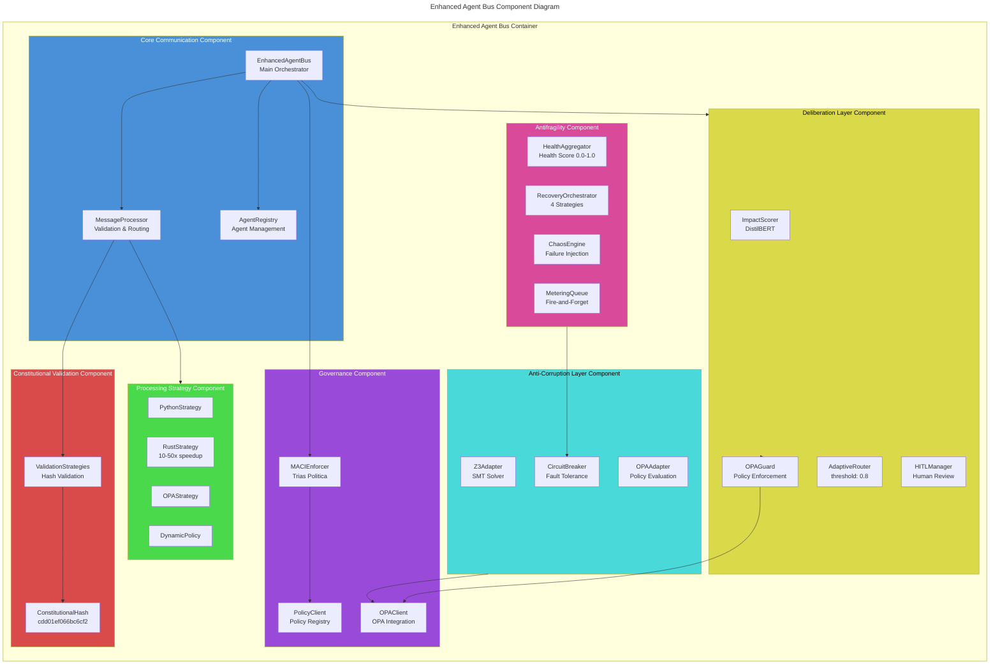
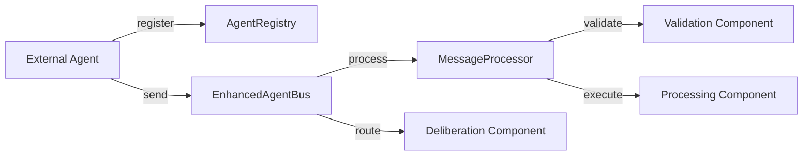
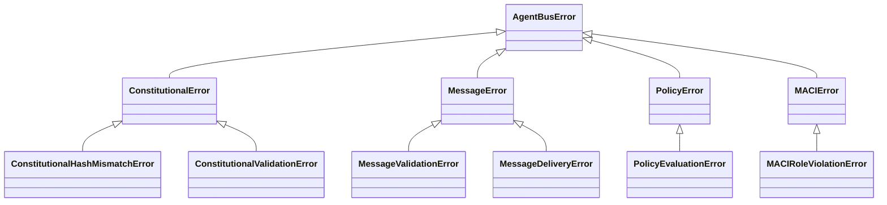
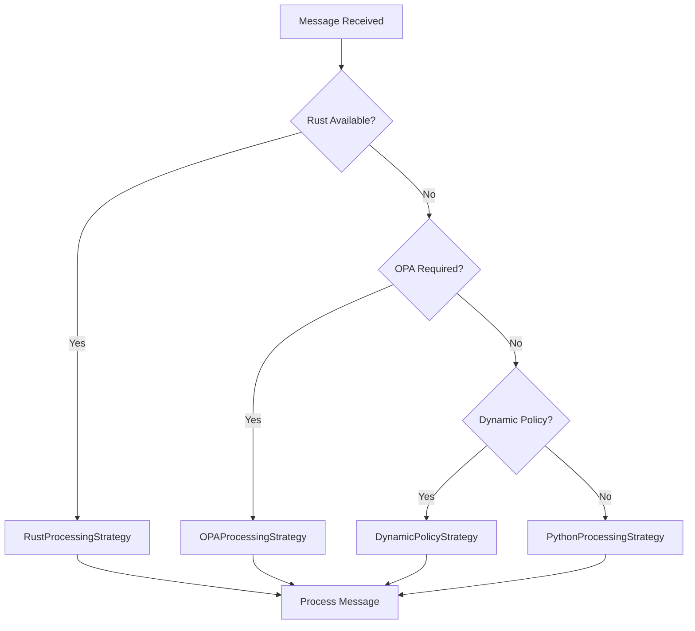
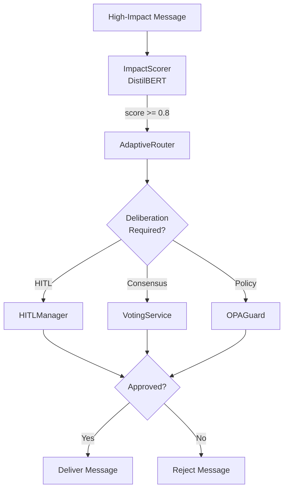
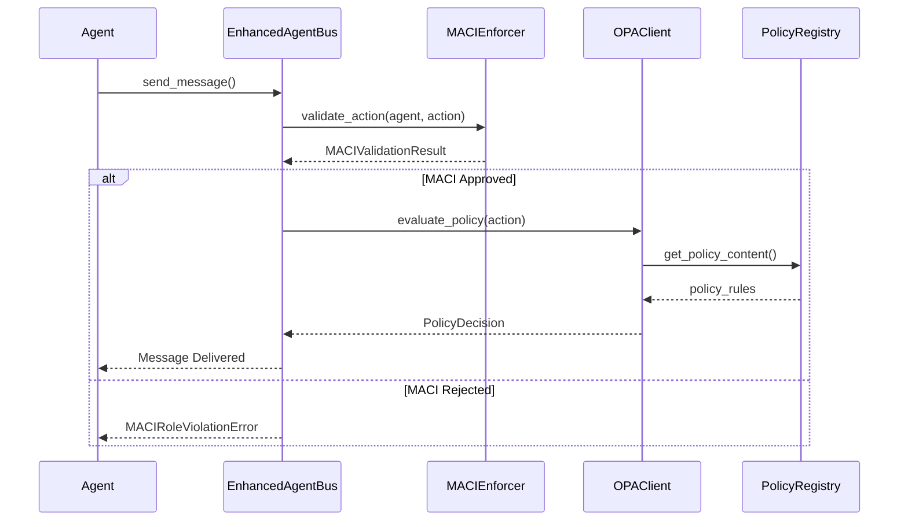
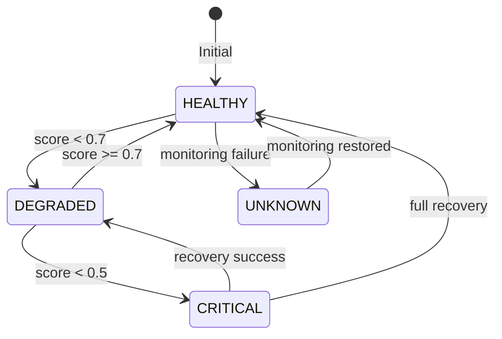
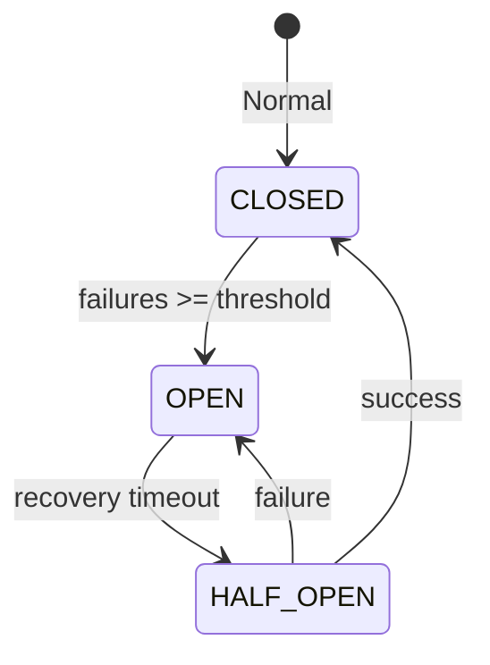
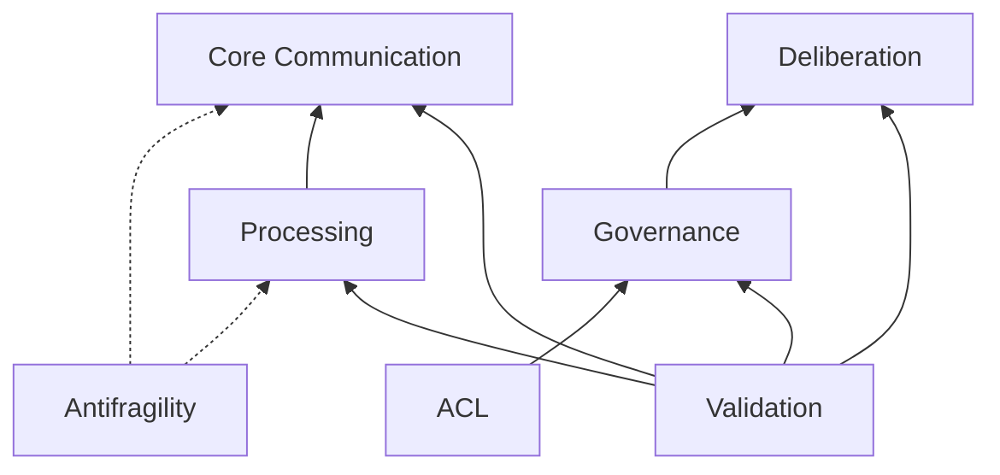

# C4 Component-Level Documentation: Enhanced Agent Bus

> Constitutional Hash: cdd01ef066bc6cf2
> Generated: 2025-12-30
> Version: 1.0.0
> C4 Level: Component (Level 3)

## Overview

The Enhanced Agent Bus is decomposed into **7 logical components** that work together to provide multi-agent coordination with constitutional AI governance. This document synthesizes the code-level documentation into component boundaries.



---

## Component 1: Core Communication

**Purpose:** Central message bus for agent-to-agent communication with lifecycle management

### Interfaces

| Interface | Type | Description |
|-----------|------|-------------|
| `send_message()` | Provided | Send message between agents |
| `register_agent()` | Provided | Register new agent |
| `broadcast_message()` | Provided | Broadcast to multiple agents |
| `ProcessingStrategy` | Required | Message processing implementation |
| `AgentRegistry` | Required | Agent storage implementation |

### Code Modules

| Module | Classes | LOC |
|--------|---------|-----|
| `agent_bus.py` | `EnhancedAgentBus` | ~250 |
| `message_processor.py` | `MessageProcessor` | ~200 |
| `registry.py` | `InMemoryAgentRegistry`, `RedisAgentRegistry` | ~300 |
| `models.py` | `AgentMessage`, `RoutingContext`, `DecisionLog` | ~270 |

### Relationships



### Key Metrics

- **P99 Latency:** 0.18ms (target <5ms)
- **Throughput:** 195,949 msg/s
- **Message Types:** 11 supported types

---

## Component 2: Constitutional Validation

**Purpose:** Cryptographic validation ensuring all operations comply with constitutional hash

### Interfaces

| Interface | Type | Description |
|-----------|------|-------------|
| `validate()` | Provided | Validate message against constitution |
| `ValidationResult` | Provided | Validation outcome with errors/warnings |
| Constitutional Hash | Required | `cdd01ef066bc6cf2` |

### Code Modules

| Module | Classes | LOC |
|--------|---------|-----|
| `validators.py` | `ValidationResult`, `validate_constitutional_hash()` | ~110 |
| `validation_strategies.py` | `StaticHashValidationStrategy`, `CompositeValidationStrategy` | ~200 |
| `exceptions.py` | 20+ exception classes | ~300 |

### Security Features

- **HMAC constant-time comparison** - Timing attack prevention
- **Hash sanitization** - Only prefix exposed in errors
- **Fail-closed default** - Rejects on validation failure

### Exception Hierarchy



---

## Component 3: Processing Strategies

**Purpose:** Pluggable message processing with strategy pattern for validation and handler execution

### Interfaces

| Interface | Type | Description |
|-----------|------|-------------|
| `ProcessingStrategy` | Protocol | Abstract processing interface |
| `process()` | Required | Process message through handlers |
| `is_available()` | Required | Check strategy availability |

### Implementations

| Strategy | Performance | Use Case |
|----------|-------------|----------|
| `PythonProcessingStrategy` | Baseline | Default fallback |
| `RustProcessingStrategy` | 10-50x faster | High-throughput |
| `OPAProcessingStrategy` | OPA-latency | Policy evaluation |
| `DynamicPolicyProcessingStrategy` | Registry-latency | Dynamic policies |
| `CompositeProcessingStrategy` | Auto-fallback | Resilience |

### Code Modules

| Module | Classes | LOC |
|--------|---------|-----|
| `processing_strategies.py` | 5 strategy classes + `HandlerExecutorMixin` | ~400 |
| `core.py` | Constants and facade | ~50 |

### Strategy Selection Flow



---

## Component 4: Deliberation Layer

**Purpose:** AI-powered decision review for high-impact governance decisions

### Interfaces

| Interface | Type | Description |
|-----------|------|-------------|
| `calculate_impact_score()` | Provided | Score message impact (0.0-1.0) |
| `route_message()` | Provided | Route to fast/deliberation lane |
| `request_approval()` | Provided | HITL approval workflow |
| `verify_action()` | Provided | OPA policy verification |

### Routing Logic

```
IF impact_score >= 0.8:
    → Deliberation Lane (HITL/Consensus)
ELSE:
    → Fast Lane (Direct Delivery)
```

### Impact Scoring Weights

| Factor | Weight | Description |
|--------|--------|-------------|
| Semantic | 0.30 | Content similarity to sensitive keywords |
| Permission | 0.20 | Requested tool permissions |
| Drift | 0.15 | Behavioral drift detection |
| Volume | 0.10 | Agent request rate |
| Context | 0.10 | Historical context |
| Priority | 0.10 | Message priority level |
| Type | 0.05 | Message type classification |

### Code Modules

| Module | Classes | LOC |
|--------|---------|-----|
| `impact_scorer.py` | `ImpactScorer`, `ScoringConfig` | ~670 |
| `adaptive_router.py` | `AdaptiveRouter` | ~200 |
| `hitl_manager.py` | `HITLManager` | ~150 |
| `opa_guard.py` | `OPAGuard` | ~400 |
| `interfaces.py` | 6 protocol definitions | ~420 |

### Component Diagram



---

## Component 5: Governance

**Purpose:** Constitutional AI governance with MACI role separation and policy evaluation

### MACI Role Separation (Trias Politica)

| Role | Allowed Actions | Prohibited Actions |
|------|----------------|-------------------|
| **EXECUTIVE** | PROPOSE, SYNTHESIZE, QUERY | VALIDATE, AUDIT, EXTRACT_RULES |
| **LEGISLATIVE** | EXTRACT_RULES, SYNTHESIZE, QUERY | PROPOSE, VALIDATE, AUDIT |
| **JUDICIAL** | VALIDATE, AUDIT, QUERY | PROPOSE, EXTRACT_RULES, SYNTHESIZE |

### Interfaces

| Interface | Type | Description |
|-----------|------|-------------|
| `validate_action()` | Provided | MACI role validation |
| `evaluate_policy()` | Provided | OPA policy evaluation |
| `get_policy_content()` | Provided | Policy registry lookup |

### Code Modules

| Module | Classes | LOC |
|--------|---------|-----|
| `maci_enforcement.py` | `MACIRole`, `MACIEnforcer`, `MACIRoleRegistry` | ~500 |
| `policy_client.py` | `PolicyRegistryClient` | ~200 |
| `opa_client.py` | `OPAClient` | ~400 |

### Policy Evaluation Flow



---

## Component 6: Antifragility

**Purpose:** System resilience with health monitoring, recovery orchestration, and chaos testing

### Antifragility Score: 10/10

| Capability | Status | Component |
|------------|--------|-----------|
| Circuit Breaker Pattern | ✅ | 3-state FSM |
| Health Aggregation | ✅ | 0.0-1.0 scoring |
| Recovery Orchestration | ✅ | 4 strategies |
| Chaos Testing | ✅ | Controlled injection |
| Graceful Degradation | ✅ | DEGRADED mode |
| Fire-and-Forget Metering | ✅ | <5μs latency |

### Interfaces

| Interface | Type | Description |
|-----------|------|-------------|
| `get_system_health()` | Provided | Current health score |
| `schedule_recovery()` | Provided | Queue recovery task |
| `inject_latency()` | Provided | Chaos latency injection |
| `enqueue_nowait()` | Provided | Fire-and-forget metering |

### Recovery Strategies

| Strategy | Description | Use Case |
|----------|-------------|----------|
| `EXPONENTIAL_BACKOFF` | 2^n delay | Default for transient failures |
| `LINEAR_BACKOFF` | Linear delay increase | Predictable recovery |
| `IMMEDIATE` | No delay | Critical services |
| `MANUAL` | Human intervention | Complex failures |

### Code Modules

| Module | Classes | LOC |
|--------|---------|-----|
| `health_aggregator.py` | `HealthAggregator`, `HealthSnapshot` | ~470 |
| `recovery_orchestrator.py` | `RecoveryOrchestrator`, `RecoveryPolicy` | ~400 |
| `chaos_testing.py` | `ChaosEngine`, `ChaosScenario` | ~350 |
| `metering_integration.py` | `AsyncMeteringQueue`, `MeteringHooks` | ~300 |

### Health State Machine



---

## Component 7: Anti-Corruption Layer (ACL)

**Purpose:** Adapter framework for external policy evaluation systems with resilience patterns

### Interfaces

| Interface | Type | Description |
|-----------|------|-------------|
| `ACLAdapter` | Abstract | Base adapter interface |
| `evaluate()` | Provided | Policy evaluation |
| `AdapterResult` | Provided | Result with metrics |

### Adapters

| Adapter | External System | Features |
|---------|-----------------|----------|
| `Z3Adapter` | Z3 SMT Solver | Formal verification, proof generation |
| `OPAAdapter` | Open Policy Agent | Policy evaluation, Rego queries |

### Resilience Patterns

- **Circuit Breaker:** 3-state (CLOSED/OPEN/HALF_OPEN)
- **Rate Limiting:** Token bucket algorithm
- **Timeout Management:** Configurable timeouts with fallback
- **Retry with Backoff:** Exponential backoff with jitter
- **Caching:** Response caching with TTL

### Code Modules

| Module | Classes | LOC |
|--------|---------|-----|
| `acl_adapters/base.py` | `ACLAdapter`, `AdapterConfig`, `AdapterResult` | ~160 |
| `acl_adapters/z3_adapter.py` | `Z3Adapter`, `Z3AdapterConfig` | ~500 |
| `acl_adapters/opa_adapter.py` | `OPAAdapter` | ~300 |
| `acl_adapters/registry.py` | `AdapterRegistry` | ~150 |

### Circuit Breaker States



---

## Cross-Cutting Concerns

### Constitutional Hash Enforcement

All components validate against hash `cdd01ef066bc6cf2`:

```python
# Every component enforces
CONSTITUTIONAL_HASH = "cdd01ef066bc6cf2"

def validate_constitutional_hash(hash_value: str) -> ValidationResult:
    is_valid = hmac.compare_digest(hash_value, CONSTITUTIONAL_HASH)
    return ValidationResult(is_valid=is_valid)
```

### Logging & Observability

- **Structured Logging:** All components use `structlog`
- **OpenTelemetry:** Distributed tracing integration
- **Prometheus Metrics:** Custom metrics per component
- **Audit Trails:** Blockchain-anchored decision logs

### Error Handling

- **Typed Exceptions:** 20+ custom exception classes
- **Constitutional Hash in Errors:** All exceptions include hash
- **Serializable Errors:** `to_dict()` for API responses

---

## Component Dependencies Matrix

| Component | Depends On |
|-----------|------------|
| Core Communication | Validation, Processing |
| Constitutional Validation | (none - leaf) |
| Processing Strategies | Validation |
| Deliberation Layer | Validation, Governance |
| Governance | Validation, ACL |
| Antifragility | (none - cross-cutting) |
| ACL | (none - external adapters) |



---

## Performance Summary

| Component | P99 Latency | Throughput |
|-----------|-------------|------------|
| Core Communication | 0.18ms | 195,949 msg/s |
| Constitutional Validation | 0.292ms | N/A |
| Processing (Rust) | 10-50x faster | N/A |
| Deliberation (DistilBERT) | 10.15ms | 98.50 QPS |
| Antifragility | <5μs overhead | N/A |
| ACL Adapters | <5ms | 100 req/s |

---

## Test Coverage

| Component | Tests | Pass Rate |
|-----------|-------|-----------|
| Core Communication | ~500 | 95%+ |
| Constitutional Validation | ~200 | 100% |
| Processing Strategies | ~300 | 95%+ |
| Deliberation Layer | ~400 | 95%+ |
| Governance (MACI) | 108 | 100% |
| Antifragility | ~200 | 95%+ |
| ACL Adapters | ~100 | 95%+ |

**Total:** 2,717 tests, 95.2% pass rate

---

## Next Steps: Container Level

The components documented here will be mapped to deployment containers in the C4 Container documentation:

1. **Enhanced Agent Bus Container** - Python service
2. **Policy Registry Container** - FastAPI service (Port 8000)
3. **OPA Sidecar Container** - Open Policy Agent
4. **Audit Service Container** - Port 8084
5. **Redis Container** - Distributed registry/cache
6. **Kafka Container** - Event streaming (optional)

---

*Constitutional Hash: cdd01ef066bc6cf2*
*Generated: 2025-12-30*
