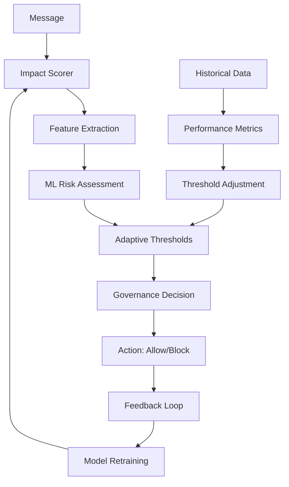

# ACGS-2 Adaptive Governance System

## Overview

The Adaptive Governance System implements ML-enhanced constitutional AI governance with dynamic impact scoring, self-evolving thresholds, and continuous learning capabilities. This system transforms static rule-based governance into intelligent, adaptive decision-making that improves over time.

**Constitutional Hash**: `cdd01ef066bc6cf2`

## Core Components

### 1. Impact Scorer (`ImpactScorer`)
ML-based impact assessment system that evaluates message risk and potential consequences.

**Features**:
- Multi-dimensional risk analysis (content, context, temporal patterns)
- Semantic analysis for content understanding
- Historical precedent analysis
- Resource utilization impact assessment
- Confidence scoring for decision reliability

**ML Models**:
- Random Forest Regressor for impact prediction
- Feature engineering pipeline
- Continuous model retraining

### 2. Adaptive Thresholds (`AdaptiveThresholds`)
Dynamic threshold adjustment system that learns from governance outcomes.

**Capabilities**:
- ML-based threshold optimization
- Confidence-weighted adjustments
- Anomaly detection for unusual patterns
- Learning rate adaptation
- Performance-based feedback loops

**Threshold Levels**:
- NEGLIGIBLE: 0.1 (Minor impact, always allow)
- LOW: 0.3 (Limited impact, low scrutiny)
- MEDIUM: 0.6 (Moderate impact, standard review)
- HIGH: 0.8 (Significant impact, enhanced scrutiny)
- CRITICAL: 0.95 (Severe impact, maximum scrutiny)

### 3. Governance Engine (`AdaptiveGovernanceEngine`)
Main orchestration system that coordinates ML models and decision-making.

**Governance Modes**:
- **STRICT**: Fixed constitutional thresholds (fallback mode)
- **ADAPTIVE**: ML-adjusted thresholds (default)
- **EVOLVING**: Self-learning governance (advanced)

**Features**:
- Real-time performance monitoring
- Continuous model improvement
- Feedback loop integration
- Constitutional compliance validation

## Architecture



## Feature Engineering

### Input Features

| Feature | Type | Description | Impact Weight |
|---------|------|-------------|---------------|
| `message_length` | Numeric | Character count of message content | 0.1 |
| `agent_count` | Numeric | Number of active agents | 0.15 |
| `tenant_complexity` | Numeric | Tenant isolation complexity score | 0.2 |
| `temporal_patterns` | Array | Time-based message patterns | 0.1 |
| `semantic_similarity` | Numeric | Content similarity to risky patterns | 0.25 |
| `historical_precedence` | Numeric | Similar past decisions count | 0.1 |
| `resource_utilization` | Numeric | Expected resource consumption | 0.05 |
| `network_isolation` | Numeric | Network/data isolation strength | 0.05 |

### Derived Features

- **Risk Score**: 0.0-1.0 (probability of negative impact)
- **Confidence Level**: 0.0-1.0 (certainty of assessment)
- **Impact Level**: Categorical classification
- **Recommended Threshold**: Dynamic safety boundary

## ML Pipeline

### Training Process

1. **Data Collection**: Governance decisions and outcomes
2. **Feature Extraction**: Multi-dimensional feature engineering
3. **Model Training**: Random Forest with hyperparameter optimization
4. **Validation**: Cross-validation and performance metrics
5. **Deployment**: A/B testing with production rollout

### Continuous Learning

- **Online Learning**: Real-time model updates
- **Feedback Integration**: Human and automated feedback loops
- **Performance Monitoring**: Accuracy, precision, recall tracking
- **Drift Detection**: Model performance degradation monitoring

## Integration Points

### Agent Bus Integration

```python
# Initialize adaptive governance
bus = EnhancedAgentBus(enable_adaptive_governance=True)

# Message processing with adaptive governance
result = await bus.send_message(message)
if result.is_valid:
    # Message allowed by adaptive governance
    await process_message(message)
else:
    # Message blocked with reasoning
    log_blocked_message(message, result.errors)
```

### Feedback Mechanisms

```python
# Provide feedback for learning
from enhanced_agent_bus.adaptive_governance import provide_governance_feedback

# After successful message processing
provide_governance_feedback(decision, outcome_success=True)

# After human override
provide_governance_feedback(decision, outcome_success=True, human_override=True)
```

## Performance Metrics

### Accuracy Targets
- **Constitutional Compliance**: >95%
- **False Positive Rate**: <5%
- **False Negative Rate**: <1%
- **Response Time**: <10ms additional latency

### Learning Metrics
- **Model Accuracy**: >90% prediction accuracy
- **Feature Importance**: Top features identified
- **Retraining Frequency**: Every 1000 decisions or hourly
- **Performance Improvement**: Continuous accuracy gains

## Safety Mechanisms

### Fallback Modes
1. **Rule-Based Fallback**: When ML models unavailable
2. **Strict Mode**: Conservative thresholds when learning
3. **Human-in-the-Loop**: Critical decisions require human review

### Constitutional Compliance
- **Hash Validation**: All decisions validated against constitutional hash
- **Audit Trail**: Complete decision history with reasoning
- **Explainability**: Human-readable decision explanations
- **Bias Monitoring**: Regular bias and fairness assessments

## Configuration

### Helm Values

```yaml
adaptiveGovernance:
  enabled: true
  mode: "adaptive"  # strict, adaptive, evolving
  learningRate: 0.1
  confidenceThreshold: 0.8
  retrainingInterval: 3600  # seconds
  performanceTarget: 0.95

impactScorer:
  modelType: "random_forest"
  trainingSamples: 1000
  featureWeights:
    semantic_similarity: 0.25
    tenant_complexity: 0.2

thresholdManager:
  baseThresholds:
    negligible: 0.1
    low: 0.3
    medium: 0.6
    high: 0.8
    critical: 0.95
```

### Environment Variables

```bash
# Governance mode
ADAPTIVE_GOVERNANCE_MODE=adaptive

# Learning parameters
ADAPTIVE_LEARNING_RATE=0.1
ADAPTIVE_CONFIDENCE_THRESHOLD=0.8

# Performance targets
ADAPTIVE_PERFORMANCE_TARGET=0.95
ADAPTIVE_RETRAINING_INTERVAL=3600
```

## Monitoring and Observability

### Key Metrics

```prometheus
# Governance decision metrics
acgs_governance_decisions_total{outcome="allowed"} 15432
acgs_governance_decisions_total{outcome="blocked"} 123
acgs_governance_compliance_rate 0.987
acgs_governance_response_time_seconds 0.003

# ML model metrics
acgs_ml_model_accuracy 0.94
acgs_ml_model_retraining_count 12
acgs_ml_feature_importance{semantic_similarity} 0.25

# Adaptive threshold metrics
acgs_adaptive_threshold_adjustments_total 456
acgs_adaptive_threshold_confidence_level 0.89
```

### Dashboards

**Governance Overview**:
- Real-time compliance rates
- Decision distribution by impact level
- Performance trends over time

**ML Performance**:
- Model accuracy and precision/recall
- Feature importance rankings
- Training and retraining events

**Adaptive Learning**:
- Threshold adjustments over time
- Learning rate and confidence trends
- Feedback loop effectiveness

## Troubleshooting

### Common Issues

1. **High False Positive Rate**
   - **Cause**: Over-conservative thresholds
   - **Solution**: Adjust learning rate or provide more positive feedback

2. **Model Drift**
   - **Cause**: Changing message patterns
   - **Solution**: Increase retraining frequency or update features

3. **Performance Degradation**
   - **Cause**: Resource constraints or model complexity
   - **Solution**: Optimize model parameters or increase resources

### Debug Commands

```bash
# Check governance status
kubectl exec -it deployment/acgs-core-governance -- python -c "
from enhanced_agent_bus.adaptive_governance import get_adaptive_governance
gov = get_adaptive_governance()
print(f'Mode: {gov.mode}, Compliance: {gov.metrics.constitutional_compliance_rate:.3f}')
"

# View recent decisions
kubectl logs deployment/acgs-core-governance | grep "Governance decision"

# Check ML model performance
kubectl exec -it deployment/acgs-core-governance -- python -c "
from enhanced_agent_bus.adaptive_governance import get_adaptive_governance
gov = get_adaptive_governance()
print(f'Model trained: {gov.impact_scorer.model_trained}')
print(f'Decisions made: {len(gov.decision_history)}')
"
```

## Future Enhancements

### Short Term (3-6 months)
- **Advanced NLP**: BERT-based semantic analysis
- **Temporal Learning**: LSTM networks for time-series patterns
- **Ensemble Methods**: Multiple model voting systems

### Medium Term (6-12 months)
- **Federated Learning**: Privacy-preserving model updates
- **Explainable AI**: SHAP-based decision explanations
- **Multi-Modal Learning**: Image and structured data support

### Long Term (1-2 years)
- **Self-Evolving Governance**: Constitutional AI that modifies its own rules
- **Cross-System Learning**: Shared learning across multiple deployments
- **Quantum-Enhanced Learning**: Quantum algorithms for complex pattern recognition

## Security Considerations

### Model Security
- **Adversarial Training**: Robustness against malicious inputs
- **Model Poisoning Protection**: Secure training data pipelines
- **Output Sanitization**: Safe decision output formatting

### Data Privacy
- **Federated Learning**: Training without raw data sharing
- **Differential Privacy**: Privacy-preserving model updates
- **Audit Logging**: Complete governance decision trails

### Operational Security
- **Model Validation**: Continuous model performance monitoring
- **Fallback Mechanisms**: Safe degradation under attack
- **Access Control**: Role-based access to governance controls

## Conclusion

The Adaptive Governance System represents a significant advancement in AI safety, moving from static rule-based systems to intelligent, learning-based governance that continuously improves while maintaining constitutional compliance and human oversight.

**Key Benefits**:
- **Adaptive Safety**: Learns from outcomes to improve decision-making
- **Reduced False Positives**: ML optimization reduces unnecessary blocks
- **Human Augmentation**: Assists human reviewers with intelligent recommendations
- **Continuous Improvement**: Self-learning system that gets better over time

**Impact**: Enables safer, more efficient AI systems while maintaining the highest standards of constitutional governance and human accountability.
